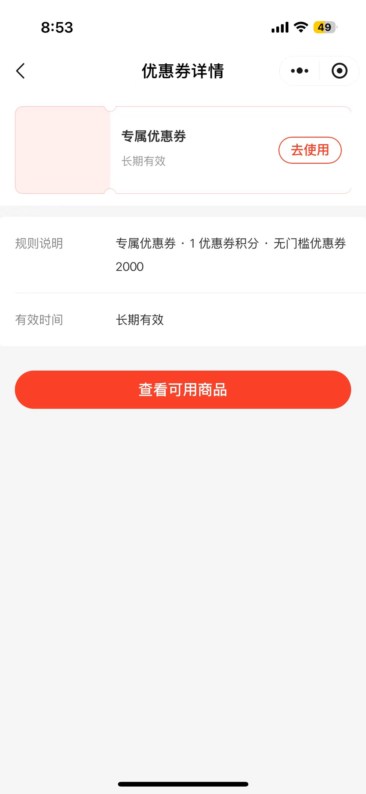
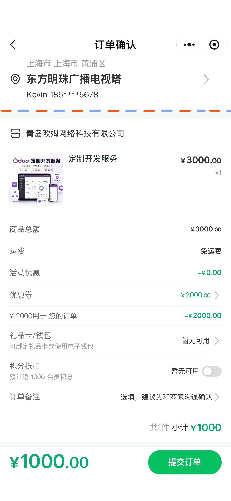
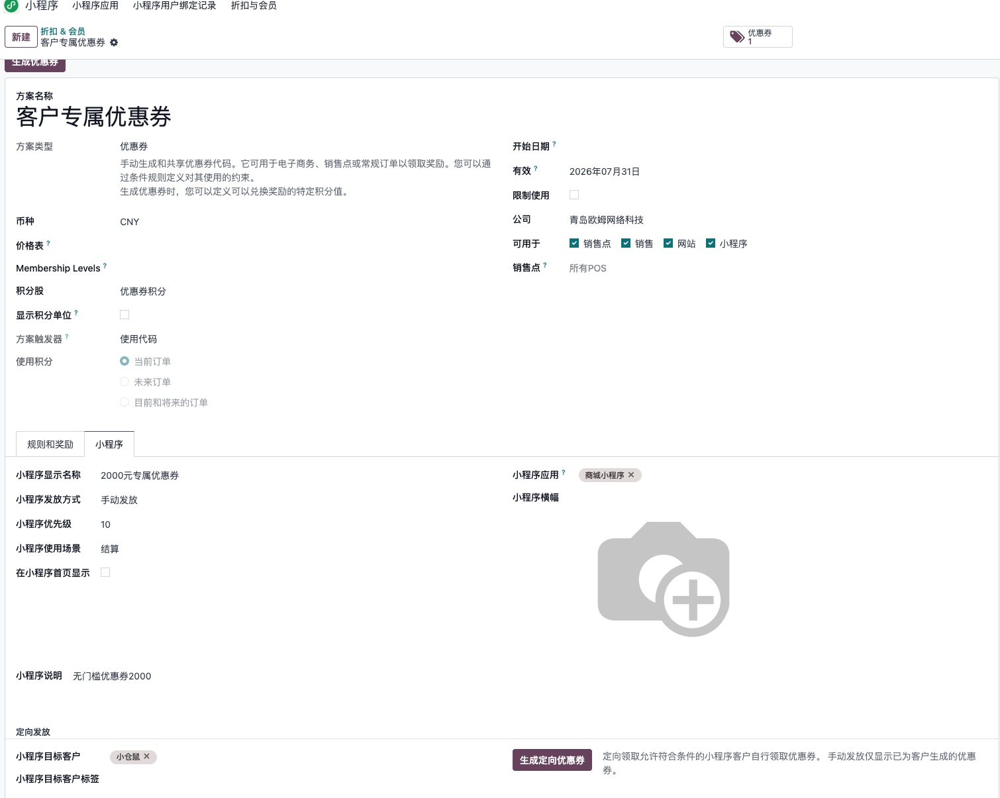
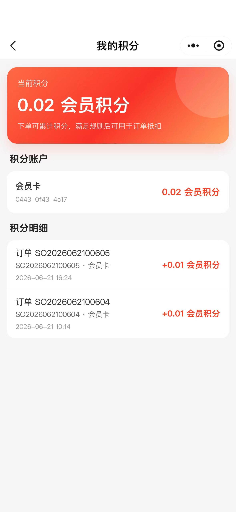
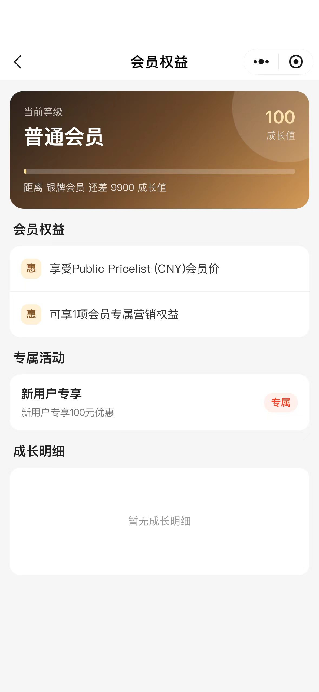
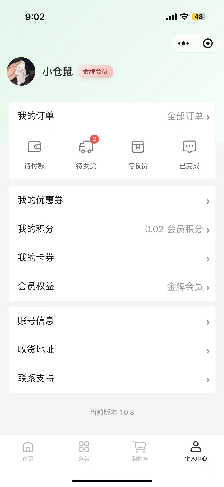
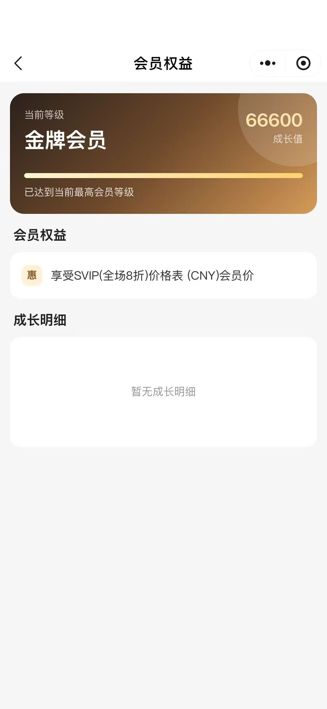
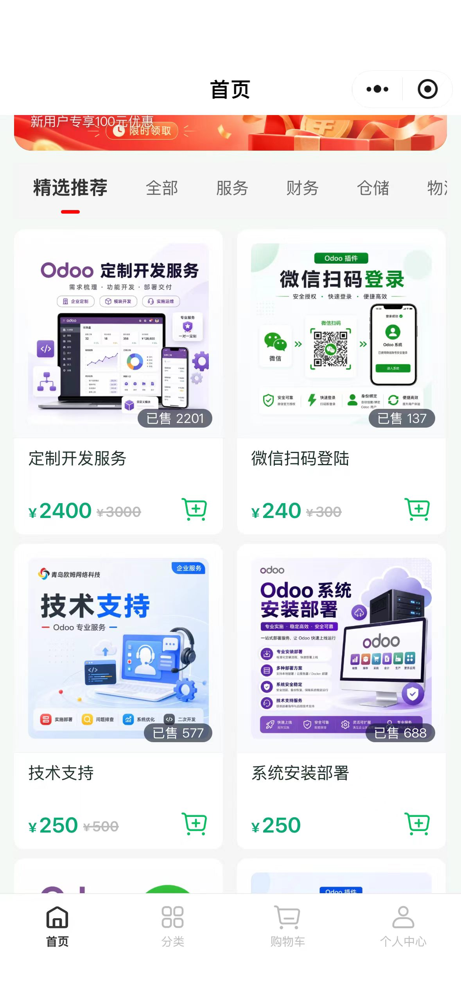
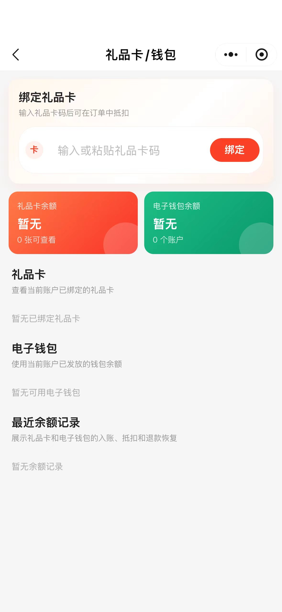
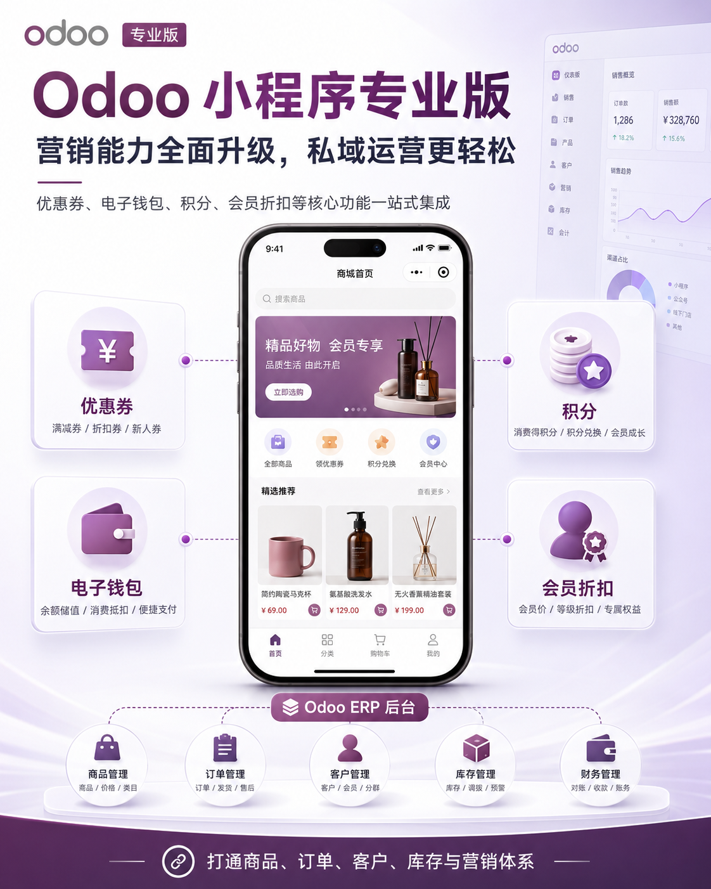

# 小程序商城专业版

在很多企业的数字化项目里，小程序商城的第一阶段，通常目标很明确：

**商品能展示，客户能下单，订单能进 Odoo，支付和地址流程能跑通。**

这一步很重要，因为它解决的是“线上交易入口”的问题。

但商城真正上线以后，企业很快会进入第二个阶段：

* 如何让客户愿意复购？
* 如何给不同客户不同权益？
* 如何做优惠券、积分、会员价、自动促销？
* 如何让小程序不只是一个“下单工具”，而是企业经营客户、沉淀数据、提升转化的运营入口？

这就是 Odoo 小程序商城专业版要解决的问题。

专业版并不是重新做一套独立的营销系统，而是在基础版商城能力之上，继续复用 Odoo的价目表、Discount and Loyalty、销售订单、客户和支付体系，让小程序成为面向客户的运营入口，让 Odoo 继续作为规则源和业务中台。

简单来说：基础版解决“能买”，专业版解决“怎么买得更灵活、怎么运营得更精细”。

## 一、为什么需要专业版：商城不只是交易，更是客户运营

基础版商城可以完成商品、分类、购物车、订单、地址、支付、个人中心等核心流程。对于很多企业来说，这已经能支撑小程序商城上线。
但当企业开始真正运营商城，就会遇到更细的问题。

比如：

* 新客户能不能领取新人券？
* 老客户能不能享受会员价？
* 下单后能不能返积分？
* 积分能不能在下一单抵扣？
* 特定客户或客户标签能不能看到专属优惠券？
* 自动满减和优惠券能不能统一由后台规则控制？
* 客户取消订单或退款后，积分、卡券、钱包余额能不能正确处理？

这些问题如果都在小程序前端单独写一套规则，短期看似快，长期就容易出现价格不一致、退款不好回滚、财务不好对账、活动不好升级的问题。
专业版的核心设计原则是：**充分利用Odoo原生的营销规则和订单计算，小程序负责渠道展示和用户体验**。

也就是说，优惠券、积分、会员价、促销规则尽量使用Odoo原生或Odoo后台增强能力来管理；小程序端只负责把这些能力以更适合微信用户的方式展示出来，让客户能看懂、能领取、能使用。

这样做的好处很直接：前端体验轻，后台规则稳，订单数据和财务口径也更容易统一。同时，如果客户有门店管理需求，那么这套方案可以做到POS门店、Web网站商城和小程序三端统一，不论客户从哪里注册，到哪里使用，都能获取一致的完美体验。


## 二、专业版能力：围绕优惠、积分、会员和卡券构建运营闭环

### 1. 后端报价单预览：让价格计算回到Odoo

专业版中，一个非常关键的变化是：结算和优惠计算不再依赖前端自己算。基础浏览和加购可以保持小程序本地购物车体验，但一旦进入结算、优惠券选择、积分抵扣等环节，就由 Odoo 后端生成或更新草稿报价单，统一计算价目表、优惠券、自动促销、积分、卡券和应付金额。

典型链路是：

```sh
小程序购物车 
-> 进入订单确认 
-> Odoo 后端报价单预览
-> 返回商品小计、优惠明细、积分明细、应付金额
-> 用户确认提交
-> 同一张报价单转为正式订单并支付
```

这一步看似技术性很强，真正的业务价值在于：价格和优惠结果以后端为准。
客户看到的结算金额、后台销售订单上的优惠行、支付金额和后续对账口径，可以尽量保持一致。对于运营活动较多的商城，这一点非常关键。

### 2. 优惠券：支持公开领取、定向领取和后台发放

专业版支持将Odoo的Discount and Loyalty活动开放到小程序渠道。优惠券不只是“发一张券”这么简单。不同企业常见的发放方式会不一样：

* 公开领取：所有符合条件的登录客户都可以看到并领取
* 定向领取：只有指定客户或指定客户标签命中的用户可以看到并领取
* 后台发放：运营人员在 Odoo 后台发放给指定客户，小程序只展示客户已经拥有的券

这让企业可以更灵活地做客户运营。



例如，新客户可以领取新人券；老客户可以看到专属复购券；重点客户可以由后台手动发放专属优惠；非目标客户即使知道券码，也会在后端校验时被拦截。
专业版强调一点：优惠券资格不能只靠前端隐藏。

领取、应用、订单预览、正式下单等环节都应由后端重复校验，确保活动规则可靠执行。

### 3. 自动促销：活动由Odoo统一应用

除了客户主动选择优惠券，专业版还支持自动促销。



例如满减、满折、指定商品活动、自动折扣等，都可以基于 Odoo 的营销规则进行配置。客户进入结算时，系统根据订单内容自动判断是否满足活动条件，并返回优惠明细。

这里需要区分两个概念：

* 优惠券：通常由用户领取或选择使用
* 自动促销：由 Odoo 根据规则自动应用

自动促销不应该简单塞进优惠券选择页里，否则客户会误以为所有活动都需要手动选择。专业版会更清晰地把自动促销作为订单优惠明细展示，让客户知道自己已经享受了什么优惠。



这对运营也很友好：活动规则在 Odoo 后台维护，小程序负责展示结果，不需要每次活动都改前端代码。

### 4. 积分体系：下单可累计，也可用于抵扣

专业版积分能力基于Odoo原生 Discount and Loyalty 的积分活动实现，不单独维护一套小程序积分账。



当前专业版积分场景包括：

* 个人中心展示积分余额
* 我的积分页展示积分账户和积分明细
* 订单确认页展示预计返积分
* 订单确认页支持积分抵扣
* 积分不可用时展示中文原因
* 订单取消时依赖 Odoo 逻辑回滚积分历史和卡余额

这里有一个细节很重要：预计返积分不是当前可抵扣积分。

预计返积分是客户完成本单后未来可能获得的积分；而可抵扣积分来自客户当前已有的积分余额，并且要满足 Odoo 后台设置的抵扣规则。

比如客户下单时看到“本单预计获得 50 积分”，这50积分不能立刻在本单抵扣。客户当前能不能抵扣，要看他账户里已有多少积分，以及后台是否配置了对应奖励。
这类边界说清楚了，客户体验才不会变成“我看到了积分，为什么不能马上用”的误会现场。

### 5. 会员等级与会员价：从小程序走向全渠道会员中枢

专业版会员体系的设计，不只是服务小程序。



会员等级应成为Odoo客户主数据的一部分，兼容后台销售、网站商城、POS 和小程序商城。这样客户无论在哪个渠道消费，会员身份和会员权益都能统一管理。

专业版会员能力包括：

* 会员等级
* 成长值
* 成长值流水
* 会员等级对应客户标签
* 会员等级对应会员价目表
* 会员专属营销活动
* 小程序会员权益页






会员价优先通过 Odoo 原生价目表实现。客户达到某个会员等级后，可以同步对应价目表，小程序展示会员价，后台销售也可以复用同一套价格体系。



这比在小程序里单独写“会员价折扣”更稳，因为价格规则仍然回到Odoo统一管理，避免出现小程序一个价、后台销售一个价、财务对账又一个价。


### 6. 礼品卡与电子钱包：为更完整的营销和售后做准备

专业版还规划并接入了礼品卡、电子钱包等余额类卡券能力。



这类能力不仅是营销问题，也会涉及支付抵扣、退款恢复、财务确认和余额对账。因此它比普通优惠券更复杂，需要更谨慎地接入。
专业版的思路是：礼品卡和电子钱包的使用、抵扣、退款恢复都要有清晰快照和记录，避免客户退款后余额重复恢复，或者订单售后时账务口径不清。

对企业来说，这意味着商城可以逐步支持更丰富的运营玩法，但仍然保持后台可查、规则可控、对账有据。


## 三、总结：专业版让小程序商城从交易入口升级为运营入口

Odoo小程序商城专业版的价值，不是简单多几个页面，也不是把优惠券、积分、会员功能堆到前端。

它真正解决的是：企业如何在微信小程序这个轻量入口里，承接更专业的客户运营能力，同时又不脱离 Odoo 后端的订单、客户、价格、营销和财务体系。

基础版让客户可以浏览商品、加入购物车、提交订单、完成支付；专业版则进一步加入优惠券、自动促销、积分抵扣、会员等级、会员价、礼品卡、电子钱包等能力，让商城从“能下单”走向“能运营”。



更重要的是，专业版坚持让 Odoo 作为规则源。营销规则在 Odoo 后台配置，价格和优惠由 Odoo 报价单计算，小程序只做渠道适配和用户体验。这种方式更适合企业长期使用，也更方便后续向企业版扩展物流轨迹、企业 IM、短信通知等能力。

一个真正好用的小程序商城，不只是界面漂亮，更要后端接得住、规则管得住、订单对得上、客户沉淀得下来。

青岛欧姆网络科技长期深耕 Odoo 实施、定制开发和本地化解决方案。我们更关注系统是否真的服务业务，是否能从基础上线走向持续运营，是否能为企业后续扩展留下稳定空间。
