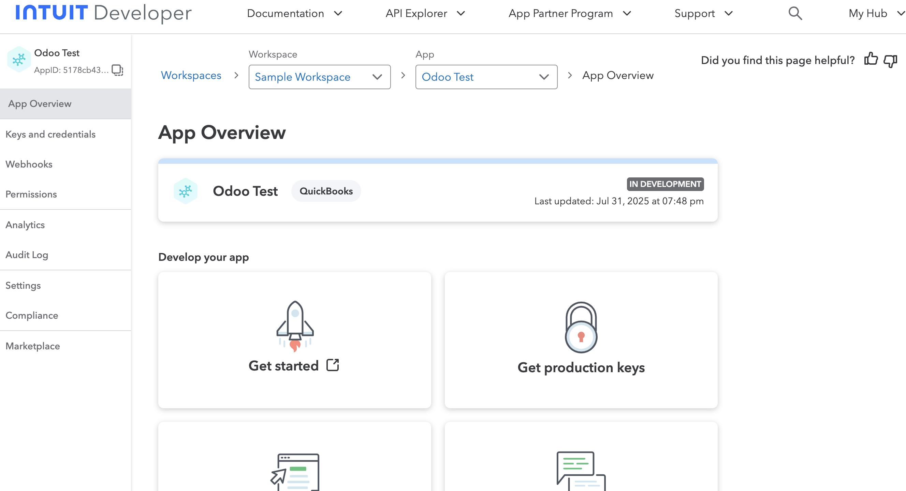
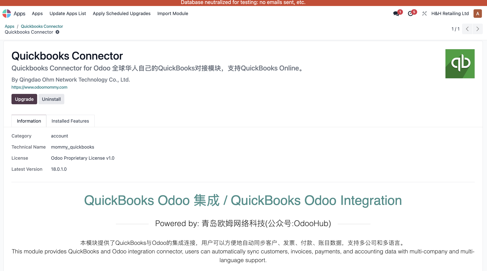
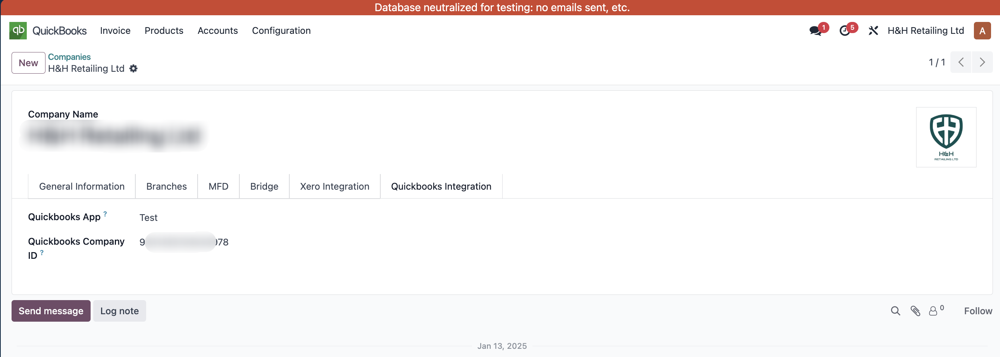
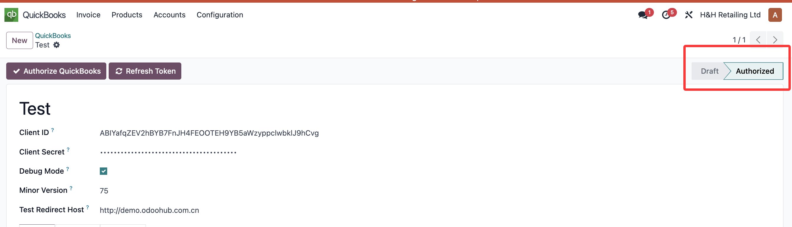
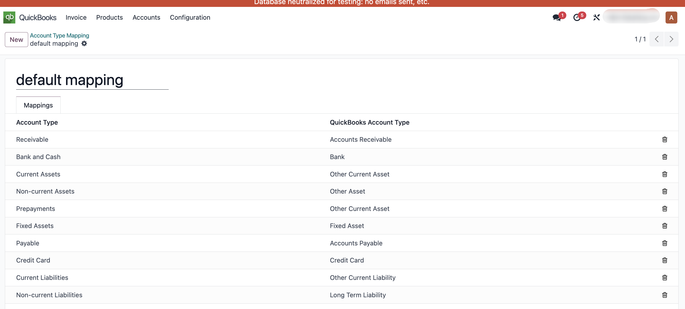
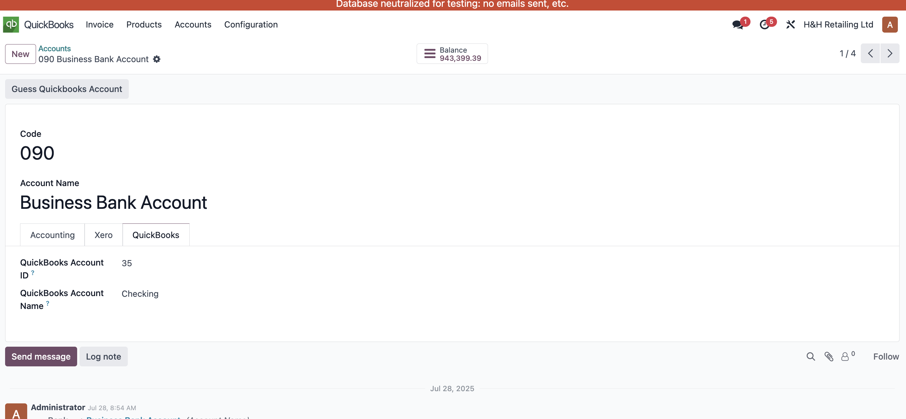
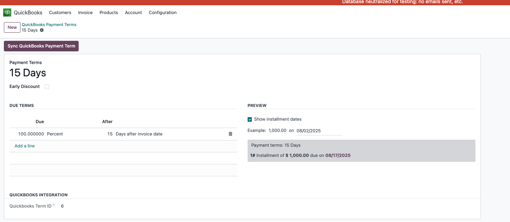
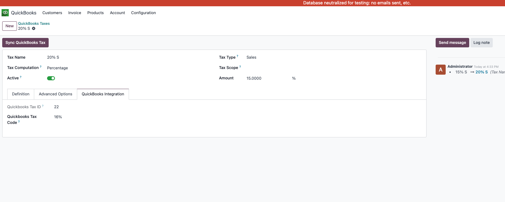

# QuickBooks

QuickBooks 是由美国公司 Intuit 开发的一套中小企业财务与会计管理软件，广泛用于做账、报税、开票、工资管理等日常财务操作。QuickBooks 提供桌面版（QuickBooks Desktop）和在线版（QuickBooks Online），在全球多个国家使用，尤其在北美市场占有率较高。

本章我们来看一下如何借助我们开发的[QuickBook插件](https://apps.odoo.com/apps/modules/18.0/mommy_quickbooks)(限时特惠)来完成常见的对接功能。

## QuickBooks端设置

同Xero一样，QuickBooks也要通过OAuth2.0来进行认证，因此我们需要先在[开发者中心](https://developer.intuit.com/)创建一个应用:

这了我们要获取到两个重要参数：

* Client ID：应用ID
* Client Secret: 应用密钥

同时我们还要获取QuickBoooks的公司ID。

### 设置Scope

然后我们需要给我们的应用授权，以允许我们的应用访问相应的数据。

### 设置Redirect URI

最后，我们要设置该应用的跳转链接的白名单。

这样我们就完成了QuickBooks端的设置，接下来我们看一下Odoo端的设置。

## Odoo端设置

首先，我们在应用中心中安装我们的应用mommy_quickbooks:

安装完成后，我们进入Quickbooks应用，创建一个Odoo的QuickBooks应用：

我们将前面获取到的Client ID和Client Secret填入到相应的位置。然后根据自己的实际情况配置相应的参数：

* Debug Mode: 测试模式
* Minor Version： QuickBooks Minor版本
* Test Redirect Host: 测试模式下的跳转链接主机
* Scopes： 应用的授权列表

如不知道如何设置保持默认或联系我们的在线客服获取帮助。

### 绑定公司

创建完应用以后，我们要对将此应用绑定到相应的公司上，同时填写该公司对应的QuickBooks公司ID。

### 授权

配置好了参数，那么接下来我们就可以进行应用授权了，点击授权按钮，系统将自动将我们跳转到QuickBooks的认证页面：

完成认真授权后，页面将自动跳回我们的应用界面，应用状态变为已授权：

之后我们就可以进行同步操作了。

## 同步数据

### 科目同步

首先，我们看科目的同步，由于Odoo的科目设置与QuickBooks并不一致，因此我们创建了一个对照关系表来供用户灵活配置他们之间的类型匹配关系：

然后我们可以在要同步的科目中进行同步：

### 发票和退款同步

同样地，我们可以在发票和退款界面进行同步：

### 产品同步

产品界面，我们可以对产品进行同步

### 支付条款的同步

我们当然也可以使用odoo来同步支付条款：

### 税率同步

最后我们把税率也同步一下

## 结语

更多设置，敬请期待
