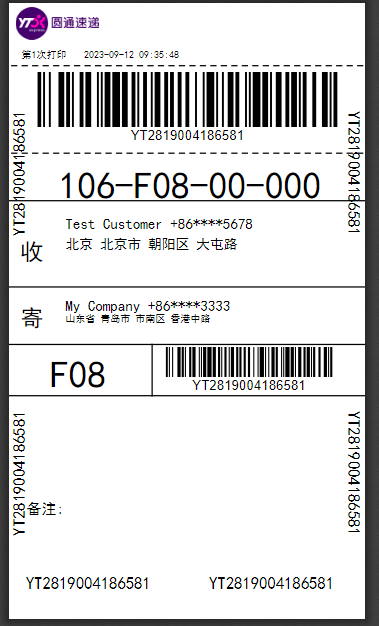
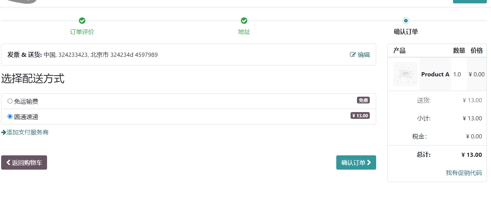

## 圆通速递

圆通是我们生活中常用的“三通一达”快递行业中的重要一员，使用频率也非常之高。本文将介绍如何使用[圆通速递](https://hub.mixoo.cn/shop/21)来完成Odoo与圆通速递的对接工作。

## 安装和配置

要使用圆通速递模块，首先我们要开启圆通速递模块，在设置-库存-物流对接中，启用圆通速递：

该选项会自动把圆通速递模块装好。

安装完成之后，我们到库存-设置-送货方式中，打开圆通速递：

配置好，我们从圆通那里获取到的沙箱账号和密码即可。

圆通的客户编码和密钥分为两类：

* STD：由圆通网点授权提供的客户编码和密钥(由K开头的编号)，用户关键接口如订单创建和取消，电子面单等接口的使用。

* Basic: 而另外一种客户编码和密钥(以OPEN开头)，则可以由用户在开放平台自动生成，但也需要审核通过后方可使用。

## 销售下单

圆通快递的使用方式和其他快递并无太大的差别，首先，我们来看销售单上设置圆通速递。

我们新建一个销售订单，并在添加送货方式那里选择圆通速递：

点击获取运费，可以根据客户的收货地址计算出预估费用。点击添加，我们即可把运费添加到销售单中。

## 发货

销售订单生成以后，我们在出库时，可以获取运单号和电子面单：

我们点击右上角的跟踪，即可在圆通官网查询该订单的物流信息。

## 网站订单

同样的， 我们也可以在网站下单的时候供用户选择圆通速递，预估费用：

