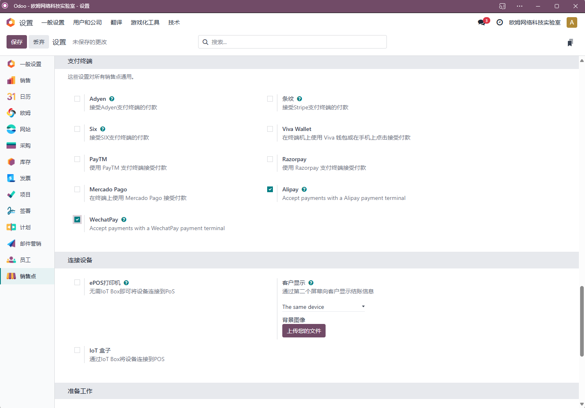
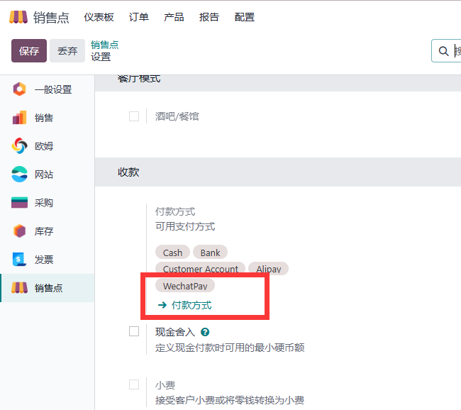
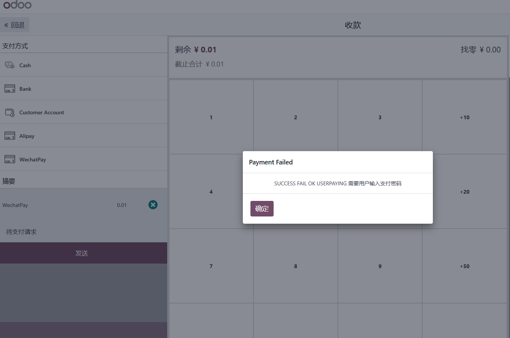
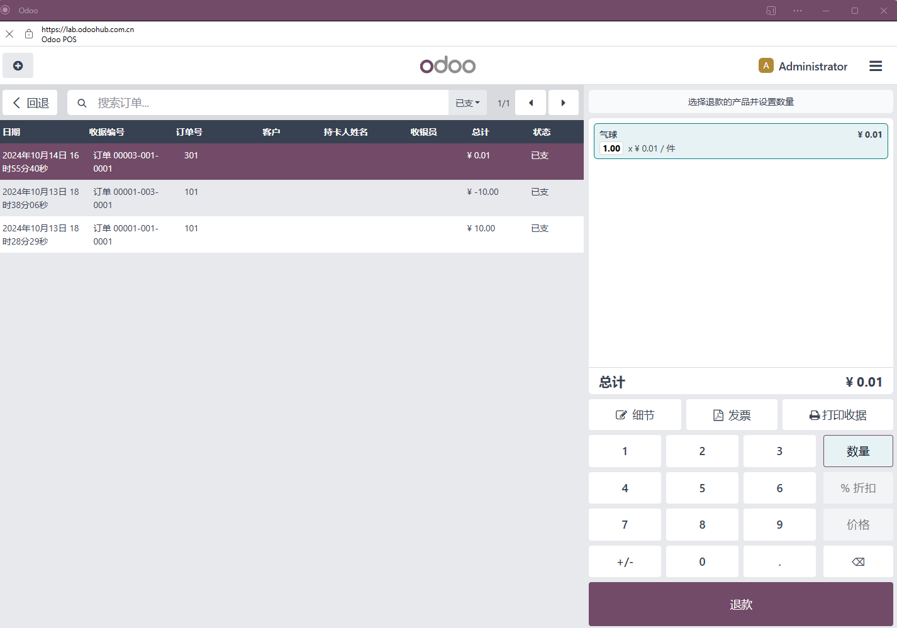
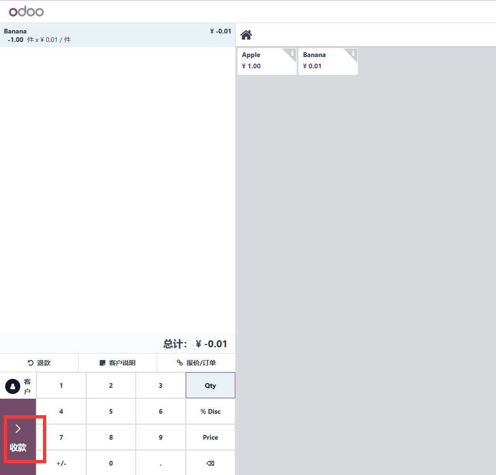
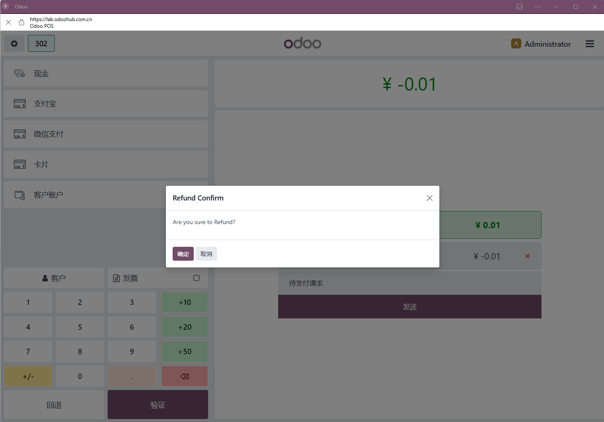

# POS微信支付

我们在前面一节中介绍了如何在销售点(Point of Sale)中使用支付宝进行收款/退款，本节我们将介绍如何使用微信支付完成同样的操作。

## 模块安装

同支付宝一样，我们在设置-POS设置-支付终端中开启微信支付：

开启之后，系统会自动把微信支付模块安装上，同样地，POS微信的设置也复用的网站应用中的微信支付模块设置，这里就不再赘述了。

## 设置微信支付

在会话关闭状态下，我们进入门店的设置页面，添加微信支付选项。

## 使用微信支付收款

具体步骤同支付宝，不同点在于付款界面选择的支付方式为微信支付：

与支付宝不同的是，微信支付有机率会让用户确认支付，会导致收款失败：

这个时候不要慌，等用户完成支付之后，我们点击发送按钮，系统江会自动核实用户是否支付成功，如果成功，将会显示支付成功。

这个时候我们再继续把小票打印给客户即可。

## 使用微信支付进行退款

对于退款场景，同支付宝，我们先找到要退款的订单，然后点击退款：

进入到POS界面，我们看到支付金额为负数，表明这是退单。点击付款按钮：

弹窗询问，是否确认退款

点击确认，完成退款。

