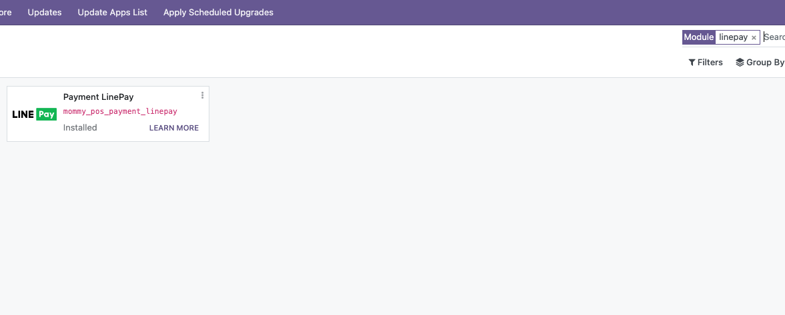
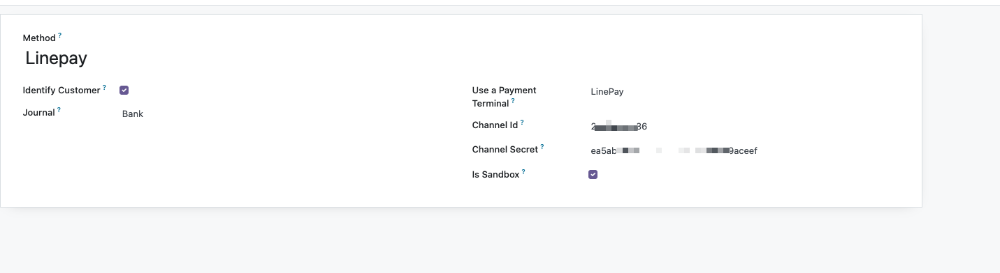

# Pos LinePay

Line是风靡日本、泰国以及中国台湾的社交软件，与微信类似，Line也有自己的支付功能: LinePay。本章就来介绍一下如何使用LinePay在odoo16.0中进行收款和退款。

## 注册LinePay商家

想要使用LinePay进行收款，就必须先注册成为LinePay的商家，由于注册LinePay的步骤异常简单，这里不在赘述，大家可自行了解注册方法。

## 获取Channel ID和Secret

成功注册成为LinePay商家以后，我们就能在邮件中收到账号和密码，登录商家后台，可以获取Channel ID和Secret。

## 安装Pos LinePay模块

获取到ID和Secret后，在Odoo的应用列表中安装Pos LinePay模块:

安装成功后，我们到Pos设置-支付方法中，找到Linepay,然后在设置中把Channel Id和Secret填入到相应的位置中：

## 使用LinePay进行收款和退款

使用LinePay进行收款和退款的步骤与我们之前介绍过的微信和支付宝的POS流程并无差别，因此我们这里不做复述。有需要的同学可以通过下面的视频来进行详细了解。

[LinePay POS支付](https://www.bilibili.com/video/BV15m42157pd/)