# Revolut支付集成

Revolut 支付（Revolut Pay）是由 Revolut 推出的一种在线支付方式，允许用户直接使用自己的 Revolut 账户完成付款，无需输入银行卡信息。通过集成 Revolut 支付，商户可以为客户提供一种便捷、安全的支付选项，提升用户体验并增加转化率。

本文将介绍如何在 Odoo 中集成 Revolut 支付，包括配置步骤和代码示例。

## 安装Revolut支付模块

Revolut支付模块由青岛欧姆网络科技有限公司开发，您可以通过以下步骤安装：

1. 登录 Odoo 后台，进入应用模块。
2. 搜索 "Revolut Pay" 模块。
3. 点击安装按钮，完成模块安装。

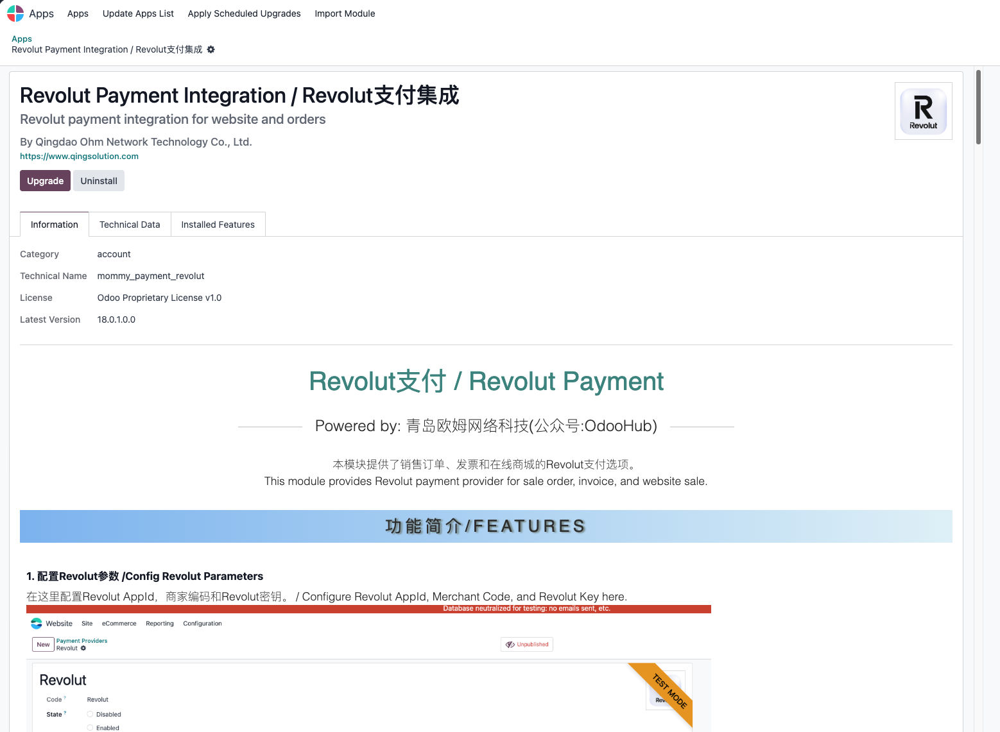

## 配置Revolut支付

安装完成后，您需要进行以下配置：

1. 进入 **设置** > **支付提供商**。
2. 找到 "Revolut Pay" 支付提供商，点击编辑。
3. 填写以下信息：
   - **商户ID**：您的 Revolut 商户账户 ID。

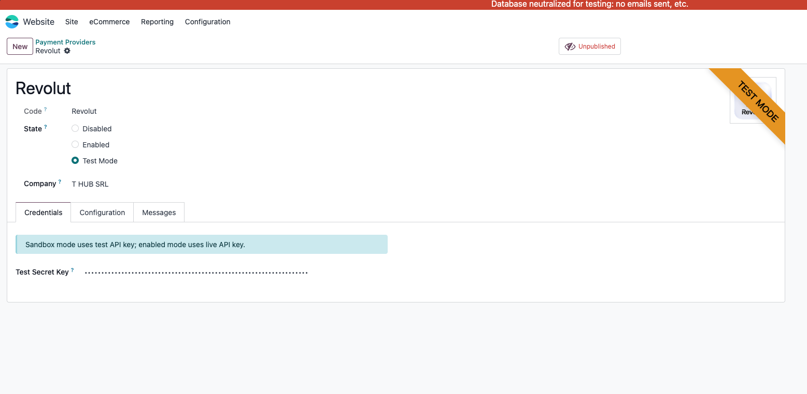

4. 保存配置。

## 使用Revolut支付

### 在销售单中使用Revolut支付

当客户在销售单中生成支付链接时，系统将引导客户完成 Revolut 支付流程。

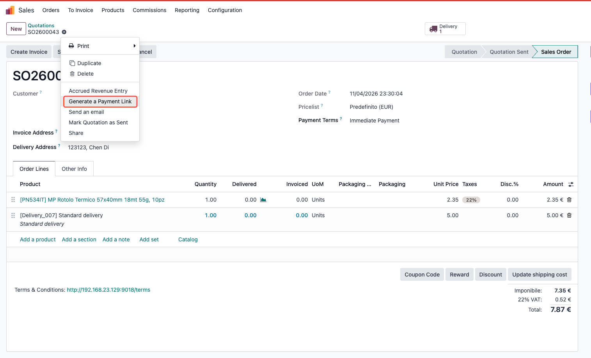

选择Revolut支付
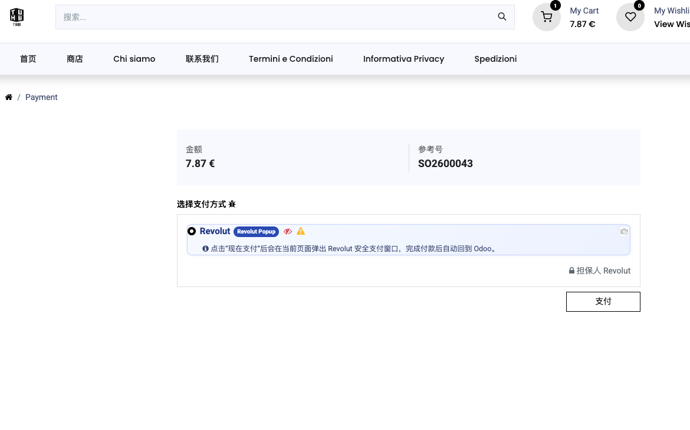

系统将弹出 Revolut 支付界面，客户填写相关信息后完成支付。

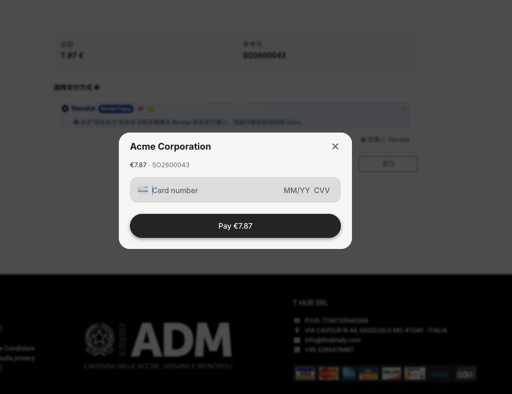

支付完成:

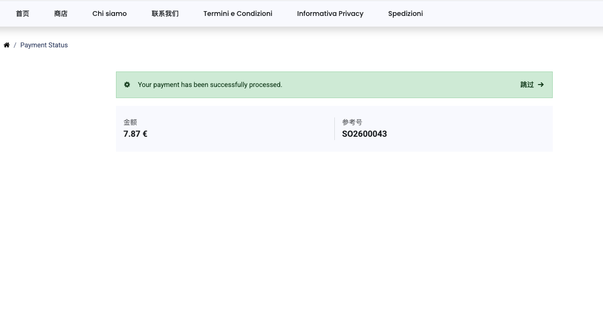

### 在发票中使用Revolut支付

客户也可以在发票中选择 Revolut 支付，流程与销售单类似。

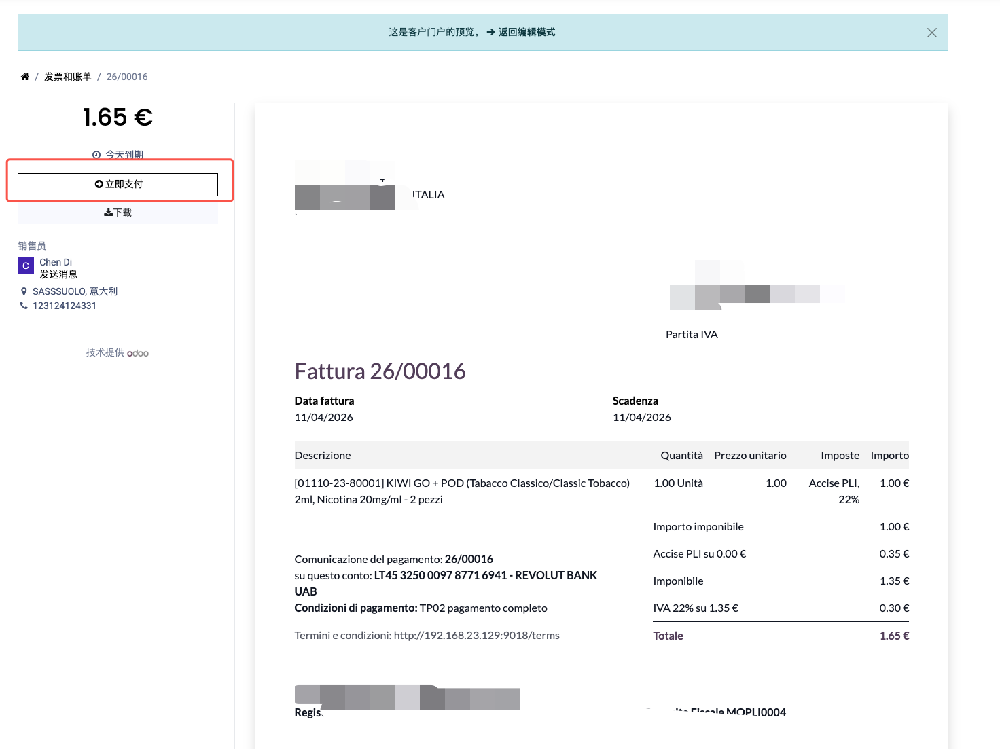

选择Revolut支付

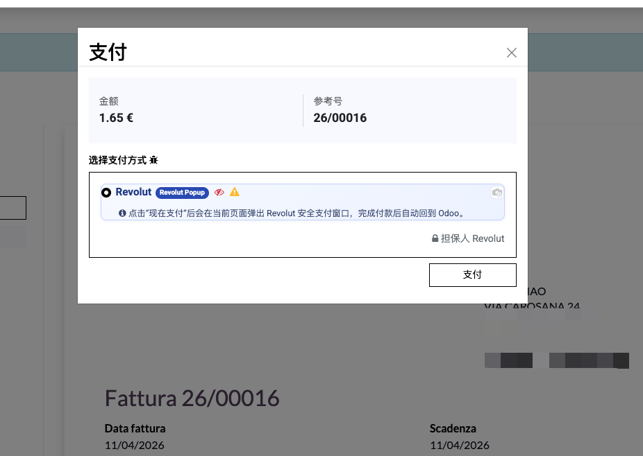

系统将引导客户完成 Revolut 支付流程。

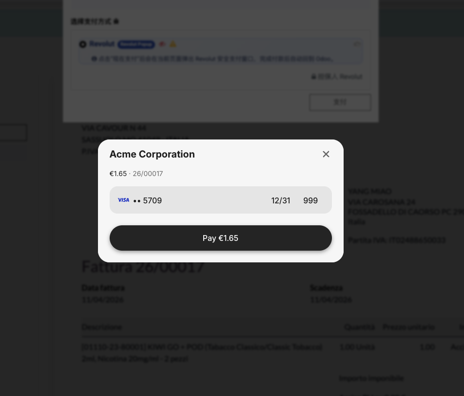

支付完成:

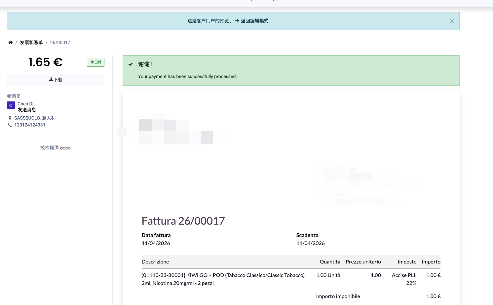

### 在商城中使用Revolut支付

客户在商城中下单后，也可以选择 Revolut 支付完成订单。

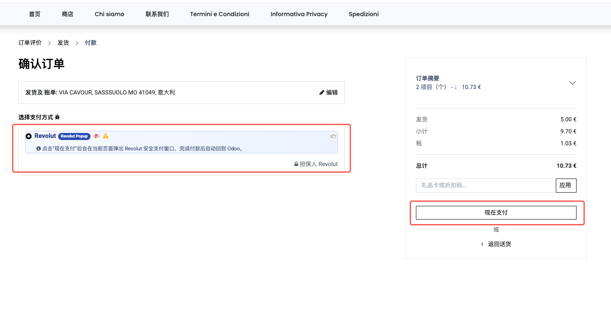

弹窗中输入相关信息完成支付:

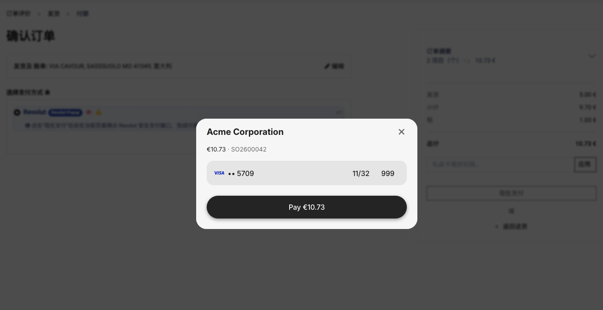

支付完成:

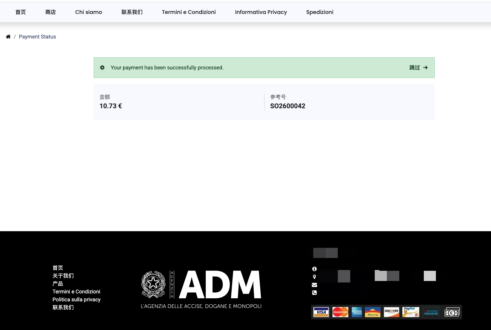

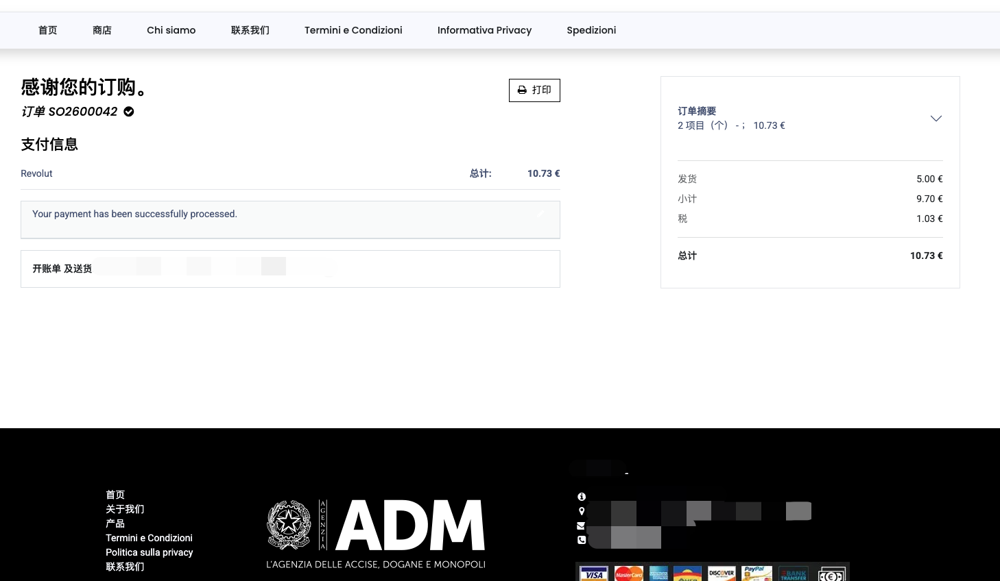

## 结论

通过集成 Revolut 支付，商户可以为客户提供一种便捷、安全的支付选项，提升用户体验并增加转化率。希望本文能帮助您顺利完成 Revolut 支付的集成和使用。如果您有任何问题或需要进一步的帮助，请随时联系欧姆网络的客服团队。