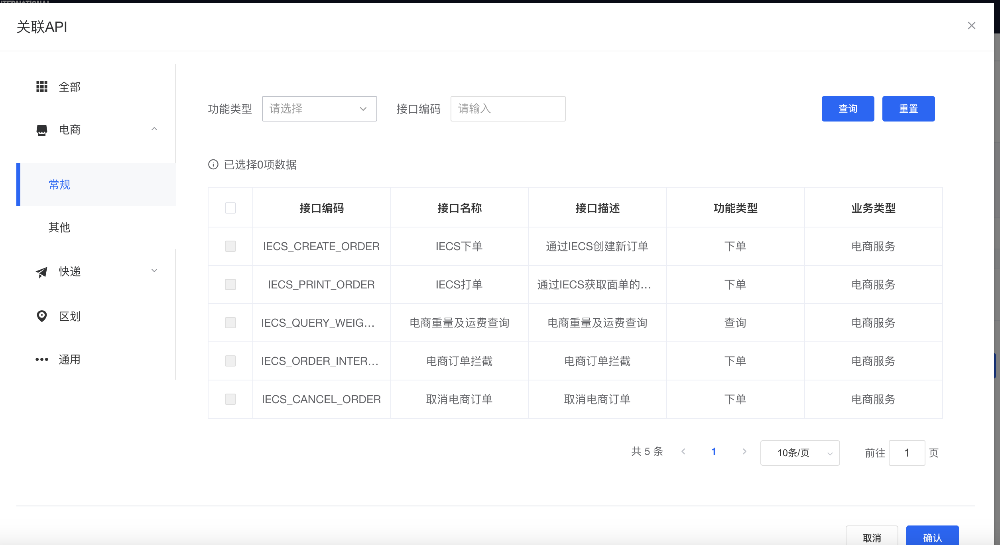
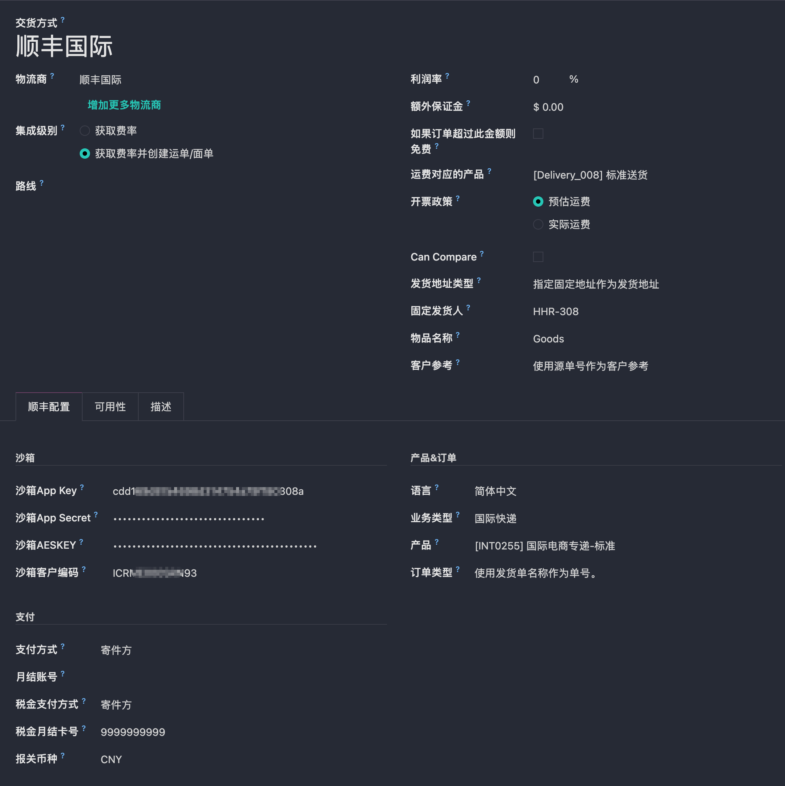
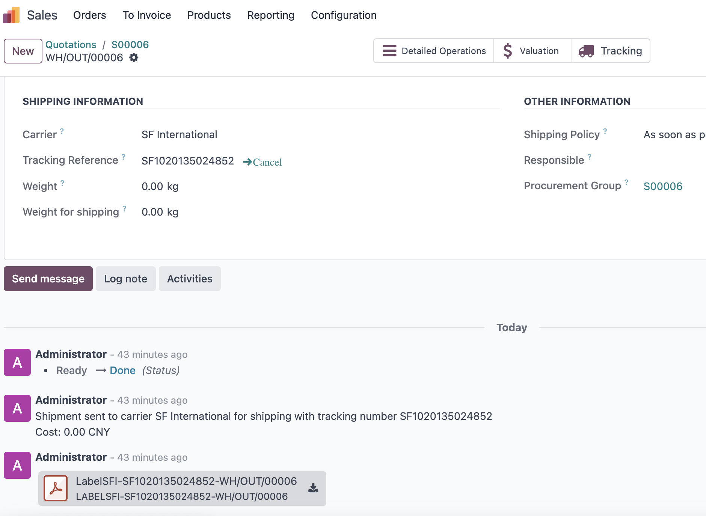
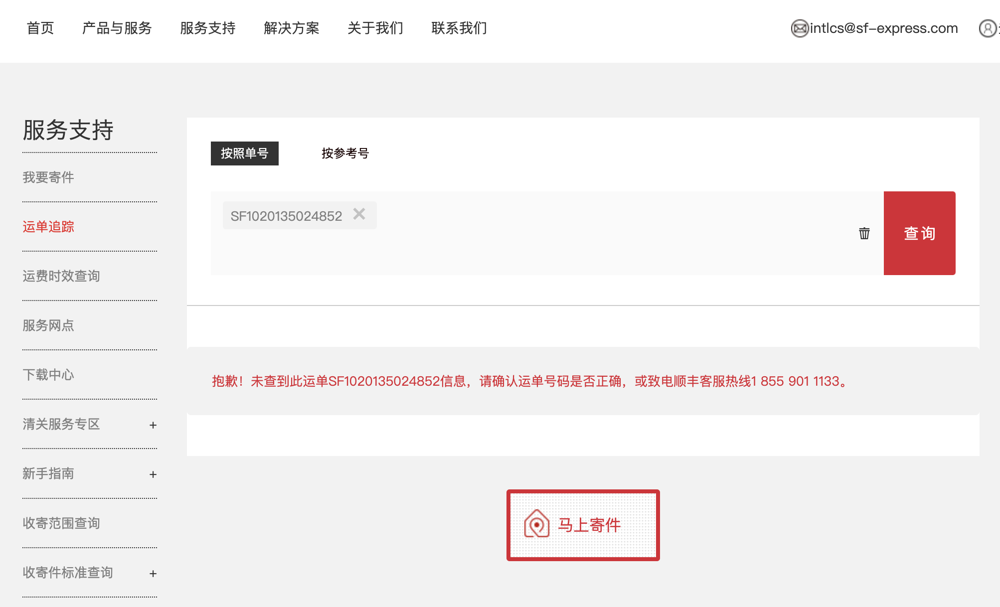

# 顺丰国际

我们之前的顺丰模块只支持国内的使用，对国际没有很好的支持。但是有客户需要使用顺丰进行国际物流运输，因此我们有开发了顺丰国际物流的模块。下面就简要介绍一下顺丰国际模块的使用方法。

## 注册顺丰国际账号

与丰桥不同，顺丰国际实际运营在香港，与丰桥不是一套体系，因此需要重新注册一个账号。具体注册方法这里就不赘述了。

## 创建APP

注册完成后，我们要到开放平台的控制台创建一个APP应用。

创建完成后，我们可以拿到应用的几个关键参数

* APPKEY
* APPSCERT
* AESKEY
* CUSTOM_CODE

最后，我们需要把我们需要使用的API接口关联到我们的APP上

## Odoo配置

配置完顺丰国际开放平台，接下来我们来在odoo中进行配置。首先，我们需要安装顺丰国际模块：

安装完成后，我们在仓库-配置-发货方式中选择顺丰国际，然后将我们获取到的参数配置：

配置完成后，我们就可以使用顺丰国际进行发货了。

## 运费预估

我们在创建完销售订单后，点击添加送货方式，在弹窗中选择顺丰国际，然后输入订单货物总重量，然后点击获取费率：

就可以看到本次发货大概需要的运费。

## 电子面单

跟国内顺丰模块使用类似，我们在发单中点击验证完成发货之后，系统会自动填充从顺丰国际获取到的运单号，并自动将电子面单输出到讨论区：

## 物流跟踪

点击物流跟踪按钮就可以打开顺丰国际的官方网站对此单号进行物流轨迹查询。

至此，港澳台的小伙伴们就可以使用顺丰国际愉快的玩耍啦。🎉