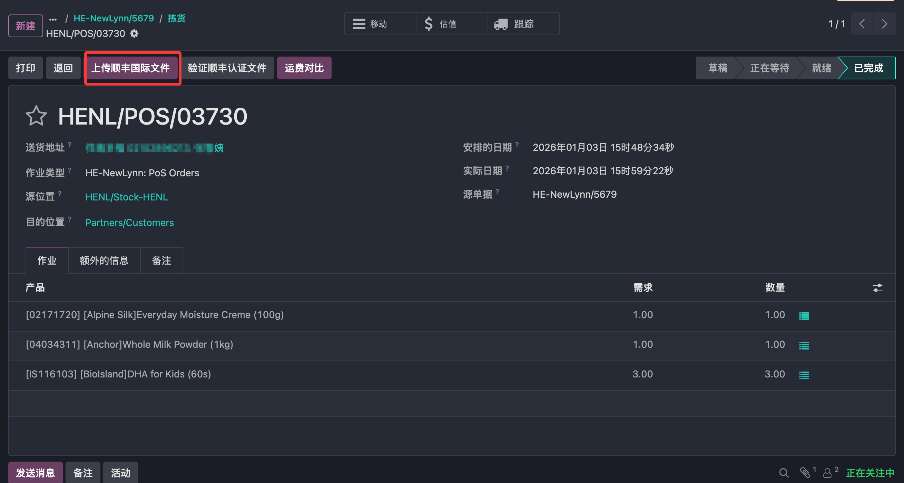
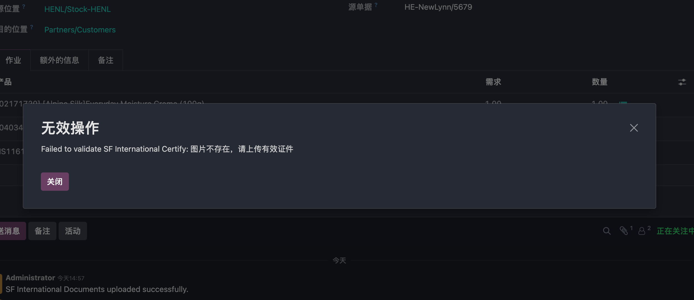

# 顺丰国际

* [前期准备](#前期准备)
  * [创建APP](#创建app)
  * [Odoo配置](#odoo配置)
* [常规业务](#常规业务解决方案)
  * [运费预估](#运费预估)
  * [电子面单](#电子面单)
  * [物流跟踪](#物流跟踪)
* [跨境业务](#跨境业务解决方案)
  * [海关申报](#海关申报)

虽然顺丰模块支持部分香港业务，但对于跨境电商以及对外贸易等行业来说还是功能欠缺。这个时候更应该使用顺丰国际来对接业务，顺丰国际对跨境运输以及海关报关等业务也提供给了更多的支持。

本章我们就来看如何使用顺丰国际来完成跨境业务的使用。

## 前期准备

与丰桥不同，顺丰国际要使用顺丰国际的[开放平台](https://openapi-portal.sf.global/)，与国内丰桥不是一套体系，因此需要重新注册一个账号。具体注册方法这里就不赘述了。

### 创建APP

注册完成后，我们要到开放平台的控制台创建一个APP应用。

创建完成后，我们可以拿到应用的几个关键参数

* APPKEY
* APPSCERT
* AESKEY
* CUSTOM_CODE

最后，我们需要把我们需要使用的API接口关联到我们的APP上

### Odoo配置

配置完顺丰国际开放平台，接下来我们来在odoo中进行配置。首先，我们需要安装由[青岛欧姆网络科技](https://www.qingsolution.com)自主研发的[顺丰国际模块](https://apps.odoo.com/apps/modules/18.0/mommy_delivery_sfi)：

安装完成后，我们在仓库-配置-发货方式中选择顺丰国际，然后将我们获取到的参数配置：

配置完成后，我们就可以使用顺丰国际进行发货了。

## 常规业务解决方案

下面我们先来看一下如何使用顺丰国际模块来完成常规业务的操作：

### 运费预估

我们在创建完销售订单后，点击添加送货方式，在弹窗中选择顺丰国际，然后输入订单货物总重量，然后点击获取费率：

就可以看到本次发货大概需要的运费。

### 电子面单

跟国内顺丰模块使用类似，我们在发单中点击验证完成发货之后，系统会自动填充从顺丰国际获取到的运单号，并自动将电子面单输出到讨论区：

### 物流跟踪

点击物流跟踪按钮就可以打开顺丰国际的官方网站对此单号进行物流轨迹查询。

## 跨境业务解决方案

顺丰国际能够更好地支持跨境电商的业务，下面我们来看一下对跨境业务的支持。

### 海关申报

跨境业务通常都需要对海关申报产品信息和收寄方资料，对此我们做了适配。需要在个人资料中配置用户的身份信息：

然后我们在发货单中生成电子面单后，可以点击上传顺丰国际文件按钮将个人身份资料提交报关：

上传后可以点击验证顺丰认证文件按钮，对提交的认证资料进行认证。如果认证不通过，将会提示重传。

