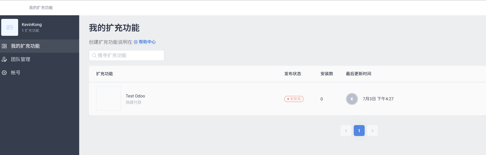
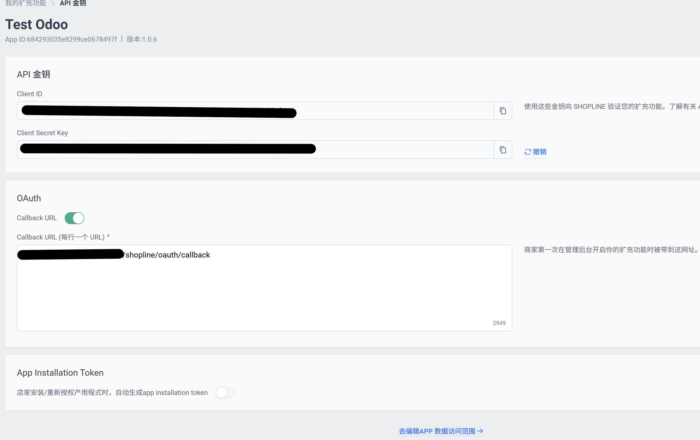
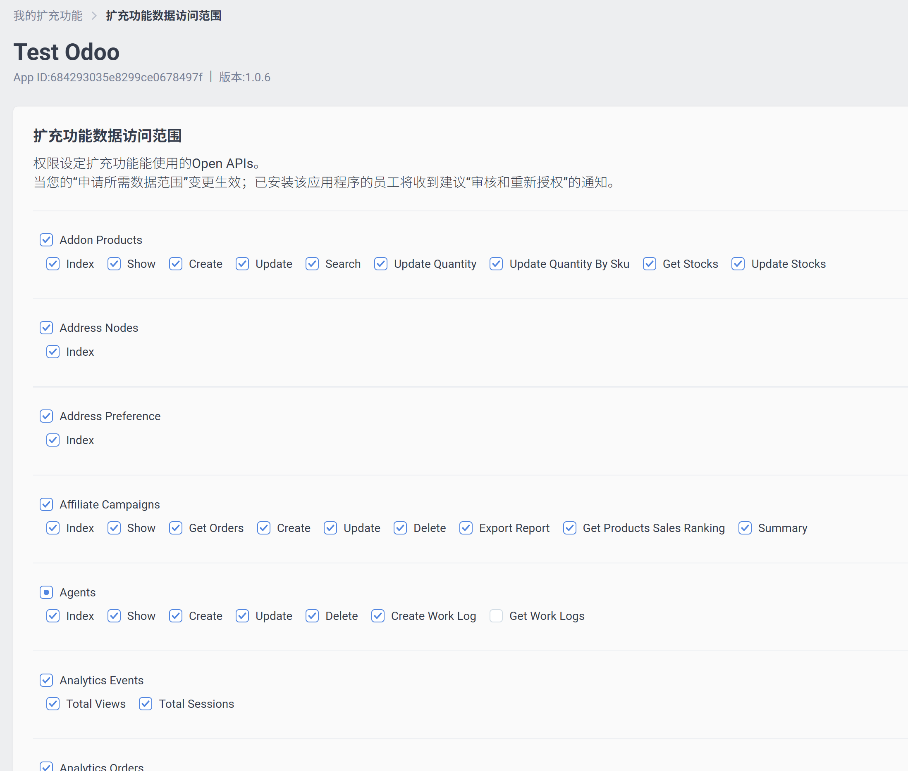
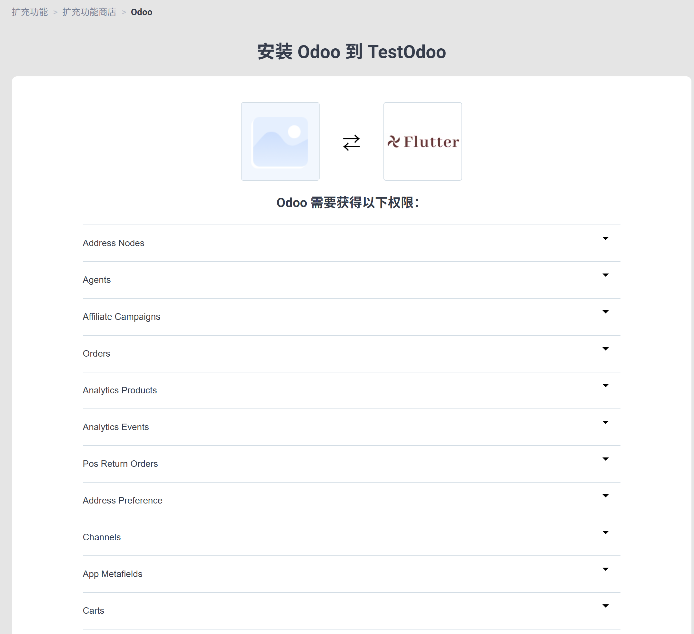
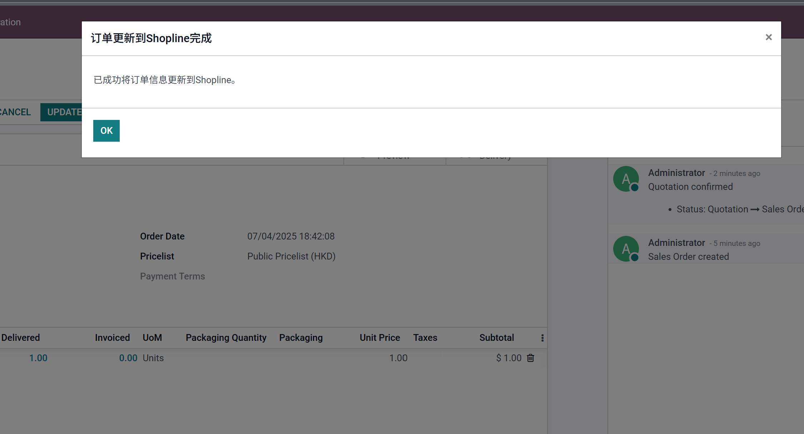

# Shopline 对接

Shopline 成立于 2013 年，总部最初设在香港，是亚洲领先的智能电商 SaaS 平台，致力于帮助商家“sell from anywhere, to anywhere” 覆盖电商、社交电商、线下 POS 和跨境营运等一体化方案，构建统一的商业生态系统。

今天我们看一下如何利用Odoo跟Shopline对接，帮助Shopline上的客户用Odoo来管理自己的ERP业务。

> 本文适用于Shopline HK、JP和TW 

> 适用版本： 15.6 / 18.0.1.3

* [Shopline端设置](#shopline端设置)
  * [注册开发者](#一-自行注册开发者账号)
    * [设置回调地址](#设置回调地址)
    * [设置访问权限](#设置访问权限)
    * [部署应用上架](#部署应用上架)
    * [安装应用](#安装应用)
  * [使用欧姆网络科技提供的扩展](#二使用欧姆网络科技提供的扩展)
* [Odoo端设置](#odoo端设置)
  * [创建shopline应用](#创建shopline应用)
  * [访问授权](#访问授权)
  * [同步客户](#同步客户)
  * [同步产品](#同步产品)
  * [同步订单](#同步订单)
  * [回传发货状态和物流单号](#回传发货状态和物流单号)
* [结语](#结语)

## Shopline端设置

Shopline有两种设置方式，一种是自行注册开发者，自行创建和部署应用。另外一种是使用我们提供的应用商店中的应用，直接安装使用。

### 一、 自行注册开发者账号

首先我们要到Shopline的[开发者中心](https://developers.shoplineapp.com/)注册一个开发者账号。然后创建一个应用:

#### 设置回调地址

Shopline的回调地址需要通过白名单认证，只有经过白名单认证的回调地址才会成功。

#### 设置访问权限

Shopline对于资源访问设置了详细的权限，我们的应用如果想要访问对应的权限需要在授权中选择相应的权限范围：

#### 部署应用上架

设置完之后，我们要将我们的应用提交审核后才可以被安装和正式使用。

#### 安装应用

应用上架之后，我们需要在我们的Shopline[商家后台](https://admin.shoplineapp.com/)安装此应用：

### 二、使用欧姆网络科技提供的扩展

使用我们的提供的扩展可以免去安装和部署的麻烦。在Shopline应用中心搜索Odoo，然后直接安装。
联系我们的客服将您的网站回调地址添加到应用列表中即可完成配置。

## Odoo端设置

首先，我们要在应用中心中安装mommy_shopline模块，然后在主页面中进入Shopline应用。

### 创建shopline应用

我们在设置-App中，创建一个Shopline的应用，然后把我们在前面获取到的Client ID、密钥和商家ID填入到指定的位置:

然后我们客户以点测试链接按钮，查看我们的设置是否有误。

### 访问授权

设置无误之后，我们需要点击授权按钮，系统将会让我们去Shopline官网进行授权，授权之后，我们会返回Odoo主界面。之后，我们就可以正常使用Shopline的应用功能了。

### 同步客户

我们到设置中，点击同步客户，可以将Shopline上的客户同步到Odoo中。

同步客户有如下几个选项：

* 绑定公司: 如果勾选，那么客户同步的时候会自动绑定到当前公司

### 同步产品

同步完客户，接下来我们就可以同步产品了。同样地，在设置中，点击同步产品菜单，完成产品的同步：

1. 产品同步的字段列表
    * 名称
    * 图片
    * 重量
    * SKU
    * 条码
    * 售价
    * 成本价

2. 如果产品在Shopline中设置有变体，也同样会同步到变体中。
3. Shopline中一个产品支持的变量设置最多三种。
4. Shopline的变体的SKU可以重复，但odoo不可以，如果Shopline中的变体包含有相同的SKU，那么odoo同步过来的SKU将是空值。

#### 产品同步逻辑

Shopline支持自定义属性配置(最多3个)，我们在同步产品的时候，首先是同步的产品模板，如果产品在Shopline的商品设置有变体，那么Odoo将会自动将变体的属性同步下来，然后再将变体同步。

变体属性同步时，优先使用英文名称、如果英文名称不存在，那么使用中文名称(zh-hant)。

#### 绑定公司

同样的，产品同步的同时也可以指定是否绑定公司，在设置中勾选绑定公司：

此时，从Shopline同步的产品将仅供当前公司可用。

### 同步订单

同步产品有如下设置可选：

* 替换订单号：如果勾选，那么同步的订单会使用Shopline的订单号
* 静默异常：系统不提示同步过程中发生的异常
* 订单状态： 同步指定的Shopline状态到本地，不选择则同步所有状态的订单。
* 自动确认： 同步订单后是否自动确认，默认为False。如果同步的订单已经确认，那么将会跳过此订单。
* 付款状态： 同步指定付款状态的Shopline订单到Odoo，不选择同步所有订单。

如果订单包含送货方式，那么odoo也可以自动将送货方式同步下来，但是需要提前设置好运费的产品:

* 默认运费产品： 指定送货方式关联的运费产品。

我们同步Shopline的订单，点击同步订单按钮：

我们可以看到来自Shopline的订单，以及包含指定了的送货方式。

> Shopline的配送方式可能与Odoo的送货方式没有强关联关系，用户可以在同步了送货方式后再自行匹配Odoo的承运商。

### 回传发货状态和物流单号

当我们在Odoo中完成了发货，我们可以把我们的发货状态和物流单号回传给Shopline，方法十分简单，在发货完成后，在订单中点击上传Shopline按钮即可。

我们在SHopline的商家后台可以看到我们的订单已经变为已发货，也已经有了跟踪单号：

## 结语

现阶段我们只是完成了Shopline的基础功能对接，后续我们会推出更多实用的功能，敬请期待。