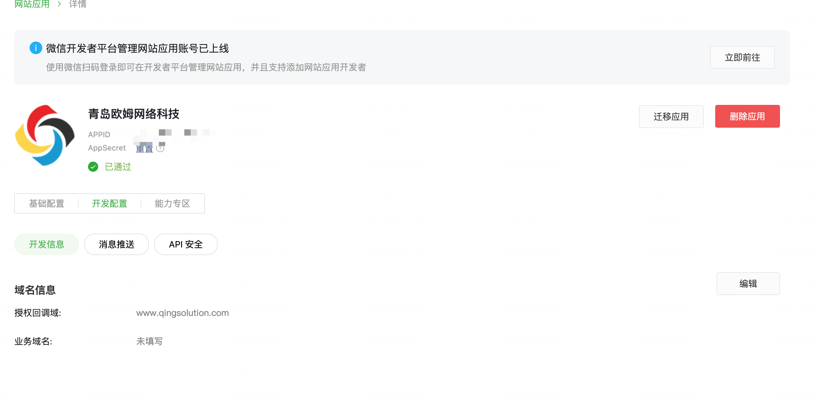
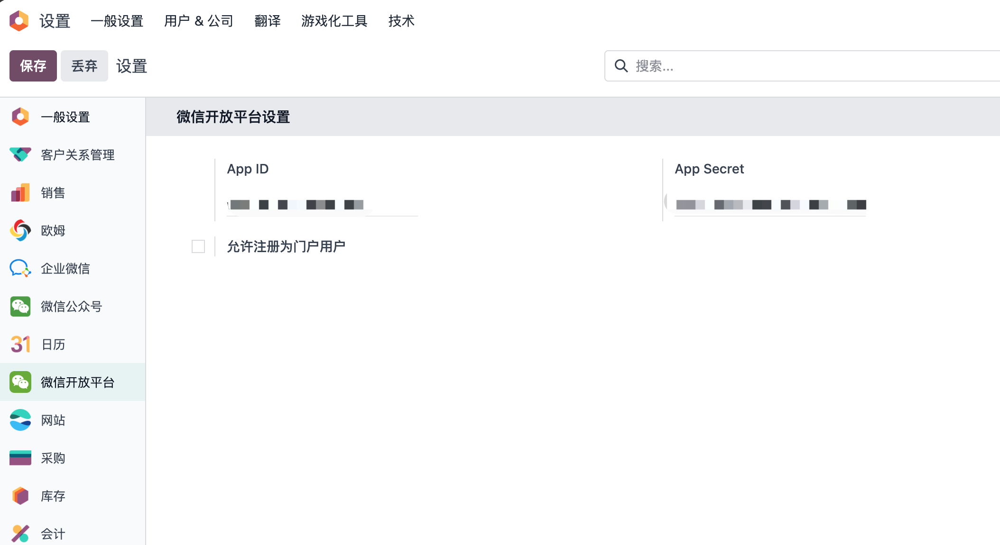
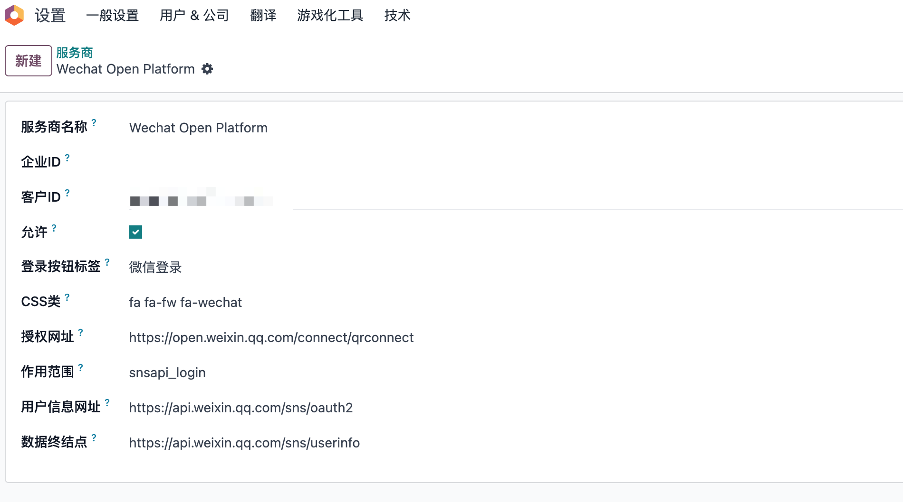
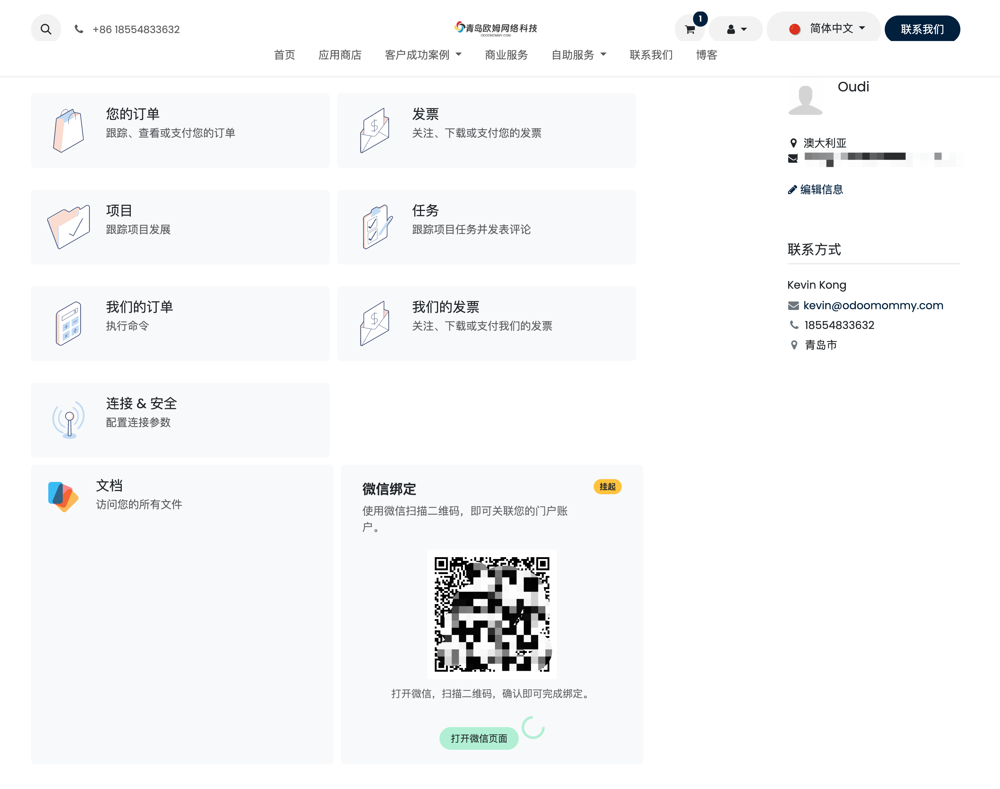

# 微信扫码登录

* [注册开放平台应用](#注册开放平台应用)
* [Odoo中的配置](#odoo中的配置)

本章我们看一下如何借助[微信开放平台](https://open.weixin.qq.com/)的能力实现用户微信扫码注册和登录、以及已有用户的微信绑定功能。

> 适用于18.0.1.5+ 19.0.1.2+

## 注册开放平台应用

我们在安装微信扫码登录模块之前，需要到开放平台注册一个网站应用。

### 获取APPID和APP Secret

创建完应用，我们要获取该应用的APPID 和APP Secret。

### 配置回调域名

同时我们要设置开放平台应用的回调域名，填写我们odoo的域名。域名不一致将导致认证失败。

## Odoo中的配置

接下来我们看如何在Odoo中进行设置。

### 配置APPID和Secret

首先，我们到设置-用户-OAuth提供方菜单下找到**微信开放平台**, 然后将应用APPID填入到客户ID中：

如果网站允许客户使用微信扫码注册，勾选下方的**允许注册为门户用户**选项即可。#

### 激活OAuth登录

默认情况下，微信扫码登录时禁用状态。可以在设置-用户和公司-OAuth服务商中选择微信开放平台，勾选允许：

## 应用

配置完成，我们看一下实际运行效果。

### 注册页面

我们到网站的注册页面查看：

可以看到出现了微信扫码按钮，我们点击它，系统会引导我们进入扫码页面：

我们扫码即可完成注册，进入门户个人中心。

### 登录页面

同样地，我们在登录页面也可以点击扫码登录，完成一键登录。

### 个人中心绑定

如果是普通注册的用户，我们也提供了快捷绑定方法，在个人中心中，扫码完成绑定即可。

