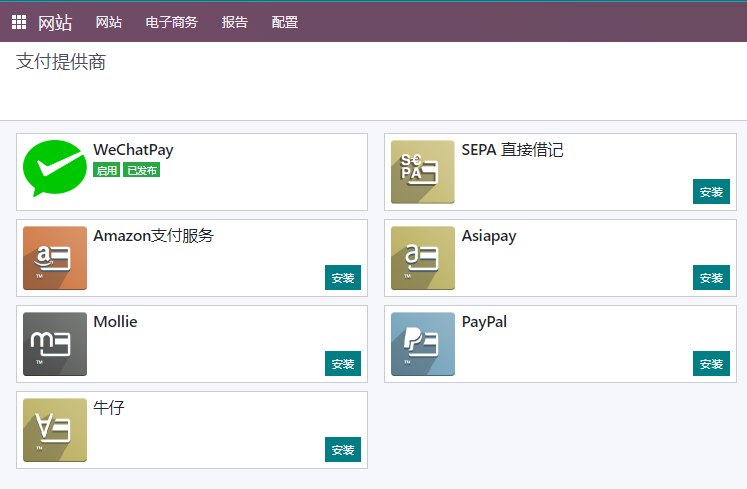
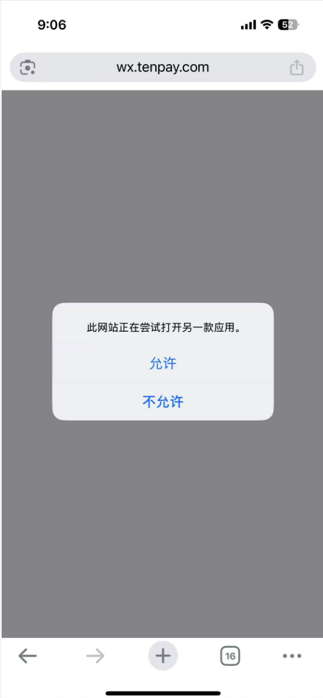

# 微信支付解决方案

* [先决条件](#先决条件)
  * [安装支付模块](#安装微信支付模块)
* [在线商城](#在线商城)
* [销售订单在线支付](#销售订单在线支付)
* [发票在线支付](#发票在线支付)

作为国内移动支付的两大提供商之一的微信支付并不在Odoo官方的支持列表中，甚至曾经一度被官方支持的支付宝(Alipay)也在16.0以后的版本中遭到的过时的标记，被并入了asipay的选项中。国内的生态不被官方重视也并非一日，但是需求并不会因为不被重视而消失，因此，我们在欧姆网络科技解决方案中实现了微信支付接入，下面来详细介绍一下。

## 先决条件

我们要使用微信支付首先要开通[微信商户平台](https://pay.weixin.qq.com/)，还要有一个支付场景（PC网站/APP/小程序/公众号），然后才可以接入到微信支付。

## 安装微信支付模块

我们在安装了微信支付模块之后，就可以在支付提供商菜单中看到微信支付的选项，然后我们点击激活，完成微信支付的启用。

### 配置指引

由于微信支付并没有提供沙箱环境，因此我们无法使用测试模式。这里我们直接配置生产环境参数：

* 微信支付APPID： 应用ID(公众号、[微信开放平台](https://open.weixin.qq.com/)认证的网站、小程序、微信小店等微信应用的AppID)
* API密钥: 商户API密钥
* 商家ID： [微信商户平台](https://pay.weixin.qq.com/)的商户号(10位数字)
* 商户密钥路径: 商户密钥文件路径(例如，/opt/odoo/perms/apiclient_key.pem)
* 商户证书路径: 商户证书文件路径(例如，/opt/odoo/perms/apiclient_cert.pem)

配置好了微信支付，那么我们来看它在odoo中的三个使用场景。

## 在线商城

配置完微信支付的基础配置，我们就可以使用微信支付了。下面我们来看一个动图例子：

## 销售订单在线支付

同样的，我们也可以在订单确认之后直接给客户发送支付链接，客户点开链接之后可以直接使用微信扫码付款：

## 发票在线支付

用户点击我们发送的邮件中invoice的链接或是门户预览，都可以找到支付按钮完成支付：

## H5支付

> 18.0.2.0+ 版本支持

微信支付的扫码支付方案不再支持微信照片扫描支付，因此我们前面的方案在移动端不能使用。用户需要在另外一台手机上扫码才能完成支付，这无疑增加了用户的支付步骤。我们在后续的版本中增加了对H5功能的支持，当用户在移动端进行操作的时候会自动唤起微信应用完成支付。

下面是操作说明：

