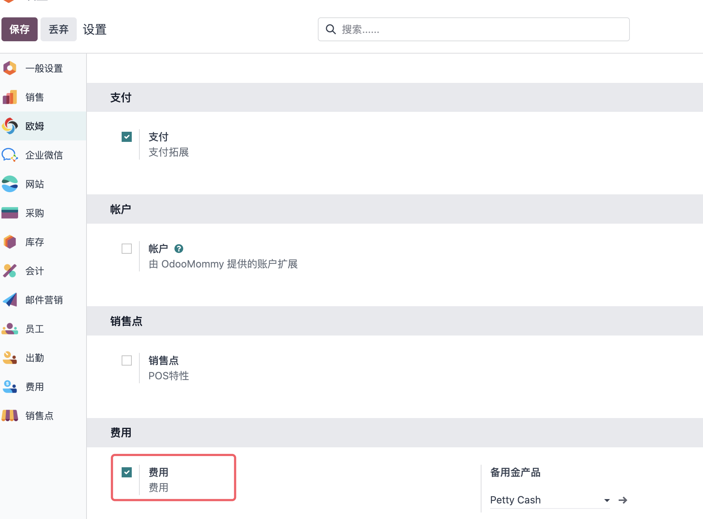
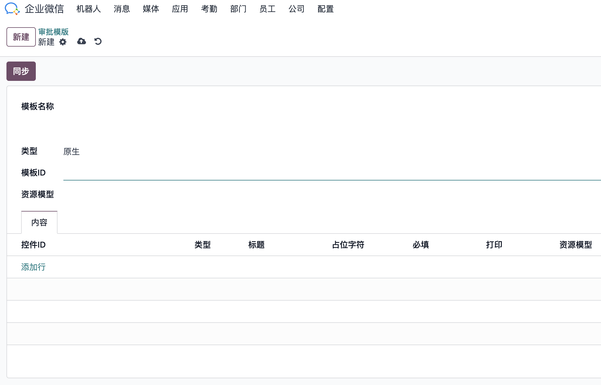
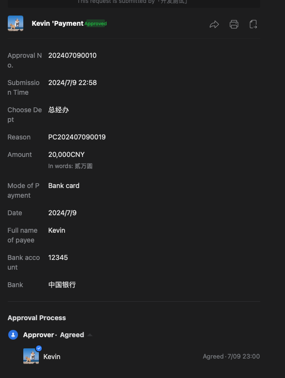
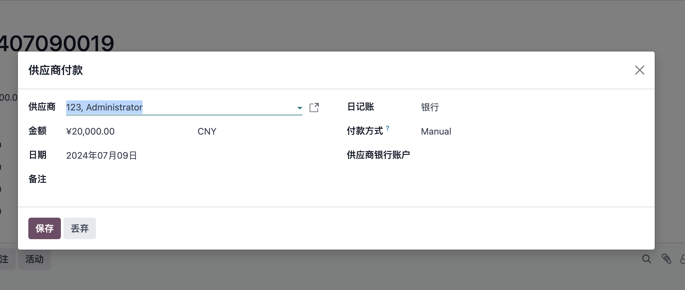
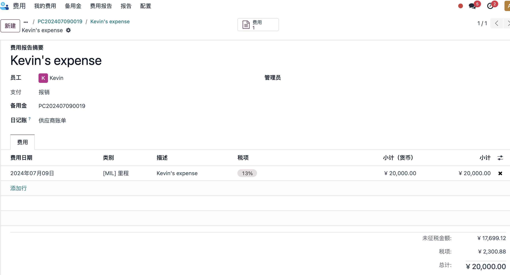
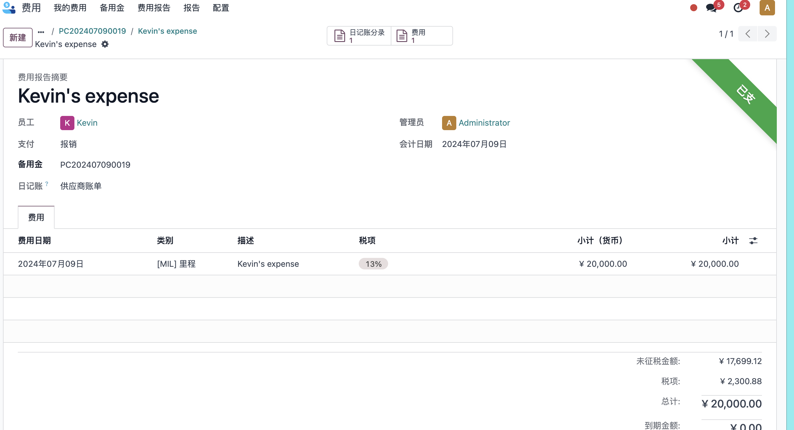

# 第六章 基于企业微信的备用金和费用报销

前面讲过了企业微信的基础应用，现在我们来看一下如何借助企业微信的审批端能力结合odoo来实现企业中的两大常规业务流程**备用金**和**费用报销**。
本章我们先来看如何使用备用金流程。

## 企业微信端设置

我们这里使用的是企业微信的原生审批流程，因此我们需要首先在企业微信端设置好审批流程的节点设置。


我们这里使用的是企业微信的付款流程，用户可以根据自己的实际需求进行相应的调整。

## 审批模板配置

首先我们需要在odoo中其启用欧姆解决方案中的费用和企业微信的费用审批功能。



开启上述两个功能以后，我们就可以到企业微信-设置-审批模板中将我们需要的审批模板同步到Odoo中了。

具体的同步方式是，我们需要在企业微信后台打开我们想要的审批模板，然后将URL中的模板ID填入到我们的审批表单中的模板ID字段中，然后点击同步按钮。



同步完成后，我们可以看到一个由很多控件组成的表单，它们跟企业微信端的设置是匹配的，我们需要根据我们在odoo中需要使用的模块进行人工匹配，匹配完成后点击保存。


## 备用金申请

设置完审批模板，我们就可以提交备用金审批了。我们到费用-备用金菜单下，新建一个备用金流程：


然后填写相应的员工、金额和日期，然后点击提交。

提交之后，员工的上级就会在企业微信端收到一个审批提醒:


审批人员在企业微信端点击审批通过或者拒绝，即可把审批后的状态推送到Odoo中进行更新。



如果推送不成功，员工也可以手动点击刷新按钮进行状态刷新。



审批通过之后，财务人员选择付款方式，然后点击付款，完成付款即可。


## 备用金还款和费用报销

员工办事完成之后，会出现以下三种情况：

* 备用金不够，报销后需要额外支付员工自己垫付的资金
* 备用金恰好用完，直接提交费用清单和报销凭据
* 备用金剩余，需要将报销后剩余的备用金返还

### 退款

如果备用金有剩余，在备用金界面点击退款按钮，直接将剩余备用金入帐。


### 费用报销

费用报销抵扣备用金，直接在备用金界面点击创建费用，进入费用报销流程。



同样的，费用报告提交审批后，主管或经理会在企业微信端收到提醒，审批通过后，财务人员进行费用核销。


财务人员在记账之后，系统出现付款按钮，如果是费用金额恰好等于备用金金额，无需额外操作，账单将被直接标记为已支付。



如果有员工自己垫付的费用，那么系统将会提示，需要给员工进行额外支付。


## FAQ

```sh
field `creator_userid` expect type `string`. invalid Request Parameter, hint: [1720512723142834164225648], from ip: 39.88.46.36, more info at https://open.work.weixin.qq.com/devtool/query?e=40058
```

出现此错误有两种可能的原因：

1. 企业微信中对应的审批流程没有设置
2. Odoo中提交的人员信息没有企业微信OpenID