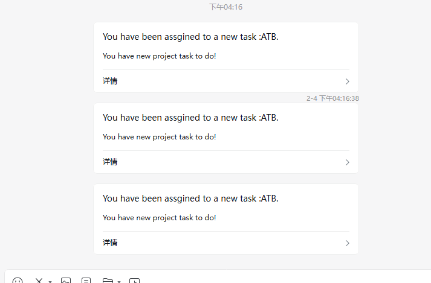
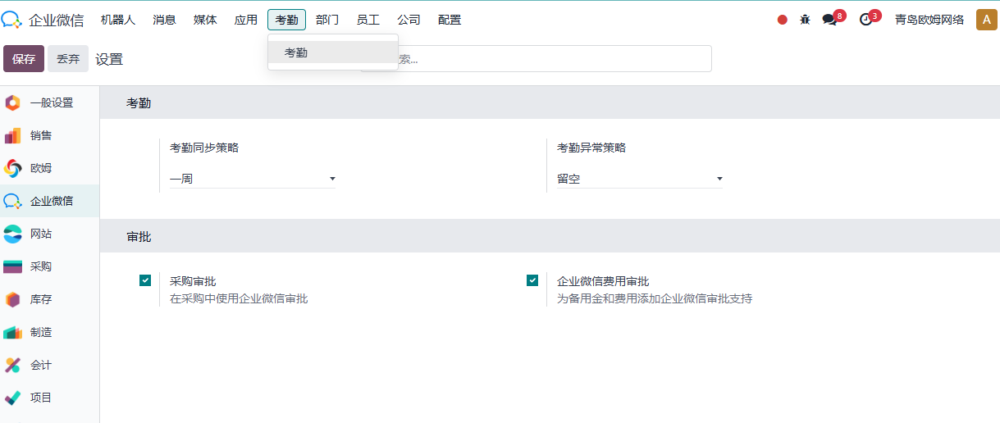
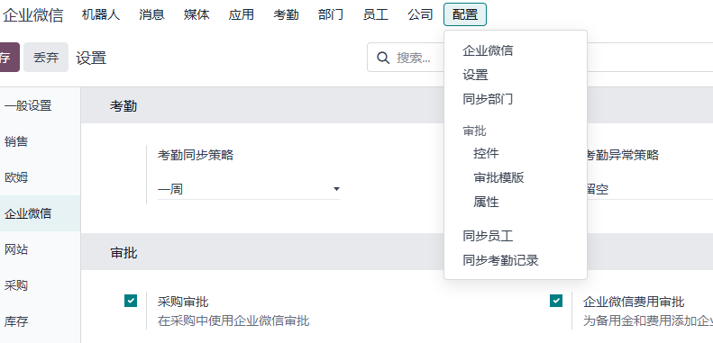
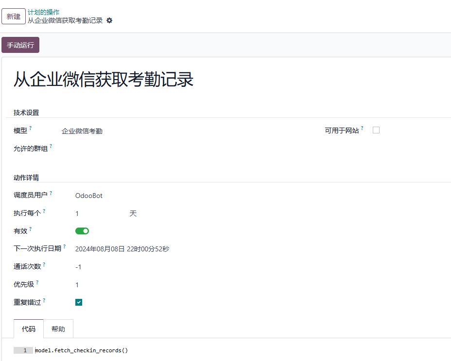
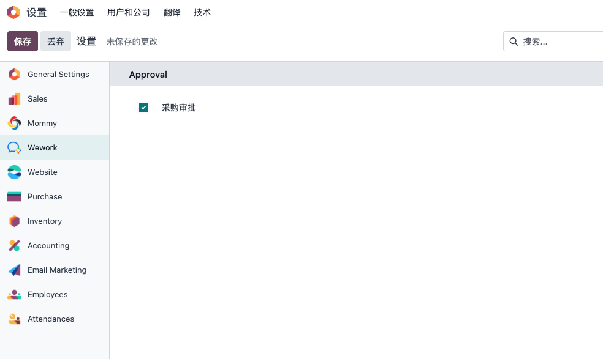
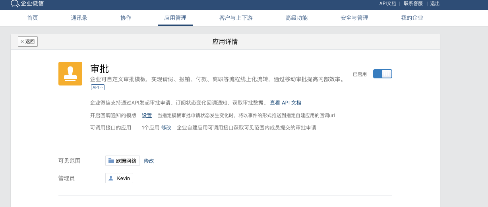
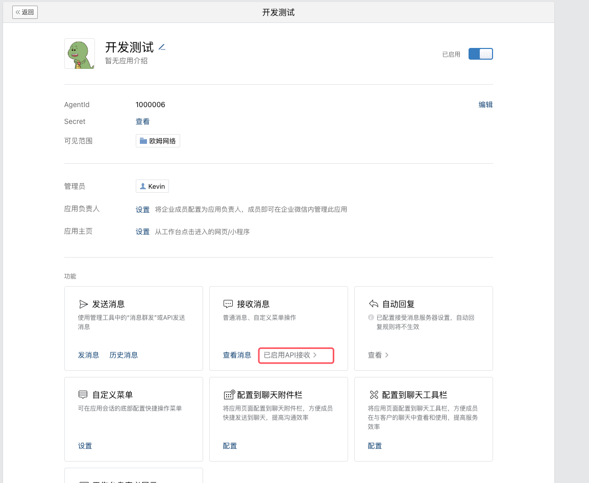
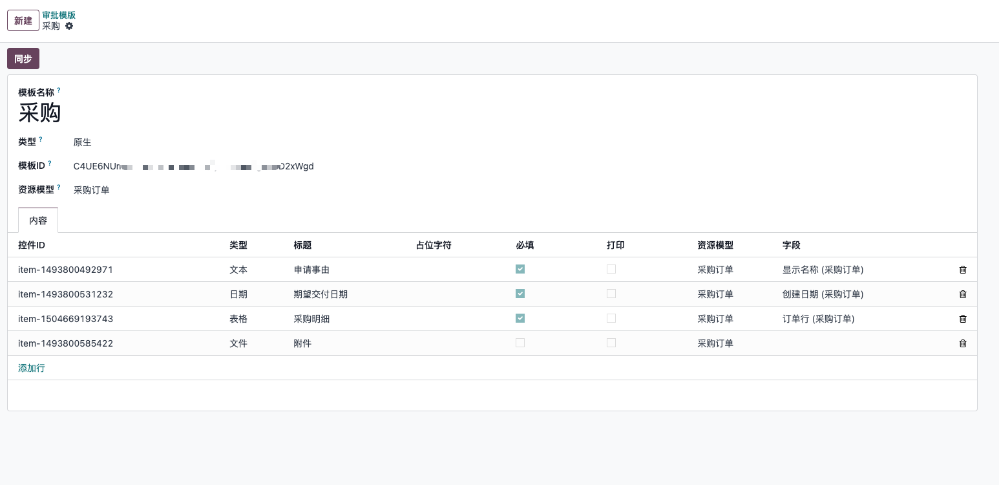
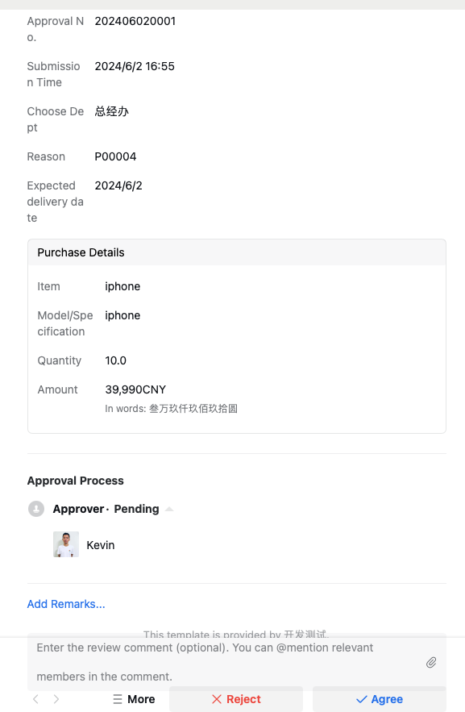
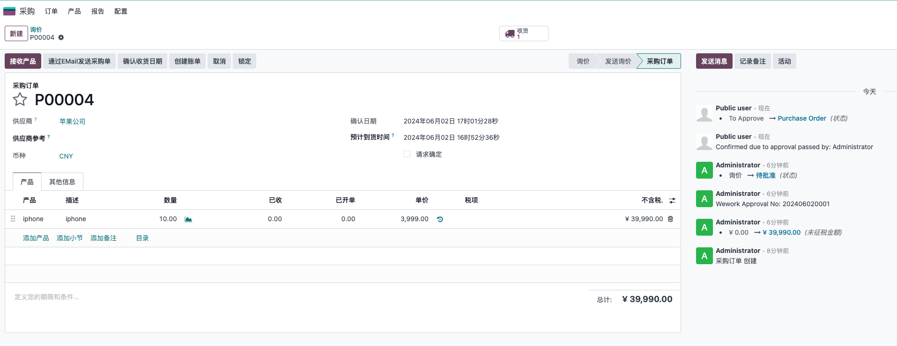

# 第二章 企业微信高级应用

在前面我们了解了企业微信和odoo的基础应用，实际上结合企业微信odoo可以做的东西更多。本章我们就将带来高级版的内容介绍。


* [项目](#项目)
* [考勤](#考勤)
* [审批](#审批)

## 项目

我们对项目模块也加入了支持，用户需要在设置中打开项目支持功能


当项目管理员在任务中给员工分配了任务时，会自动给员工发送一条企业微信通知。




员工还可以在企业微信里直接通过链接打开该任务。

## 考勤

企业微信方案解决了日常公司管理中的考勤问题，下面我们看一下如何使用。

### 查看企业微信考勤记录

首先，我们要把在企业微信管理后台把打卡的权限开放给我们的自建应用。


> 企业微信官方于2023-12-01之前的应用使用打卡专属APPID和密钥，之后的版本取消了。

安装了高级版企业微信应用之后，我们可以在根菜单下看到一个考勤菜单：



我们点开考勤菜单可以看到考勤人员的列表，点开其中一个可以看到该人员的所有企业微信考勤记录。


### 原生考勤记录

我们在同步企业微信考勤记录的时候，同步把记录同步到了原生的出勤应用中，以方便后期的薪酬统计。


### 同步设置

考虑到不同客户的不同需求，我们在设置中对同步操作做了一个策略:

* 今天： 只同步今天的考勤记录
* 一周： 同步截至到今天的一周前的考勤记录
* 一月： 同步截止到今天的一月的考勤记录

> 针对特定日期的同步，用户可以在定时任务中指定特定的日期进行同步，详细方案请咨询[欧姆网络](https://odoohub.com.cn)技术支持。

在创建原生应用的考勤记录时，通常会有诸多条件限制，例如，原生不允许在缺少前一天的签出记录的情况下创建新的签到记录。因此，我们加入了在碰到同步异常时的策略：

* 留空： 即碰到异常则跳过当前记录的同步
* 与签到时间一致： 使用签到时间作为签出时间，以保证原生记录的完整性 

### 同步操作

为了方便用户操作，我们在多个地方加入了同步设置。首先，用户可以在企业微信的设置菜单中，点击**同步考勤记录**菜单进行同步：



单击此菜单后，系统会根据设置中的同步策略自动同步企业微信考勤记录。

另外，我们也可以单独针对某个员工进行同步，步骤是点击员工资料，在**动作-同步企业微信考勤记录**：


最后，我们在定时任务中也加入了同步功能，用户可以根据自己的需求设置自动同步任务计划，以节省手动操作：



## 审批

由于Odoo原生并未实现复杂的审批流程设置，常见的解决方案是使用OCA的tier系列模块，但由于过于复杂的设置和并不十分友好的展示方式，导致企业在实际使用落地过程中的体验并不是很理想。鉴于国内企业主流的使用工具是钉钉，企业微信等IM工具，因此我们在解决方案中添加了对此类软件的支持，借助这些软件提供的审批流功能，从而补齐了Odoo在审批方面的弱项。

现在，我们以采购为例来展示一下，如何借助企业微信来实现审批流的设置。

首先我们要安装企业微信高级版模块,然后在设置-企业微信-审批中勾选采购审批:



### 企业微信后台设置

然后我们要到企业微信后台设置审批应用:



将我们自定义的应用添加审批权限。然后，我们需要到我们的自定义应用中设置后调接口:



配置的回调URL为: ```https://yourdomain/wework/approval```

### 消息设置

然后我们需要在odoo的后台企业微信的设置中添加解析企业微信消息的AESKEY和Token:


### 同步审批模版

然后我们在设置-审批-审批模版中，将采购的模板同步到系统中:



> 企业微信的审批模版分为原生和自定义两类，这里我们使用的是原生模版

然后我们在审批模板中对审批模板的各个控件进行相应的赋值(字段映射)。

### 提交采购审批

完成审批模板的设置之后，就可以在采购询价单中提交微信审批了。


我们在做完询价单后，点击提交微信审批，即可把采购订单提交给企业微信审批流中进行审批。


审批提交成功之后，系统会自动显示出在企业微信中的审批单号和审批状态。



采购管理者在企业微信端审批通过之后，采购订单自动进入确认状态。


