# XERO 对接

Xero是一款基于云的会计软件，专为中小型企业设计，用于管理财务和简化账务流程，在新西兰和澳大利亚有着广泛的应用。本章将演示如何使用Odoo跟Xero进行无缝链接。

> 适用于18.0.1.6 /17.0.1.6

* [XERO端设置](#xero端设置)
  * [获取Tenants ID](#获取tenants-id)
* [Odoo端设置](#odoo端设置)
  * [创建Xero应用](#创建xero-app)
  * [绑定公司](#绑定公司)
  * [OAuth授权](#oauth授权)
* [Odoo中的应用](#odoo中的应用)
  * [客户同步](#客户同步)
  * [发票同步](#发票同步)
  * [修改同步](#修改同步)
  * [科目类型匹配](#科目类型匹配)
  * [手动匹配科目](#手动匹配科目)

## XERO端设置

首先，我们来一下XERO端的设置，我们打开[XERO开发者中心](https://developer.xero.com/app/manage/)，创建一个应用：

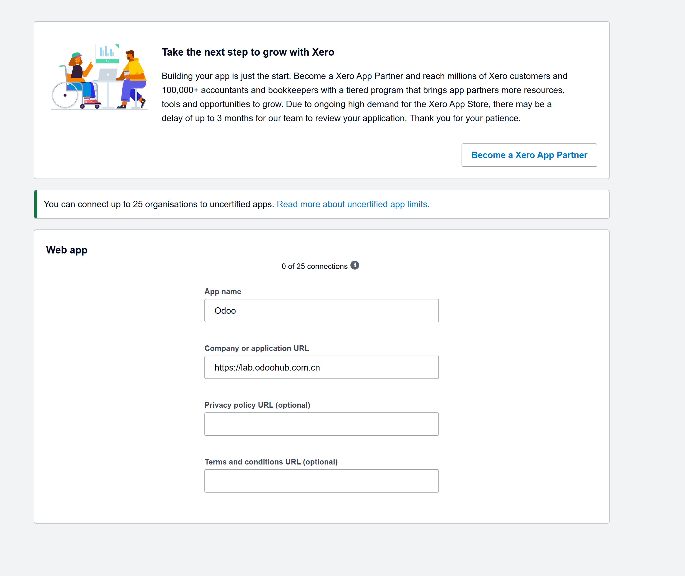

这里需要填写应用名称和应用的网站。

然后我们点击左边的配置，配置我们应用的回调地址：

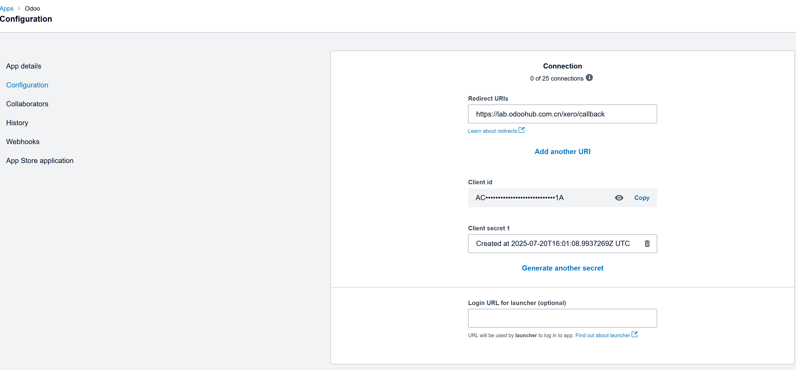

这里我们要获取两个重要的参数：

* Client Id：应用的APPID
* Client Secret： 应用的密钥

### 获取Tenants ID

接下来就是获取商家ID这个参数，点击API Expoloer

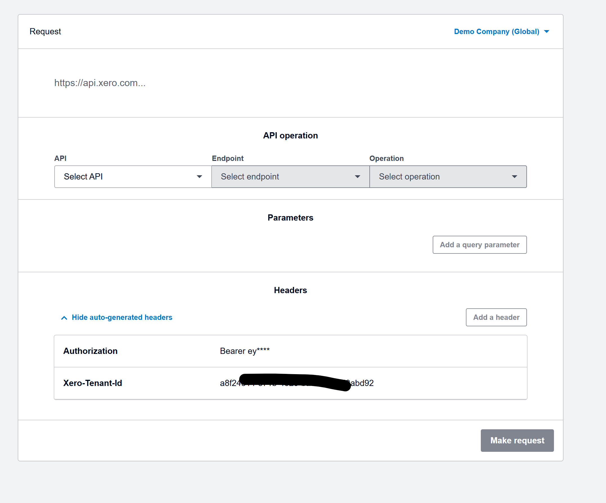

在底部的Headers信息中获取 Tenant ID。

做完以上两步就可以在Odoo中进行对接了。

## Odoo端设置

首先，我们在应用中心中安装[mommy_xero](https://)模块：

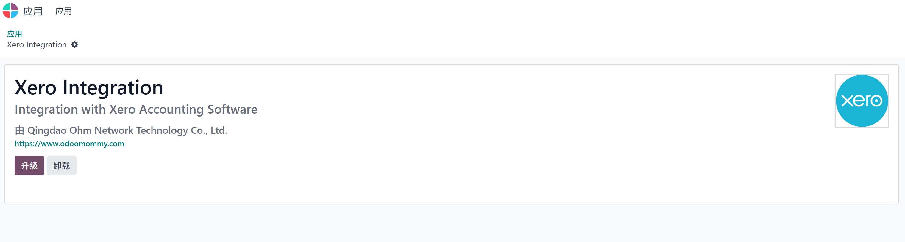

### 创建Xero App

我们在设置中新建一个Xero App，然后将我们在第一步获取到的应用APPID和密钥填到相应的位置中：

然后我们在主应用点击Xero应用进入设置页面：

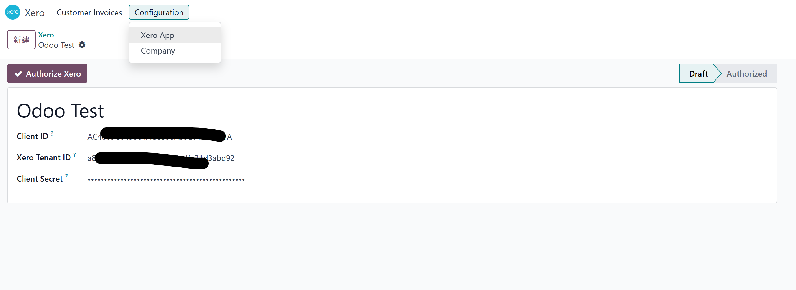

### 绑定公司

创建完应用后，我们需要将应用绑定到当前公司才可以使用，在设置-公司中点击公司，然后选择当前公司，在Xero选项卡中选择我们刚才创建的应用：

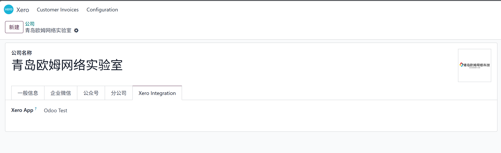

### OAuth授权

由于Xero认证采取的是OAuth2的认证方式，因此我们只有再经过授权之后才可以正常使用。我们回到Xero应用，点击授权按钮，跳转到Xero官网进行认证：

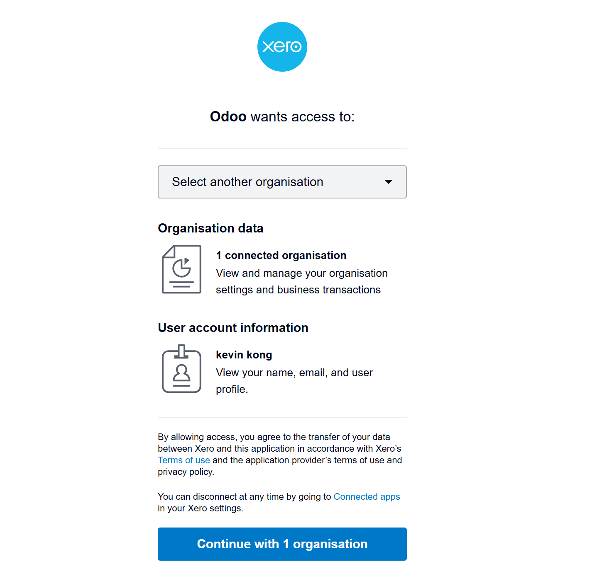

认证完成后，页面会自动跳回到我们的App页面，如果没错，那我们可以看到我们的App处于已认证的状态。

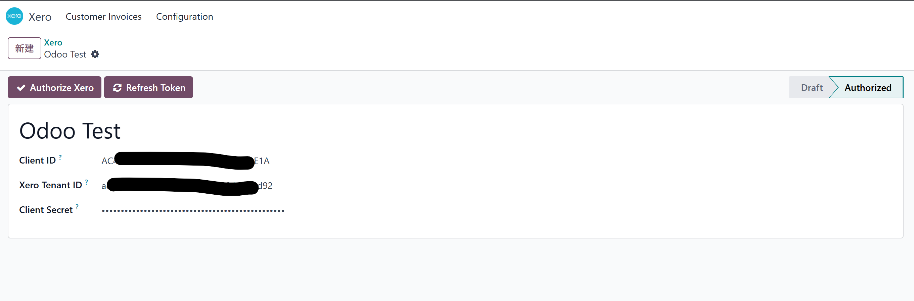

这就意味这我们可以使用Odoo正常跟Xero进行对接了。

> Xero Access Token有效期30分钟， Refresh Access Token 60天。

## Odoo中的应用

接下来，我们看一下如何在Odoo中应用Xero。

### 客户同步

与QuickBooks不同，Xero并没有强制要求我们在同步invoice的时候必须要同步客户，Xero支持只上传文本格式的客户名称。但我们仍然实现了客户同步的功能，以方便用户进行同步。下面我们来看一下如何使用Xero同步客户。

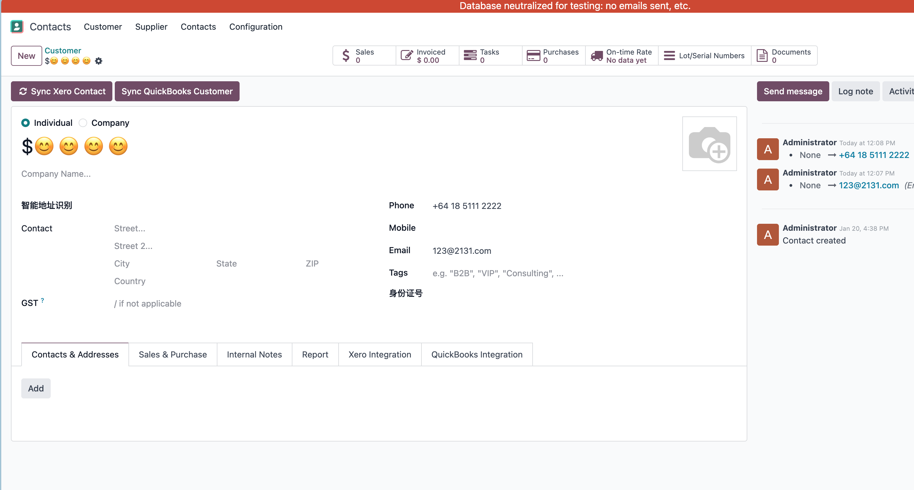

在联系人的表单页面中，我们可以看到同步到Xero的按钮，点击同步即可完成同步操作。同步完成后，联系人资料中的Xero选项卡中会自动将Xero对应的联系人编号写入。

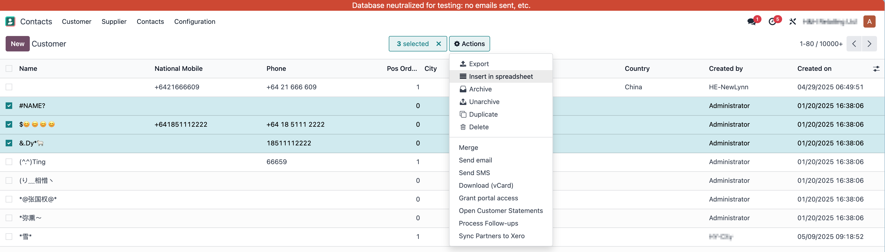

批量同步：如果想要批量同步联系人到Xero，那么在列表视图，勾选想要同步的客户，在动作-同步至Xero的动作中，即可完成同步操作。

**注意**： 联系人资料中的电话或邮箱必须填写，才能同步至Xero

### 产品同步

同样地，我们也可以把产品信息同步到Xero。步骤是，在产品表单页面中点击同步至Xero按钮：

完成同步后，我们可以在Xero选项卡中看到Xero的产品编码。

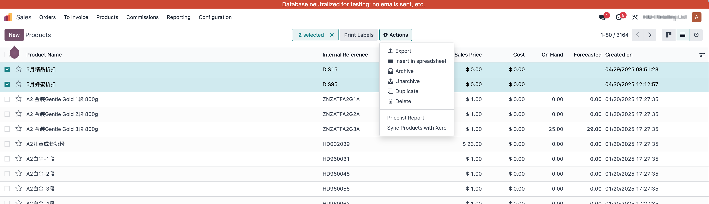

批量同步：在产品列表视图，我们也可以批量将产品信息同步到Xero。

### 发票同步

我们在会计模块中打开客户发票：

然后当我们点击确认或同步Xero按钮后，此发票就会被同步到Xero:

同步成功后，我们可以在xero选项卡中看到xero的invoice id和invocie number

我们到Xero官网上也可以看到我们的发票信息：

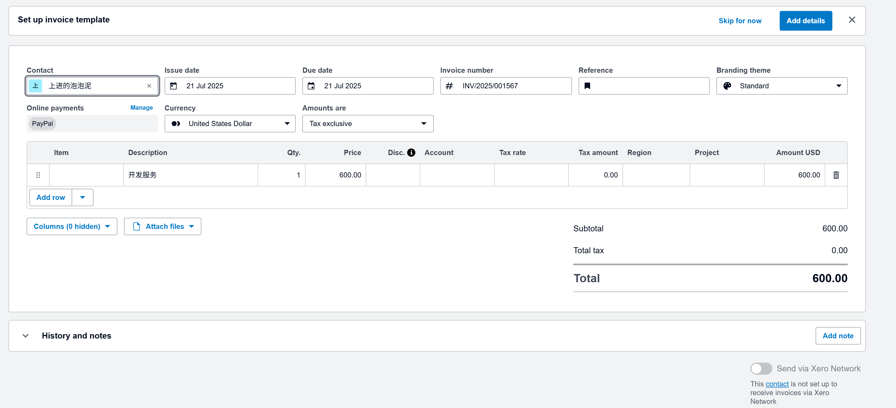

#### 修改同步

当我们修改了发票信息想要同步到Xero时，直接点击同步发票按钮即可。

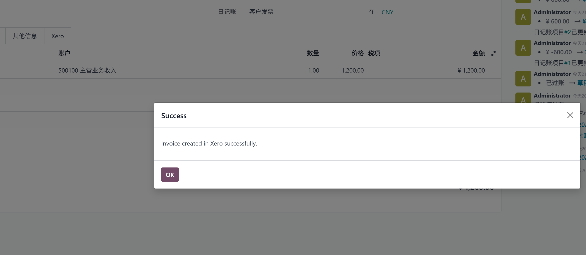

### 科目类型匹配

由于Odoo和Xero的科目类型并不严格一致，因此我们在应用增加了科目类型匹配的策略：

用户可以根据自己的需求调整匹配关系。

之后将调整完的策略绑定到Xero App中即可。

### 手动匹配科目

如果不想让odoo的科目和xero的科目代码保持一致，那么我们可以通过手动的填写xero代码的方式完成匹配。具体步骤：
打开科目列表，找到要匹配的科目，点击Xero选项卡，填写匹配的科目代码即可。

匹配完成后，我们就可以在业务中使用xero的code进行数据同步了。例如，此时我们就可以在invoice中点击同步将我们的发票明细同步给xero，xero会根据自己的科目设置应用相关的处理。

