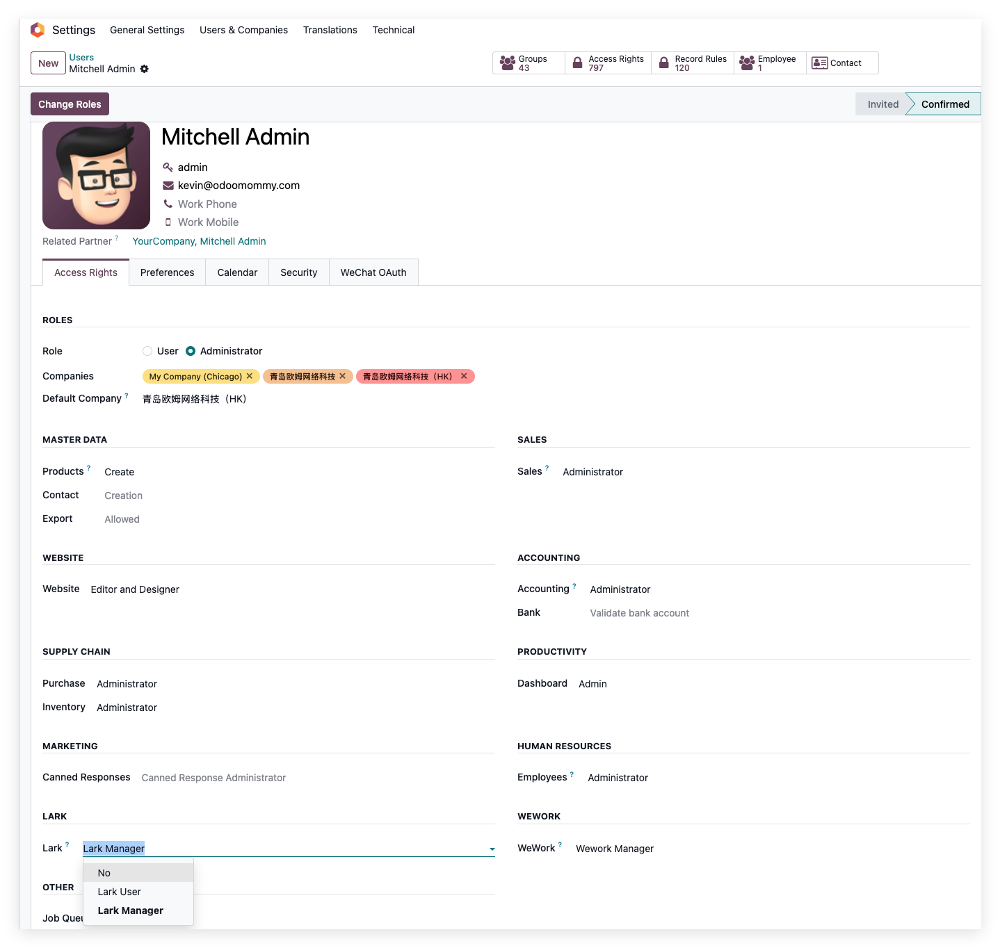
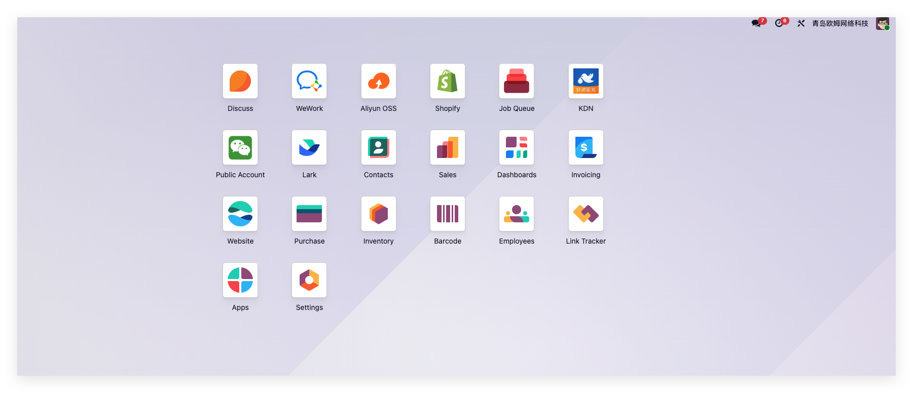
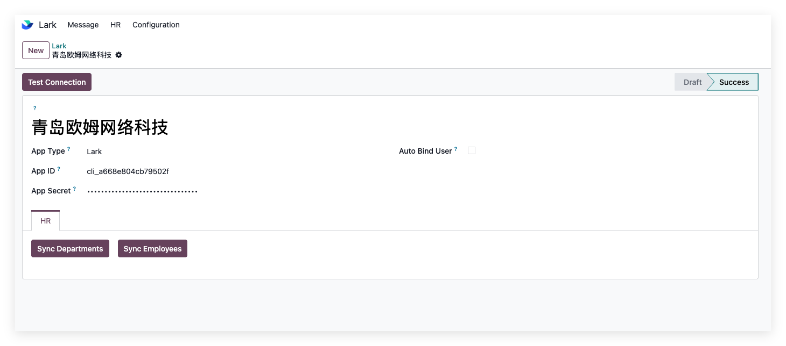
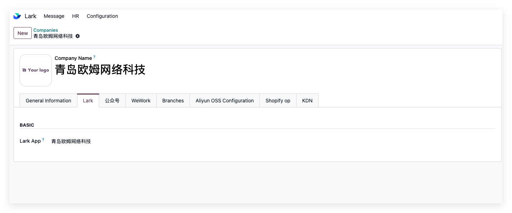
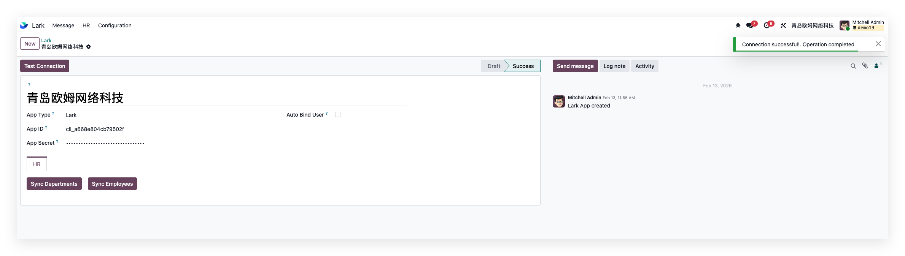
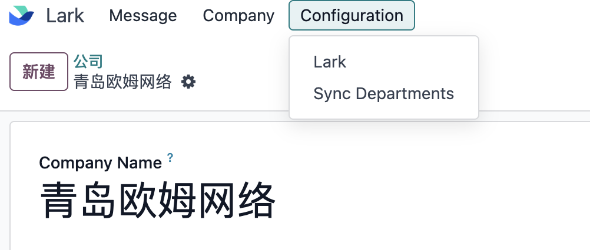
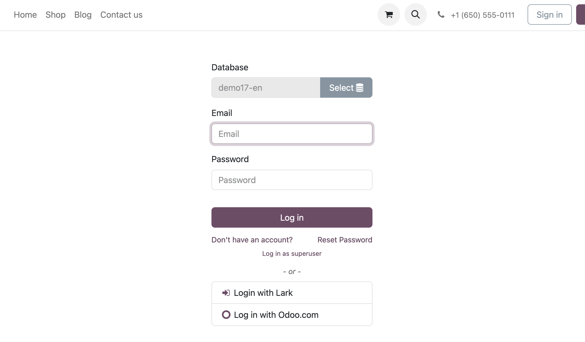
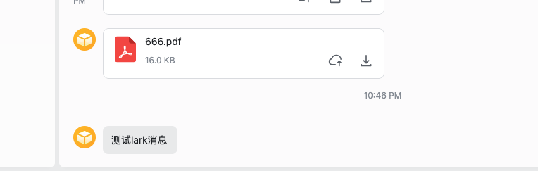

# Lark / 飞书集成

> 当前版本：17.0.1.1+ 18.0.1.0+ 19.0.1.0+

* [模块安装](#模块安装)
* [基础配置](#基础配置)
  * [绑定公司](#绑定公司)
* [基础数据同步](#基础数据同步)
* [扫码登陆](#扫码登陆)
* [讨论消息](#讨论消息)

飞书作为国内企业IM三巨头之一，在国内市场有着不错的口碑，尤其是其多维表格相比企业微信和钉钉有着不小的优势。2而飞书的海外版本Lark，目前在在 日本、新加坡、印度市场增长也非常快，欧洲市场也在不断拓展。

今天我们就来看一下Odoo如何和飞书(lark)进行集成。

## 飞书(lark)端设置

### 创建Lark应用

要实现odoo与lark的对接，我们就需要现在lark开发者中心创建一个lark应用，然后拿到AppID和AppSecret:


* AppID: Lark应用ID
* AppSecret: Lark应用密钥

拿到这两个参数，我们就可以在Odoo中创建应用来开始进行配置了。

## Odoo端设置

### 安装模块

首先我们要在Odoo中安装由青岛欧姆网络科技开发的[飞书/Lark集成模块](https://apps.odoo.com/apps/modules/19.0/mommy_lark)，然后点击安装。


### 设置用户权限

安装完成后，需要给使用的用户一个lark的权限：



### 基础配置

回到Odoo主界面，点击飞书/Lark图标，进入飞书应用：



然后将我们在飞书(Lark)开放平台获取到的App ID和App Secret填入到对应的位置:



### 绑定公司

创建好应用之后，我们要在使用的公司设置中绑定应用。



这样我们的基础配置工作就完成了。我们可以点击测试链接按钮来测试一下我们的配置是否完全正确。



如果我们配置无误，那么系统会在右上角弹出链接成功的提示。

## 应用

配置完成，接下来我们看一下如何使用，首先我们来看数据的同步。

### 基础数据同步

1. 同步部门数据：点击设置-同步部门菜单，完成后提示同步成功。

    

2. 同步员工数据：打开同步的部门，然后在上方按钮点击同步员工，即可完成该部门员工的同步。

    

这样基础数据同步完成。

### 扫码登陆

Odoo也支持飞书(Lark)扫码登陆。不过我们需要先在开放平台中给我们的应用添加网页能力：

1. 登陆开放平台，给应用添加**网页应用**的能力，并设置网页端URL:

    

    Redirect Url的设置填写：

    ```sh
    你的Odoo地址/mommy_lark/authorize
    ```

2. 在开发配置-权限管理中，给应用设置contact:contact权限：

    

3. 在odoo中，打开开发者模式，在用户和公司-OAuth提供商菜单下，激活Lark登陆:

    

这样用户就可以在odoo登陆界面使用lark扫码登陆。实际效果：




完成授权后，系统将会自动跳转到Odoo绑定的系统账号内。

### 讨论消息

Lark也支持讨论消息同步。

首先，在需要在lark端接收讨论消息的用户中，打开设置：


然后我们在用户关注的文档中，给用户发送一个文本消息：


然后用户就可以在lark中收到消息推送：

。

