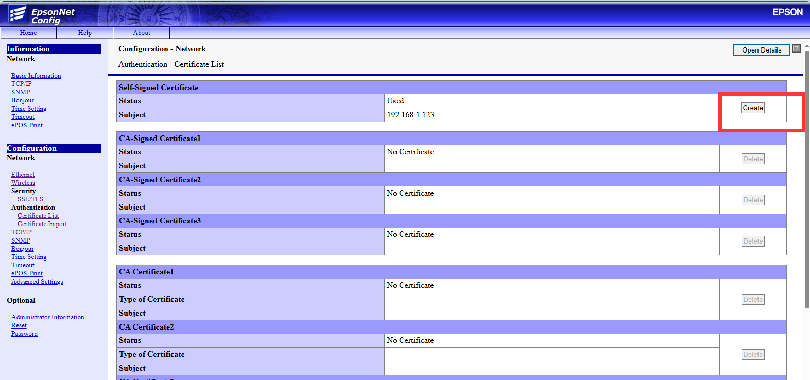

# 第一章

## 使用EPOS打印

Odoo支持一下打印机分为两种类型**直接打印**和**集成IOT盒子的打印机**：

```sh
https://www.odoo.com/documentation/17.0/applications/sales/point_of_sale/configuration/epos_printers.html
```

顾名思义，直接支持打印的热敏打印机不需要IOT盒子即可直接打印。

下面来介绍一下使用直接支持打印的热敏打印机的配置步骤(EPSON TM-T82III)：

### 1. 在odoo中开启ePos打印机选项


其中IP地址，需要填写热敏打印机的IP地址。

### 2. 配置odoo系统参数，强制使用HTTPS协议

到-系统-配置-技术参数中，新建以下参数：

```sh
key: point_of_sale.enforce_https
value: True
```

在odoo中需要配置的就这两个选项，下面是打印机配置。

### 3. 自签证书

使用EPOS自检提供的账号和密码登录打印机web界面(默认为192.168.192.168)，经过设置后，跟我们的PC处在同一内网内。这里假设，我们的IP是192.168.1.55， 打印机IP是192.168.1.123.

登录打印机以后，点击证书列表菜单，创建自签名证书：



### 4. 导入证书到本地系统

自签名证书导出以后， 双击进行安装，将证书安装到系统的Root目录下：


证书安装成功后，重启浏览器以生效。

如果前面过程没有问题，我们再次访问打印机地址的时候，会看到证书已经被认为是安全的：


### 5. 解决浏览器跨域问题

证书安装完成后，我们还会碰到浏览器的报出的跨域问题，因为我们的打印机在内网，服务器在外网不在一个域内。


用户需要根据自己使用的浏览器使用不同的方法解决此问题，这里我们已edge为例，提供一个解决方法。

复制桌面的edge快捷方式，然后在属性中，添加以下参数：

```sh
--disable-web-security --user-data-dir=C:\edgeDevData
```


### 6. EPOS中开启ePOS-print功能

默认情况下，EPOS的ePOS-Print功能并没有开启，用户需要自行到打印机的ePOS设置界面开启。

[7](./images/7.png)

如果上述步骤都没有问题，应该就可以在POS界面的打印按钮中打印出小票来了。