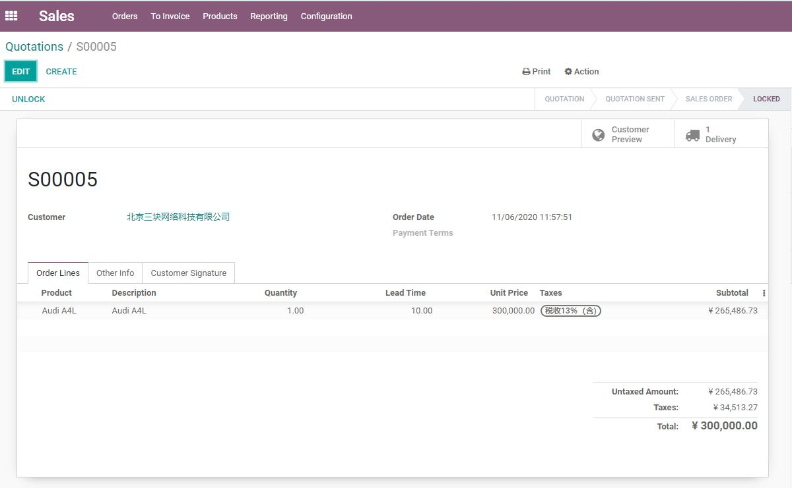
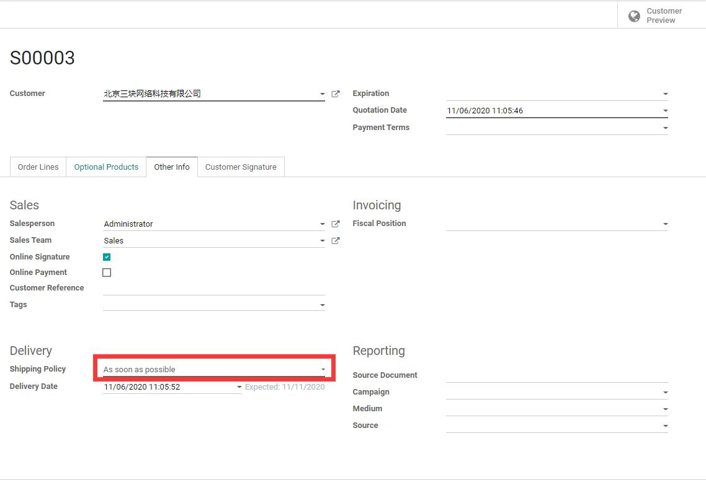

# 第一章 报价与销售

* [报价单与销售订单](#报价单和销售订单)
  * [客户地址](#客户地址)
  * [锁定销售订单](#锁定销售订单)
  * [订单策略](#订单策略)
  * [承诺交货日期和预计日期](#承诺交货日期和预计日期)
  * [开票策略](#开票策略)
  * [变体配置]()
* [销售明细中显示成本](#销售明细中显示成本)
* [报价单和销售订单的打印](#报价单和销售订单的打印)
* [电子公章](#报价单中嵌入电子印章)

## 报价单和销售订单

报价单，其含义是指尚未确定的销售订单。从技术角度上讲，报价单和销售订单是同一个对象(sale.order)，报价单只是草稿状态的销售订单。一个sale.order对象拥有的完整的状态分别有，**草稿(draft)**、**已发送的草稿(sent)**、**销售(sale)**、**完成(done)和取消(cancel)**。从这些状态上我们可以大概看出来一个订单的生命周期，首先是从草稿开始，然后确认成为订单，发货收款以后被锁定完成。其中如果有问题，则可以随时取消订单。

一个典型的销售订单如下图：

可以看到，销售订单中包含了我们的客户信息，订单时间，订单内容，还包括一些附加信息如销售员、销售团队，开票信息和发货信息等。

### 客户地址

一个订单只有一个客户信息，默认情况下，客户信息即发货单的送货地址和开票地址。这对大多数客户地址和收货地址一致的情况是好用的。但是，也有客户的收货地址、发票地址均为不同的地址，这种情况下，我们就要启用"指定开票和送货地址"特性，以选择不同的开票地址和送货地址。

15.0及之前版本的开启方法：设置-销售-报价单和销售订单，勾选"客户地址"：

然后点击保存。刷新我们之前的订单，就可以看到客户信息区域多了两个字段，开票地址和送货地址：

16.0+版的开启方法： 用户-技术设置-勾选发货地址：

### 锁定销售订单

odoo12以后，新增了一个锁定销售订单的功能，会在销售订单中显示一个锁定和解锁的按钮：

点击锁定按钮，可以将订单设置为锁定状态(技术角度上的完成状态)，需要时也可以通过点击解锁按钮，将其反向设置回销售订单状态，以方便修改某些数据。

要启用此功能，需要到用户-设置-技术特性种，勾选"锁定确认的订单"选项:

### 订单策略

每个销售订单可以在"其他信息-发货"选项中指定发货的策略，Odoo支持的发货策略有两种：

* **尽快**：使用订单明细中最早的交付时间。
* **当全部产品就绪**：等所有产品就绪，即使用订单明细中最迟的交付时间。

> 订单策略会影响到出库的策略，具体参考出库单一节

### 承诺交货日期和预计日期

首先，我们先来明确两个时间的定义：

* **承诺交货日期**：对客户承诺的交货日期，如果此值不为空，发货单的安排日期将会根据此值进行计算，而不是根据订单明细信息中的交货提前期进行计算。
* **预计日期**：可以对客户承诺的交货日期，如果产品是服务类型，那么将根据订单明细中的最早交货提前期进行计算，而如果是库存商品，具体根据最早还是最迟交货期提前期就需要依据产品的交货策略而定。

承诺交货日期只能在草稿状态下进行填写，如果留空，那么系统将依据产品的交货提前期进行计算预计日期。如果承诺交货日期不为空，那么预计日期将根据订单的发货策略决定使用最早还是最迟的日期。

预计日期的计算逻辑是，如果当前订单的状态是草稿，那么取当前时间和订单明细的提前期之和，作为预计日期，如果当前订单已经确认或者锁定，那么取订单的确认时间和订单明细的提前期之和，作为预计日期。

例如，我们创建了一个汽车销售订单的时间是2020-11-06，本订单中只有一辆奥迪A4L，它的销售提前期是10天，当我们没有指定承诺给客户的交货时间时：

那么它的预计日期: 当前日期（2020-11-06） + 提前期(10) = 预计日期(2020-11-16)。如果我们指定了承诺给客户的交货日期早于2020-11-16，那么系统会提示你，有可能会延误交货：

假设我们这里指定一个可以完成的承诺给客户的交货日期为 2020-11-20：

当我们确定订单后，发货单的安排日期和DeadLine日期都会设置为2020-11-20:

因为我们这里只有一辆汽车在销售，因此不存在最早和最迟提前期的问题。

从上面的例子可以看出，**交货提前期**的概念有点类似于交付这个产品最少要等待的时间。

### 开票策略

销售订单确认之后，我们就可以根据不同的产品开票策略来制定相应的开票策略了。开票策略可以在产品信息中进行设置：

可以看到odoo中产品可以设置的开票策略有两种：

* 订单数量：根据订单中的订单数量进行开票
* 交货数量：根据订单中的交货数量进行开票

产品默认的策略是根据交货数量，也就是说，假如你做了一张销售单并确认了，但是在没有发货之前，你是不能对这张销售单进行开票处理的。

### 变体配置

我们在第一部分简单地介绍过变体的概念，默认情况下，我们需要在产品信息中配置好变体属性，然后再在销售订单中进行选择。

从13.0版本开始，为了更方便地配置产品变体属性，用户可以选择使用产品变体配置器来在订单中进行配置。首先，我们需要在设置中，开启这个属性：

配置完成后，我们在产品信息中就多了一个配置，可以用来选择产品配置器的展示形式。可供选择的形式一共有两种，配置（默认）和矩阵（网格）。下面我们分别来看一下这两种形式：

#### 配置模式

产品变体配置的默认模式，当我们启用了变体配置功能后，我们在订单中选择一个具有变体属性的产品时，系统会弹出配置窗口供我们进行选择：

#### 矩阵模式

当我们的产品配置模式选择为矩阵时，订单选择时的选择窗体将变成下面的形式：

可以看出来，矩阵模式下，我们可以一次填入多个不同的产品，效率会更高一些。

> 从技术角度上，两种模式分别被命名为configurator和matrix。它们依赖于原生模块sale_product_matrix。同样的，在采购模块也有类似的功能，但是遗憾地是采购模块只有matrix模式而不具有configurator模式，后面我们将给出解决方案。

## 销售明细中显示成本

默认情况下，销售单中是不会显示成本的，如果想要在明细中显示产品的成本价格，就需要开启销售利润功能。

在销售-设置-价格设置中勾选利润：

## 报价单和销售订单的打印

Odoo支持打印报表的操作，我们可以轻松地打印报价单和销售订单：

> 打印PDF版本的报表，需要系统预装Wkhtmltopdf插件，安装方法参考开发指南一书。

打印出来的PDF版本的订单样式如下图：

默认的报表样式非常简单，用户可以到系统-设置-商业文档-文档布局 选项中对报表的样式进行微调：

如果想要调整报表更多的内容，可以安装企业版的Studio模块进行调整，但是可以调整的范围也是有限，更为灵活地方式是修改报表的代码文件，缺点是技术门槛比较高。

笔者的[商城](http://opensoft.taobao.com)提供报表文件的修改及设计服务，欢迎垂询(opensoft.taobao.com)。

## 电子公章

有些情况下，我们希望报价单或销售订单打印出来的时候就带着公司的电子销售章，可以直接发送给客户而不必再人工进行盖章操作。

odoo原生没有模块来完成此项任务，因此，笔者开发了一个[电子公章]()模块来解决此类问题

安装完成此模块以后，我们可以在公司设置中看到上传电子版公章的地方：

这里可以分别对销售订单、采购订单、发票和发货单进行设置，设置完成后我们在打印销售订单就可以看到自带公章的报价单和销售订单了。

