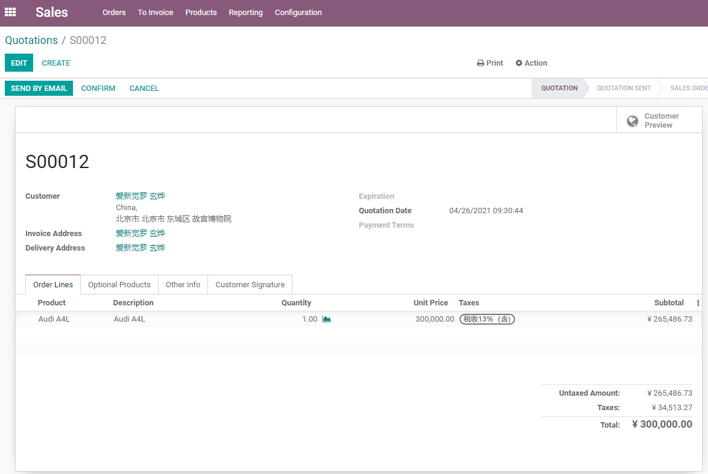
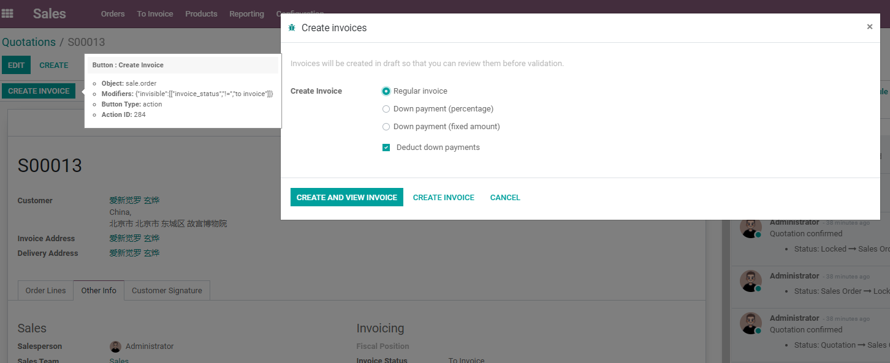
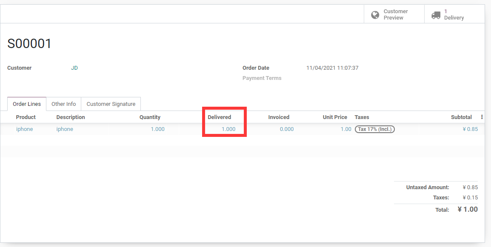
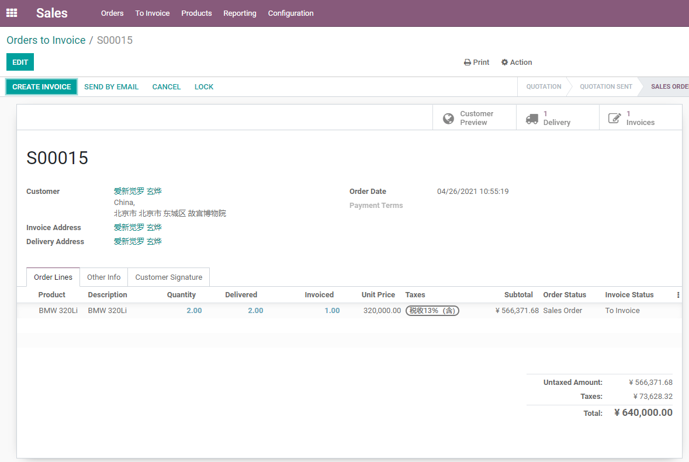

# 第三章 销售流程

* [基本的库存销售](#基本的库存销售)
  * [创建销售报价单](#1-创建销售报价单)
    * [确认订单](#2-确认订单)
    * [创建发票](#3-创建发票)
      * [常规发票](#常规发票)
        * [预付款](#预付款)
        * [登记付款](#登记付款)
        * [预付款尾款](#预付款尾款)
    * [发货](#4-发货)
    * [取消订单](#5-取消订单)
* [发票状态](#发票状态)
* [额外销售](#额外销售up-selling)

第一章介绍了销售报价单、销售订单、客户以及开票和策略等基本概念，本章将介绍销售的基本流程。由于销售环节并不是一个独立的环节，它会涉及到财务开票、库存发货等其他模块的内容，因此，本章将按照销售的流程进行介绍。

### 基本的库存销售

我们先介绍最核心也是最简单的销售流程，假设我们库存中有一辆新的奥迪A4L汽车，现在有客户要全款来购买这辆汽车，那么我们可以按照下面的流程来进行销售：

#### 1. 创建销售报价单

首先，我们先创建一个报价单，填写上客户的基本信息，然后填写客户购买的产品信息，然后点击保存，形成报价单：

#### 2. 确认订单

报价单确认以后，我们可以给**客户发邮件**(参见第九部分设置-邮件设置)进行通知，或者直接点解确认订单按钮，形成销售订单。销售订单的确认之后，相当于合同已经成立，系统会根据产品的设置类型进行后续的操作。本例中，系统会自动生成出库单，并将订单进行**锁定**。

我们可以点击发货单按钮查看发货单，因为我们当前的库存满足我们订单的需求，因此，发货单会自动变为就绪。仓库人员直接进行发货操作即可。

#### 3. 创建发票

> odoo中的发票(invoice)是西方国家的发票，而不是国内的增值税票(VAT)。

我们先解锁销售订单，然后可以看到一个创建发票的按钮。点击创建发票，可以看到三个选项：

* 常规发票： 既根据订单全部金额开具的发票。
* 预付(百分比): 按百分比进行支付的预付款。
* 预付(固定金额)： 按固定金额进行支付的预付款。

##### 常规发票

如果我们选择开局常规发票，我们可以看到生成的发票是全额发票，我们直接确认，然后登记付款即可。

##### 预付款

如果我们选择了预付一部分，比例或者固定金额：

生成的发票会是预付的金额：

我们确认之后，可以在该客户的详情页中看到该客户待支付的金额：

##### 登记付款

发票确认之后，需要进行付款操作，否则该发票只是提交状态，并不会变为已支付的状态。

关于发票更多的内容，参见第六部分。现在我们点击登记付款进行收款操作：

##### 预付款尾款

客户在支付预付款之后，我们可以安排发货操作，客户支付尾款时候需要另外创建一张发票，重新登记付款操作。

我们可以看到，生成的尾款发票自动抵扣了之前的预付款发票：

#### 4. 发货

报价单确认之后就变成了销售订单，同时系统会自动创建发货单。

销售明细中有一个发货数量用来记录此销售单中已经发货的数量，该数量会将退货的数量统计在内，因此可以作为一个实际的发货数量来用。此字段只有当销售单处于销售订单和完成状态时可见。

#### 5. 取消订单

在订单发货之前进行取消，系统会同时将发货单一并取消掉。但是如果取消时，已经发货了，那么这些发货单将不能取消，而是应该进行退货处理。

> 14.0版本中，如果点击取消按钮时，发货单进行完成，那么系统将会提示你应该进行退货操作。
> 13.0版本则不会提示任何消息，将直接把销售单取消，但是发货单仍将为发货状态。

#### 6. 订单的删除

odoo在订单确认状态下是不可以进行删除操作的，系统会提示，确定的订单不允许删除。但是这里也有一个漏洞，即订单允许进行取消，即便是发货单已经完成。取消之后便可以进行删除。

如果不希望已经发货的订单允许被删除，那么可以安装由[我们](https://www.odoomommy.com)出品的销售模块**解决方案**来解决这个问题。

在系统-设置-销售-订单设置中勾选，不允许删除已经发货的订单选项：

然后当我们在删除已经发货的订单时，系统会提示我们不能删除：

### 发票状态

客户的发票状态，有一下几种：

* 没有要开票的： 销售订单状态不为'销售'或'完成',意思是没有需要等待开票的产品，也是销售订单默认的发票状态。
* 等待开票：销售订单中有等待开票的产品或部分开票了的产品，前面提到的预付款之后的发票状态也是这个状态。
* 全部开票： 开票的数量大于或者等于订单数量时，判断为全部开票。
* 额外销售： 当产品策略为按订购数量且发货数量大于订单数量时，被定义为额外销售。

### 更清晰的状态显示

为了更方便的显示订单的各种状态，在安装了我们的销售解决方案模块后，您将看到更多快速的状态显示:

### 额外销售(Up-selling)

根据定义，当我们把产品的订购策略设置为按订货数量，且发货数量大于订购数量时，发票状态为被设置额外销售。

此时，我们点击编辑，将订购数量修正为2，因为已经开票的数量是1，因此我们需要对额外销售的1辆汽车进行开票：

至此，我们对额外销售的1辆汽车也进行了开票，销售订单的状态也因此变为了全部开票。由此，我们可以看出，所谓额外销售只是销售过程中的一种中间状态，而且只有产品销售策略为订购数量时才会生效。

### 订单的锁定与解锁

早期版本中，odoo的订单旦确认后将不可更改，只能取消重置。在13.0以后，odoo在系统中加入了**锁定和解锁**功能，锁定即订单信息不可再更改，如果需要更改则需要点击解锁后再进行修改。

锁定与解锁的本质逻辑是销售订单状态中的销售(sale)和完成(done)的切换。

