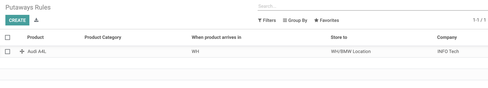

# 第二章 库位管理

默认情况下，系统并没有开启多库位管理，开启的方法在菜单设置-库存-仓库-存储位置，开启多库位管理：

开启之后，我们就可以在仓库-设置-库位中看到库位管理功能了。

## 库位类型

odoo中的库位类型有以下几种：

* 供应商：供应商库位，一个虚拟库位，代表供应商库位。
* 客户：客户库位，一个虚拟库位，代表客户的存储库位。
* 盘点库位：盘点库位，虚拟库位，代表盘点业务的源或者目的库位。
* 生产：生产库位，虚拟库位，消耗原材料，产生成品的库位。
* 视图：逻辑库位，本身不能存储库存，主要用于逻辑上的库位层级关系。
* 中转库位：多公司下多库位调拨的中转库位。

另外两个选项，可以标记此库位为一个报废库位还是一个退库库位。只有被标记为退库之后，才可以在退回向导中选择。

## 下架策略

odoo中可以在库位上设置下架策略，但是此功能默认是没有开启的。需要给当前用户管理推拉物流路线权限后，可以看到：

我们之前说过，在产品分类中也有一个下架策略，产品分类中的下架策略的优先级是要高于此处的下架策略的。我们可以看个例子，我们先采购一批Play Car玩具，批次号为A00001，然后我们在此产品分类上设置LIFO，在stock库位上设置FIFO。然后，我们再采购一批同样的玩具，批次号为A00002，此时我们的库存：

此时，我们做一个销售单，按照我们的逻辑，由于产品分类设置了LIFO，那么优先出库的应该是A00002批次的产品。

由上图可以看出，优先查找的库位确实是A00002批次的库存。

关于下架策略，官方还提供了另外一种下架方式，根据产品的保质期进行选择。开启的方式为先启用库存-追溯性-序列号，然后选择设置过期日期：

启用之后，我们可以看到下架策略处多出了一个FEFO，即先到期先出库。

## 上架策略

与下架策略相对应的功能是上架策略，对于指定到达的产品，设置默认的入库库位。在仓库-设置-仓库管理-上架策略中进行管理：

上架策略需要设置以下几项：

* 产品：上架策略应用于哪个产品
* 产品到达：产品抵达的指定库位，只能是父级库位
* 存储到：需要存储的目的库位
* 公司：多公司条件下指定的公司

也就是说，假如我们这里有一个产品A，和两个库位 WH/S1和WH/S2，如果我们希望在采购单确认的时候把入库单上架到S2库位，那么我就这样设置：

产品：A, 产品到达：WH, 存储到: WH/S2。

### 上架策略与调拨单的优先级

读者在使用odoo的过程中可能会碰到比较迷惑的一种操作，假设我们这里有一张调拨单WH/INT/0002，我们设置的其源库位是BMW Location，目的库位是Audi Location，我们希望的操作是将一辆错误放到BMW库位的A4L调拨回Audi库位，但是实际操作过程中却出现了下面诡异的行为：

这显然与我们直观的逻辑不符，我们明明指明了目的库位是Audi Location，但是在检查库存的时候生成的目的库位居然依旧是BMW Location。那么这究竟是Odoo背后的逻辑错误，还是我们误操作了什么呢？

经过我们对源代码的研究，发现了其逻辑设计的思路，其背后的在作祟的就是上架策略。odoo的上架策略优先级要高于调拨单的目的库位设置，因为我们设置了A4L的在WH仓库的上架策略，因此，这里份简单上设置的目的库位就无效了。

