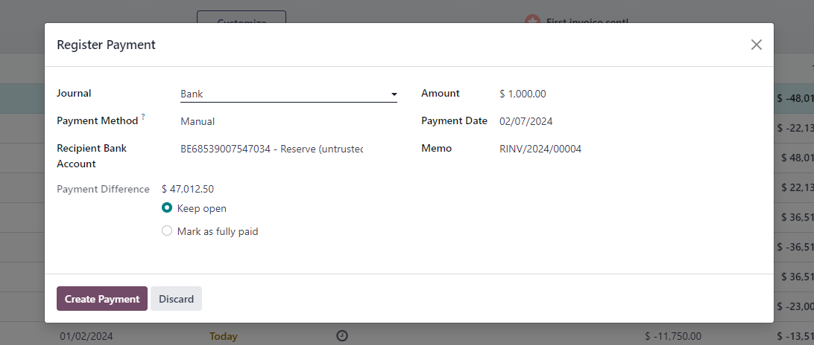
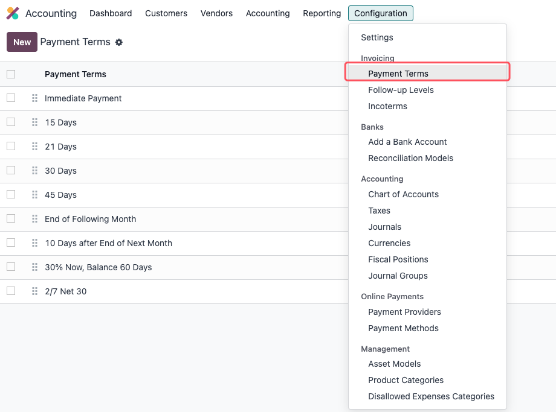

# 第三章 支付

了解了客户和供应商开票的相关内容，接下来，我们看一下如何进行客户和供应商的支付。

## 客户和供应商支付

我们在开具了客户/供应商发票之后，我们可以在会计-仪表盘中看到等待支付的发票：

正常情况下，我们勾选我们要收/支付的账单然后点击**登记付款(Register Payment)**即可。

### 多次支付

默认情况下，登记支付的金额为整个账单的金额。我们也可以分多次进行支付，我们只需要更改支付的金额即可。

odoo会提供给我们两个选项

* 保持打开状态： 表示账单仍未完全支付
* 标记为完全支付： 即尾款出于某种原因不再继续支付，标记账单已完全支付。

### 将账单关联到已有支付

默认情况下使用账单的登记付款功能会自动将支付和账单关联起来。但是也有场景是账单和支付分开的，例如，客户上笔订单的退款或之前支付的余额。这种情况下，我们就可以手动将额外的支付与账单进行手动关联。

odoo会在账单上显示一个浅蓝色的提示框用来表示，此账单有可以手动关联的支付。我们在右下角的列表中选择我们想要关联的支付，点击添加按钮即可完成关联。

### 使用现金账户支付

我们知道，通常情况下,我们使用银行账户给供应商付款后，供应商账单会变为**支付中(In Payment)**状态，如果我们使用现金账户给供应商付款，能否跳过这一状态从而使支付状态直接变为**已支付(PAID)**呢?

答案是肯定的，我们下面来看一下如何做。

首先，我们打开会计-设置-日记帐，找到现金日记账，在现金日记账的支出中设置中，显示出**待对账支付科目(Outstanding Payments Account)**:

然后我们将其设置为现金科目。这样当我们在支付供应商账单时，选择现金日记账，支付结果就会直接变为已支付。

## 在线支付

我们除了使用传统的现金和银行来支付现有的账单外，odoo也支持使用在线支付来完成支付。

首先我们要在设置中打开在线支付设置，位置在设置-销售-报价单和订单，勾选在线支付：

我们可以看到odoo默认支持的在线支付列表：

我们激活需要的在线支付提供商就可以了。

### 支付宝和微信支付

对于中国大陆用户来说，支付宝和微信支付可以说是挺普遍的需求。我们在通用解决方案中加入了对支付宝和微信支付的支持。

有需求的读者可以到我们的公众号(OdooHub)中了解相关内容。也可以在我们的[开发教程](https://dev.odoohub.com.cn)的附录中找到介绍。

