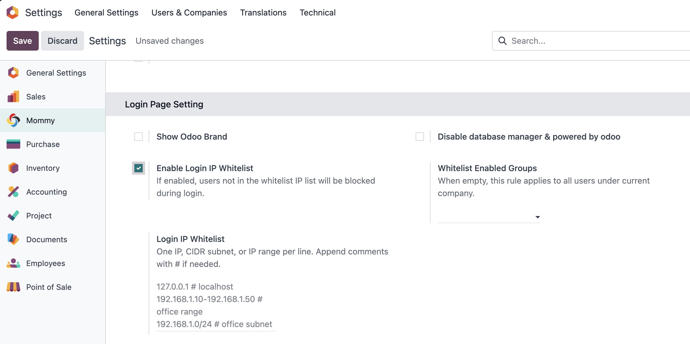
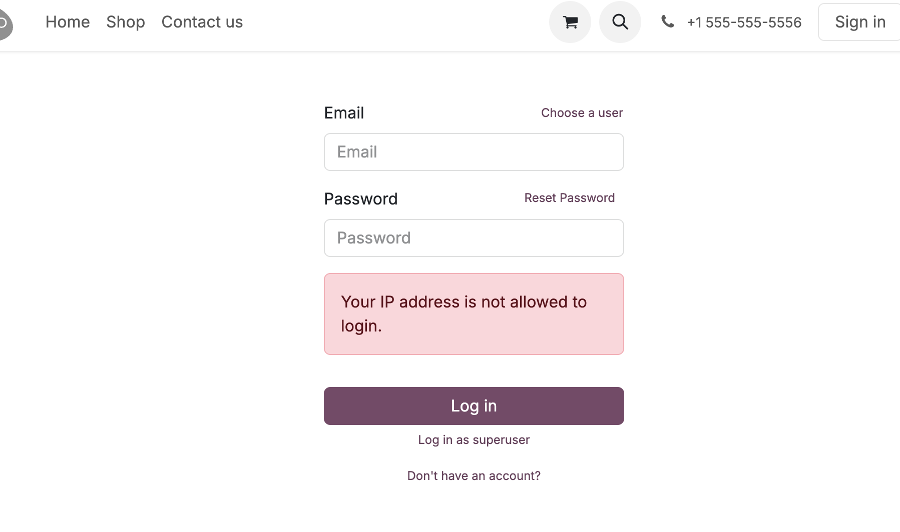
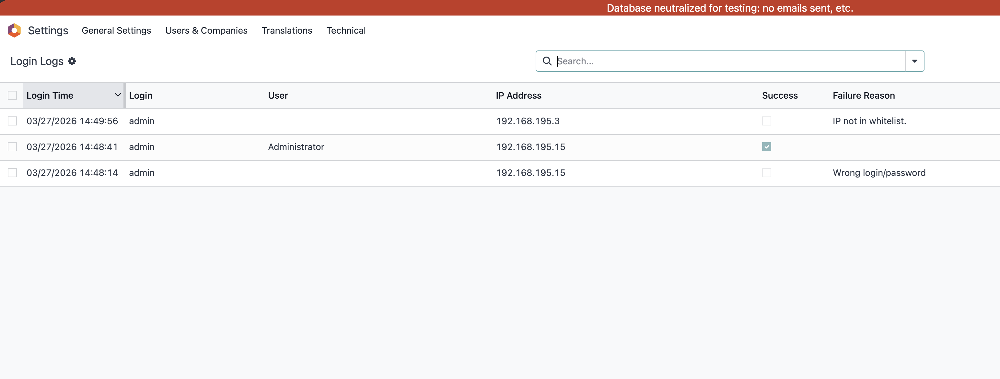

# IP白名单

> 本功能仅供欧姆网络科技签约用户使用

* [开启IP白名单功能](#开启ip白名单功能)
* [用户组限制](#用户组限制)
* 

有时候我们希望对登录系统的用户根据IP进行限制，以减少不必要的安全风险。因此，我们在基础模块中增加了IP白名单的功能，本文我们就来看一下如何在Odoo中开启白名单登录功能。

## 开启IP白名单功能

首先，我们到设置-欧姆-登录设置功能块中开启IP白名单功能：

开启白名单功能之一，我们可以在下面的设置框中填写白名单IP，每行一个。同时，我们也支持IP号段，或者子网掩码。

## 用户组限制

默认情况下，开启白名单限制后，针对所有用户生效。但某些情况下，我们可能只想限制某些用户组的人受控，这时候，我们只需要在右侧的用户组中选择我们想要限制的用户组就可以了。

## 登录日志审查

同时，我们对试图尝试登录系统的行为进行了记录。在设置-技术-数据库菜单下，我们可以看到所有用户的登录日志：

