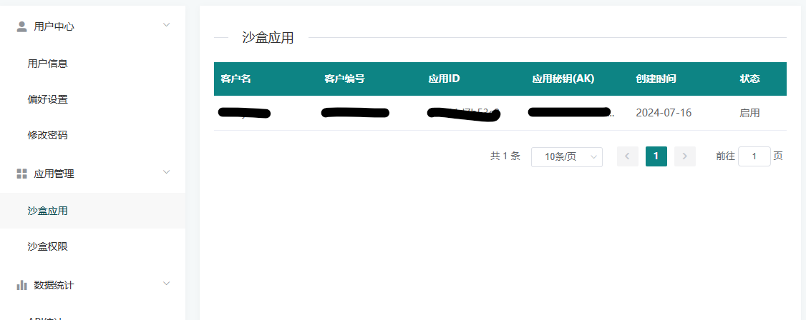
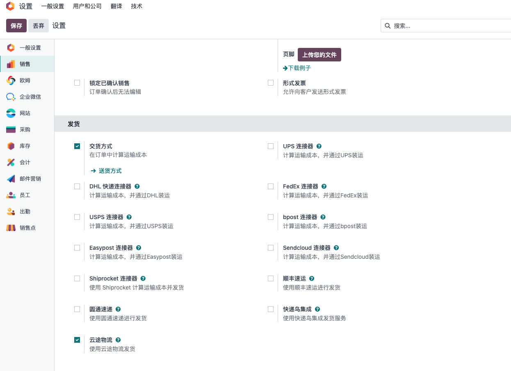
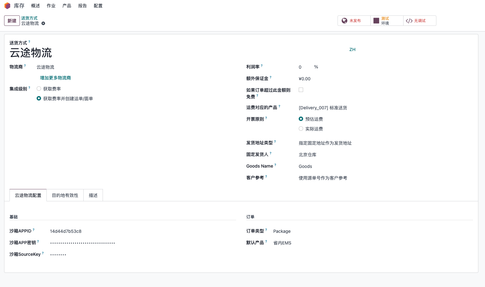
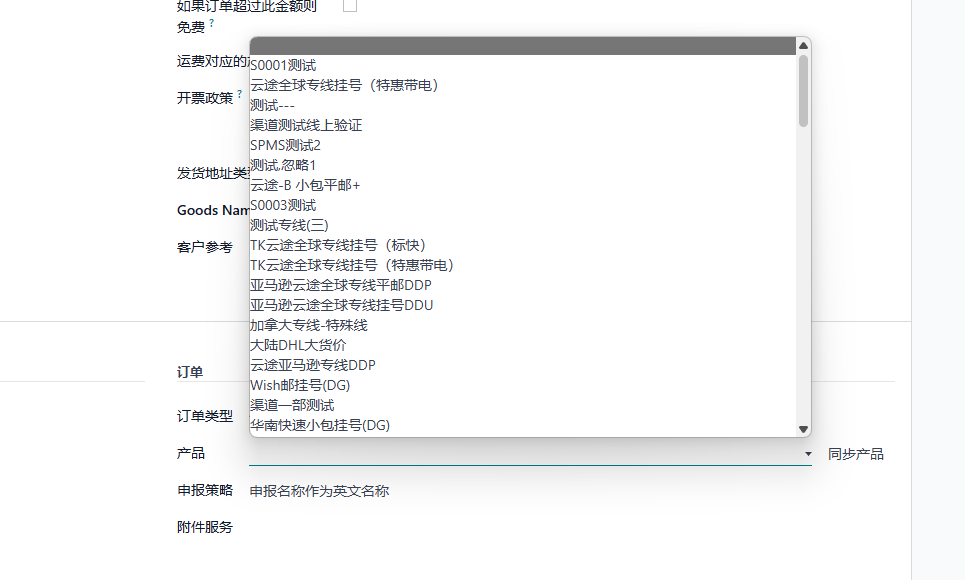
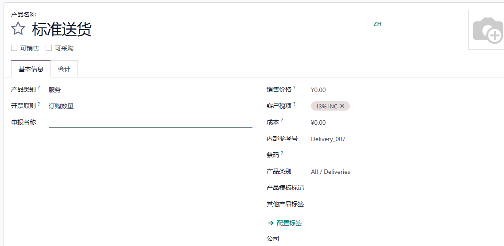
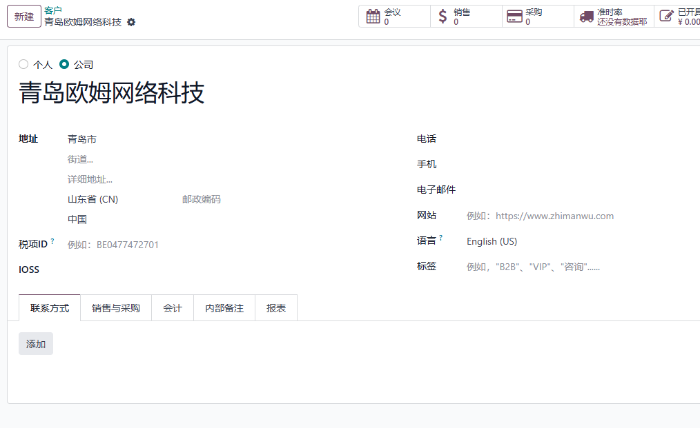
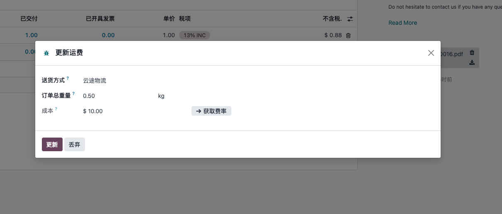
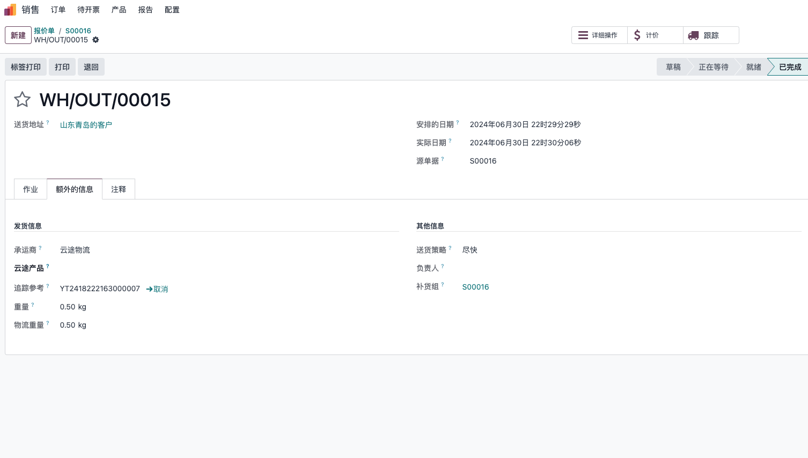
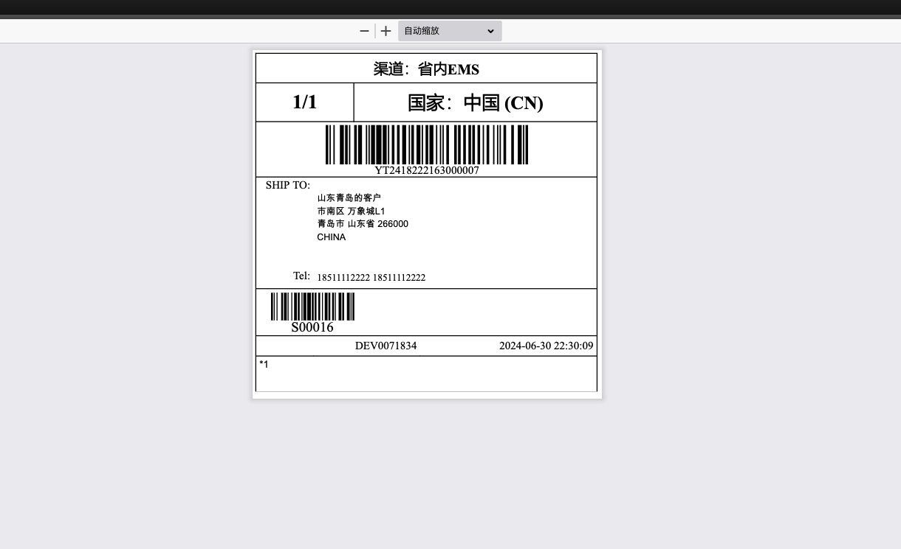
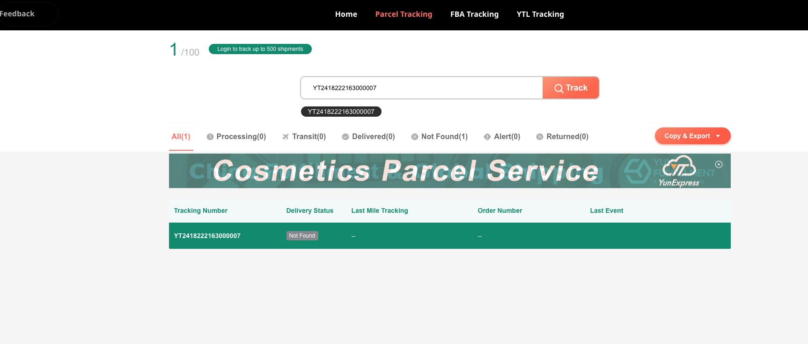

# YunExpress Integration

> Supported versions: 15.3+ / 17.0.1.2+ / 19.0.1.3+

YunExpress is a logistics provider widely used by cross-border eCommerce sellers for small international parcels. For companies selling through marketplaces, independent websites, or Odoo Sales, a YunExpress integration can reduce manual shipping work: users can estimate shipping fees, create shipping orders from Odoo delivery orders, obtain tracking numbers, download shipping labels, and open the official tracking page from Odoo.

This chapter explains how to use the YunExpress integration in Odoo 19.0. We will start from the YunExpress developer account, then configure the delivery method in Odoo, sync YunExpress shipping products, prepare declaration and IOSS data, and finally walk through shipping fee estimation, waybill creation, label download, and tracking.

* [Register A YunExpress Developer Account](#register-a-yunexpress-developer-account)
* [Install And Configure The YunExpress Module](#install-and-configure-the-yunexpress-module)
  * [Order Type](#order-type)
  * [YunExpress Products](#yunexpress-products)
  * [Declaration Policy](#declaration-policy)
  * [Additional Services And IOSS](#additional-services-and-ioss)
* [Estimate Shipping Fees On A Sales Order](#estimate-shipping-fees-on-a-sales-order)
* [Create A Waybill From A Delivery Order](#create-a-waybill-from-a-delivery-order)
* [Track The Shipment](#track-the-shipment)
* [Common Error](#common-error)
* [Implementation Notes](#implementation-notes)

## Register A YunExpress Developer Account

Before configuring Odoo, register a developer account on the [YunExpress Open Platform](https://open.yunexpress.cn/) and create an application. After the application is created, YunExpress provides the API credentials required by Odoo.

You will normally need three values:

| Field | Meaning | Where It Is Used |
| --- | --- | --- |
| `APPID` | Application ID | Identifies the YunExpress application. |
| `APPSECRET` | Application secret | Used to request API access tokens and sign requests. |
| `SOURCEKEY` | Source verification key | Confirms the request source in the YunExpress OpenAPI. |

> `SourceKey` can be found in the user information settings on the YunExpress Open Platform.

Keep these credentials in the Odoo carrier configuration only. Do not write them into documentation, screenshots, code comments, or shared chat messages.

## Install And Configure The YunExpress Module

After the YunExpress credentials are ready, install the YunExpress delivery module in Odoo. The module extends Odoo's native delivery carrier flow, so users can still work from Sales Orders and Inventory Delivery Orders instead of opening a separate shipping system.

Go to `Settings > Sales` and enable the YunExpress shipping option.

After saving the setting, go to `Inventory > Configuration > Delivery Methods`, create or open the YunExpress delivery method, and enter the credentials obtained from the YunExpress Open Platform.

The basic configuration usually includes API credentials, environment, order type, package type, default YunExpress product, declaration policy, and optional additional services. In a real project, do not rush to test shipping immediately after entering the credentials. First make sure products, customer addresses, company sender information, weights, and declaration names are ready; otherwise most API errors will appear at the shipping order stage.

### Order Type

YunExpress shipping orders can be created in two major scenarios:

| Type | Usage Scenario |
| --- | --- |
| Package | Used for normal single-parcel shipping orders. This is the most common scenario for cross-border eCommerce parcels. |
| FBA | Used when shipping goods to Amazon FBA warehouses. |

Choose the order type according to the actual business process. If the company handles both direct-to-consumer parcels and FBA replenishment, it is usually clearer to create separate delivery methods or at least document which configuration is used for each scenario.

### YunExpress Products

YunExpress provides multiple logistics products and routes. In Odoo, these products are stored locally so the delivery method can select a default YunExpress product for quotation and waybill creation.

Click the sync button to update the available YunExpress product list from the OpenAPI.

After syncing, select the default product on the delivery method. This default product is important because the sales shipping fee estimation uses it to find the matching YunExpress price result.

### Declaration Policy

Cross-border parcels usually require customs declaration information. The YunExpress module adds a declaration name field on products so the implementation team can maintain names used for shipping declaration separately from the normal product display name.

The declaration policy controls how Odoo maps product names into YunExpress declaration fields:

| Option | Behavior |
| --- | --- |
| Use declaration name as English name | The declaration name is sent as the English declaration name. |
| Use declaration name as Chinese name | The declaration name is sent as the Chinese or local declaration name. |

For cross-border sellers, this field should be treated as master data, not as a temporary shipping note. Product weight, product value, HS-related information if required by the business, and declaration names should be checked before go-live.

### Additional Services And IOSS

For shipments to Europe, IOSS information may be required depending on the tax and shipping scenario. The YunExpress module adds an `IOSS` field on contacts, so the company can maintain the IOSS number on the relevant sender or company contact.

When the sender has an IOSS number, use that number in the contact record. If the sender does not have an IOSS number and the business chooses to use YunExpress VAT collection service, add the `V1` additional service in the delivery method configuration.

Common additional services may include remote area handling, duty prepaid services, VAT collection, or export tax refund related services. The available services should be confirmed with the YunExpress account manager or the official Open Platform configuration for the customer's contract.

## Estimate Shipping Fees On A Sales Order

Once the delivery method is configured, users can estimate YunExpress shipping fees directly on the Odoo Sales Order.

The estimation is based on the YunExpress product configured on the delivery method. In practice, the calculation also depends on the shipping country, postal code, package type, origin, and product weight. If the quotation result is unexpected, check these data first before assuming the API is wrong.

This step is useful before order confirmation because sales users can compare shipping methods and understand the estimated delivery cost without leaving Odoo.

## Create A Waybill From A Delivery Order

After the sales order is confirmed and the delivery order is ready, process the Odoo delivery order as usual. When the delivery is validated with the YunExpress delivery method, Odoo creates a YunExpress shipping order and receives a waybill number.

After the waybill is created successfully, Odoo downloads the electronic shipping label and attaches it to the delivery order chatter. Warehouse users can open or print the label from the delivery order.

Before using this flow in production, the warehouse team should test at least three scenarios: a normal parcel, a parcel with incomplete address data, and a parcel using the expected IOSS or additional service setup. These tests help confirm that the API credentials, sender data, product declaration data, and printing process all work together.

## Track The Shipment

Like other Odoo delivery methods, the YunExpress delivery method provides a tracking action. Users can click the tracking button on the delivery order to open the official YunExpress tracking page.

This standard tracking link is suitable for basic customer service work. If the company needs structured tracking events inside Odoo, such as automatic status updates, delayed shipment alerts, or customer notification rules, the implementation can be extended by connecting YunExpress tracking events to Odoo's delivery tracking model.

## Common Error

### `receiver.address_lines` single string length: 1-200

This error usually means the recipient address line is longer than 200 characters, or one of the address fields is empty in a way that YunExpress does not accept.

Recommended checks:

| Check Item | What To Do |
| --- | --- |
| Street address | Split an overly long address into `Street` and `Street 2`. |
| Country and state | Make sure the country is selected correctly and the state/province format is accepted. |
| Postal code | Confirm the postal code is not empty for countries that require it. |
| Phone or mobile | Make sure the recipient has a phone number or mobile number. |
| Hidden spaces | Remove line breaks, repeated spaces, or pasted special characters. |

In cross-border logistics projects, address quality is often the first operational bottleneck. A small amount of master data cleanup before go-live usually saves much more time than repeatedly handling failed waybill creation later.

## Implementation Notes

The YunExpress integration is built on top of Odoo's native delivery carrier mechanism. From a user perspective, the flow stays familiar: configure a delivery method, estimate shipping on the sales order, validate the delivery order, receive a tracking number, and print the label.

From an implementation perspective, YunExpress has a few extra requirements that should be planned early:

| Area | Practical Note |
| --- | --- |
| Credentials | Keep sandbox and production credentials separated. Test in sandbox first if the YunExpress account supports it. |
| Product data | Maintain product weight and declaration names before enabling warehouse users to create labels. |
| Address data | Recipient country, postal code, city, street, phone, and email should be complete enough for YunExpress validation. |
| IOSS and services | Confirm whether the company uses its own IOSS number or YunExpress VAT collection service. |
| Batch operations | If the warehouse prints labels in batches, test duplicate-click prevention and label merge behavior before production use. |
| Tracking | A simple tracking link is enough for basic use; structured tracking events require an additional implementation layer. |

In this chapter, we completed the main YunExpress flow in Odoo: account preparation, delivery method configuration, product sync, declaration setup, IOSS and additional services, shipping fee estimation, waybill creation, label download, and tracking. In later chapters of the English manual, we can continue translating other logistics and general solution chapters so overseas readers can understand the same Odoo implementation patterns with consistent terminology.
