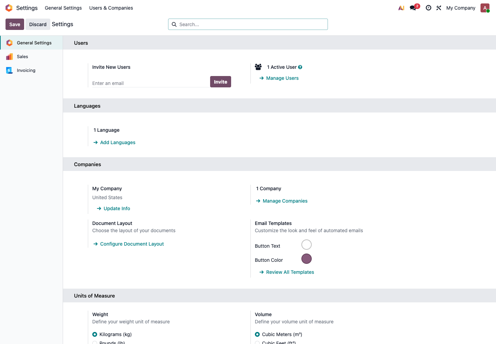
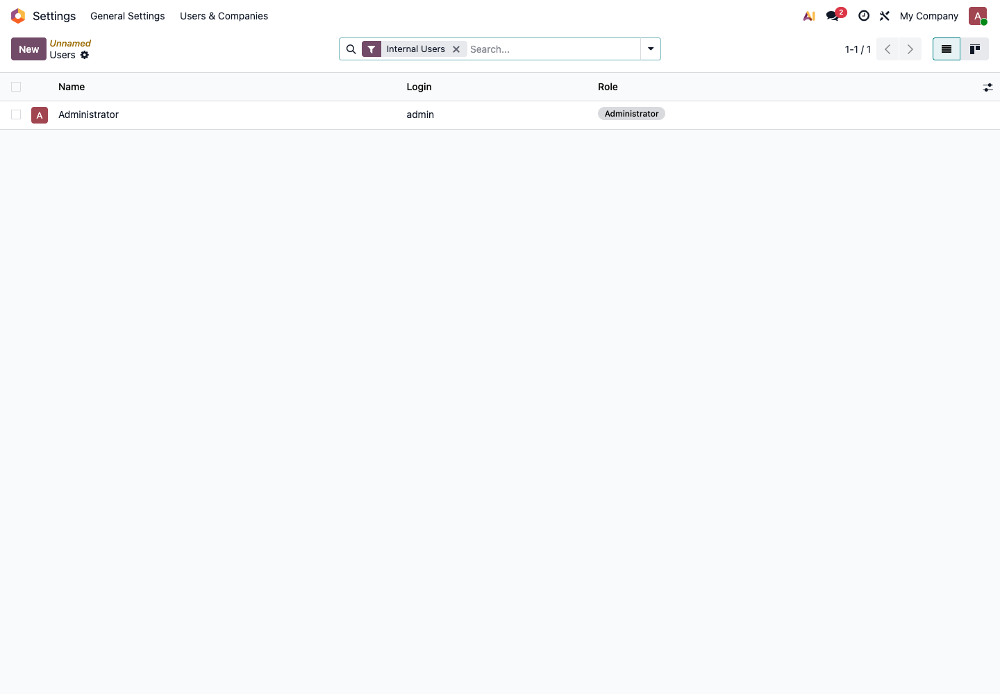
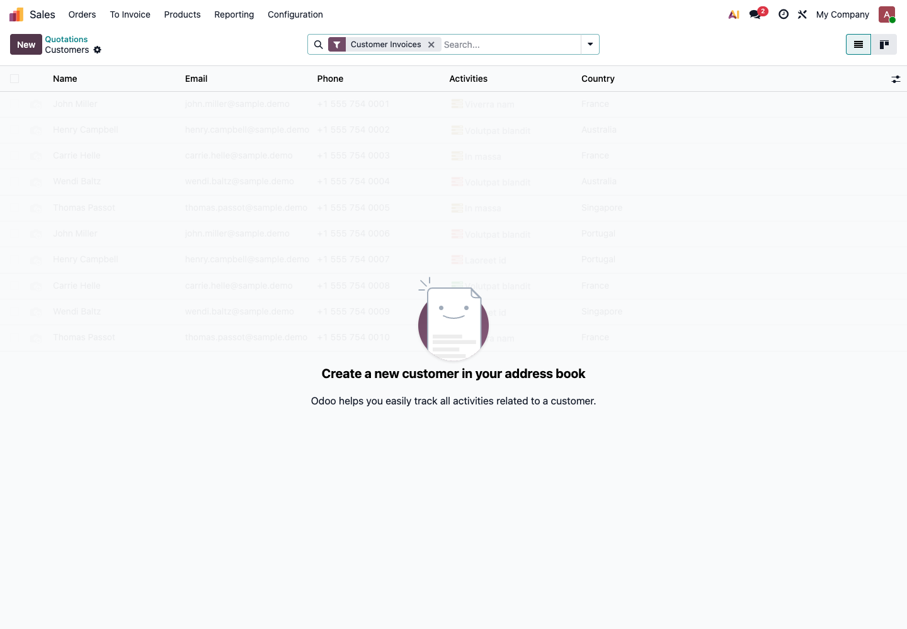
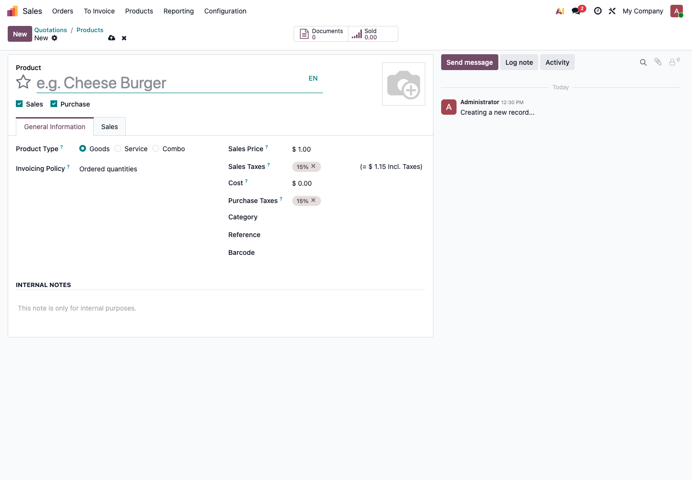

# 第三章 基础数据准备

基础数据是 Odoo 实施中最容易被低估的一步。很多客户以为“把 Excel 导进去”就是数据准备，实际不是。真正的数据准备，是把旧系统、Excel 和员工脑子里的业务规则，整理成 Odoo 能稳定使用的数据。

这一章不追求一次性把所有资料都搬进系统，而是先帮客户准备第一期上线必须用到的数据。

## 为什么先做基础数据

Odoo 的销售、采购、库存、财务都依赖基础数据。

如果产品资料错了，销售报价会错，库存数量会错，成本也会错。如果客户资料重复，后面的应收账款、对账、发票都会分散在多个客户下面。数据不干净，系统再强也很难用。

所以自主实施时，建议先花时间整理数据，再开始大量录业务单据。

## 基础数据总览

第一期至少要准备这些资料：

| 数据类型 | 用在哪里 | 最低要求 |
| --- | --- | --- |
| 公司资料 | 报价单、发票、邮件、报表 | 公司名称、地址、电话、邮箱、税号、银行账号 |
| 用户资料 | 登录系统、权限控制、审批和消息 | 姓名、邮箱、岗位、需要使用的模块 |
| 客户资料 | 报价、销售订单、发票、收款 | 客户名称、联系人、电话、邮箱、账期、发票地址、送货地址 |
| 供应商资料 | 采购订单、供应商账单、付款 | 供应商名称、联系人、电话、邮箱、付款条件 |
| 产品资料 | 销售、采购、库存、生产、POS | 产品名称、内部编码、单位、售价、成本、类别、条码 |
| 仓库资料 | 收货、发货、调拨、盘点 | 仓库名称、库位、期初库存、批次或序列号规则 |
| 财务资料 | 开票、付款、对账、报表 | 税率、银行账号、应收期初、应付期初、银行余额 |

不要一开始就追求字段很全。第一期最重要的是：能下单、能收发货、能开票、能对账。

## 公司资料

公司资料会出现在很多地方，例如报价单、发票、邮件签名和客户门户。

在 Odoo 中，可以先从 **Settings** 设置公司和系统信息。

建议准备：

| 字段 | 说明 |
| --- | --- |
| 公司名称 | 对外显示的正式名称 |
| 地址 | 报价单、发票和送货文件常用 |
| 电话和邮箱 | 客户联系和邮件模板会用到 |
| 税号 | 财务和发票相关资料 |
| 银行账号 | 报价、发票或付款说明中可能会显示 |
| 默认币种 | 决定报价、采购和会计金额的默认币种 |
| 时区和语言 | 影响日期、时间和用户界面 |

如果企业有多家公司，不建议第一天就全部配置复杂的多公司流程。先确认是否真的需要多公司记账、跨公司采购、跨公司库存，再决定是否启用。

## 用户和权限资料

不要让所有员工共用管理员账号。管理员账号只负责配置和维护，日常业务应该用员工自己的账号。

用户资料可以从 **Settings -> Users & Companies -> Users** 进入。

建议先按岗位准备用户，而不是按个人临时决定权限。

| 岗位 | 常用权限范围 |
| --- | --- |
| 销售 | 客户、报价、销售订单、销售报表 |
| 采购 | 供应商、询价单、采购订单、采购报表 |
| 仓库 | 收货、发货、调拨、盘点 |
| 财务 | 发票、付款、银行对账、财务报表 |
| 门店 | POS 收银、退货、交班 |
| 老板 | 报表查看、审批、关键业务查看 |
| 管理员 | 应用安装、系统设置、用户权限 |

权限的原则是“够用就好”。权限太小，员工做不了事；权限太大，容易误改价格、库存和会计数据。

## 客户和供应商资料

Odoo 中的客户、供应商、联系人，本质上都属于联系人资料。一个公司既可以是客户，也可以是供应商。

在 Sales 中，可以进入客户列表查看和维护客户。

客户和供应商不要只导入名称。至少要整理：

| 字段 | 为什么重要 |
| --- | --- |
| 公司名称 | 报价、订单、发票的主体 |
| 联系人 | 销售跟进、收发邮件、送货联系 |
| 电话和邮箱 | 通知、报价发送、对账沟通 |
| 发票地址 | 客户发票和账务资料 |
| 送货地址 | 仓库发货和物流资料 |
| 付款条件 | 影响账期和应收应付 |
| 销售员或采购负责人 | 方便后续过滤和统计 |

导入前要先去重。常见重复情况：

- 同一个客户有公司简称和全称两个版本；
- 同一个供应商被不同部门分别建了一次；
- 联系人被当成公司导入；
- 发票地址和送货地址混在同一条资料里；
- 客户电话、邮箱为空，后续无法发送报价或对账邮件。

如果客户有多个送货地址，建议在 Odoo 中维护成同一公司下面的不同地址，而不是创建多个重复客户。

## 产品资料

产品是销售、采购、库存、生产和 POS 的核心数据。产品资料错了，后面所有业务都会跟着错。

可以从 Sales 的 Products 菜单创建产品。

产品至少要确认这些字段：

| 字段 | 说明 |
| --- | --- |
| 产品名称 | 对内和对外显示的名称 |
| 内部编码 | 企业内部识别产品的编码 |
| 条码 | POS、仓库扫码和快速查找常用 |
| 产品类型 | Goods、Service 或 Combo |
| 可销售 | 是否出现在销售订单中 |
| 可采购 | 是否出现在采购订单中 |
| 销售价格 | 报价和销售订单默认价格 |
| 成本 | 库存估值、毛利和成本分析会用到 |
| 税率 | 销售税和采购税 |
| 产品类别 | 报表、会计科目和库存估值常用 |

产品类型要特别注意。

| 类型 | 适用场景 | 常见误区 |
| --- | --- | --- |
| Goods | 有库存、需要采购或发货的商品 | 把实物商品建成服务，导致库存不变化 |
| Service | 咨询、安装、运费、人工服务 | 把服务建成商品，导致仓库出现无意义的发货 |
| Combo | 组合销售场景 | 没确认业务场景就滥用组合 |

如果产品有颜色、尺码、规格等变化，可以用变体。但第一期不要为了“看起来完整”建立过多变体。变体太多会增加维护成本。

## 仓库和库存资料

有库存管理的企业，必须准备期初库存。期初库存不是简单写一个总数，而是要能说明“哪个产品、在哪个仓库、哪个库位、有多少”。

至少准备：

| 字段 | 示例 |
| --- | --- |
| 产品 | A001 手机壳 |
| 仓库 | 青岛仓 |
| 库位 | Stock 或具体货架 |
| 数量 | 100 |
| 单位 | 件 |
| 批次或序列号 | 有追踪要求时必须准备 |
| 成本 | 需要库存估值时必须确认 |

如果企业暂时不管理库位，可以先只用一个主库位。不要为了追求精细化，一开始就建很多货架、区域和虚拟库位。

## 财务基础资料

财务资料一定要让财务人员参与确认。不要只由业务部门或实施人员代填。

第一期至少确认：

| 数据 | 用途 |
| --- | --- |
| 税率 | 销售开票、采购账单、税额计算 |
| 银行账号 | 收款、付款、银行对账 |
| 付款条件 | 应收应付到期日 |
| 期初应收 | 上线前客户还欠公司的钱 |
| 期初应付 | 上线前公司还欠供应商的钱 |
| 银行期初余额 | 对账和现金流报表 |

注意：Odoo 中的 Invoice 是会计上的客户发票或供应商账单，不等于中国税控系统里的增值税发票。国内企业如果需要开具数电票、金税盘或第三方开票接口，需要单独评估。

## 推荐导入顺序

数据导入不要随便排顺序。建议按下面顺序做：

1. 公司资料；
2. 用户和权限；
3. 客户、供应商、联系人；
4. 产品类别；
5. 产品资料；
6. 仓库和库位；
7. 价格表和供应商价格；
8. 期初库存；
9. 期初应收和期初应付；
10. 未完成销售订单和采购订单。

先导主数据，再导业务余额。不要先导订单，再发现客户、产品和税率都不对。

## 数据清洗检查表

导入前可以用这张表检查。

| 检查项 | 通过标准 |
| --- | --- |
| 客户去重 | 同一客户只有一个主档案 |
| 供应商去重 | 同一供应商没有重复资料 |
| 产品编码 | 每个关键产品都有唯一编码 |
| 单位统一 | 同类产品使用一致单位 |
| 价格确认 | 售价、成本、税率已抽查 |
| 地址拆分 | 发票地址和送货地址没有混乱 |
| 库存数量 | 期初库存已经盘点确认 |
| 财务余额 | 应收、应付、银行余额由财务确认 |

如果这张表没有通过，不建议急着导入正式库。

## 不建议第一期导入的数据

第一期不要把所有历史资料都搬进 Odoo。

暂时不建议导入：

- 多年以前已经停用的客户；
- 已经不销售、不采购的老产品；
- 没有后续业务价值的历史报价单；
- 已经结清的历史发票和付款明细；
- 旧系统里没人维护的自定义字段；
- 无法解释来源的库存数量；
- 重复、缺字段、没有负责人确认的数据。

历史数据不是越多越好。第一期更重要的是让未来业务在 Odoo 中准确发生。

## 基础数据验收标准

基础数据准备完成后，应该能达到这些标准：

| 项目 | 验收方式 |
| --- | --- |
| 客户 | 随机抽查 10 个客户，名称、地址、联系人正确 |
| 供应商 | 随机抽查 10 个供应商，付款条件和联系方式正确 |
| 产品 | 随机抽查 20 个产品，编码、类型、价格、税率正确 |
| 库存 | 随机抽查 10 个产品，系统数量和盘点数量一致 |
| 用户 | 每个岗位能登录自己的账号 |
| 权限 | 员工只能操作自己岗位需要的功能 |
| 财务 | 税率、银行账号、期初余额由财务签字确认 |

基础数据验收通过后，再进入下一章的测试库演练。
