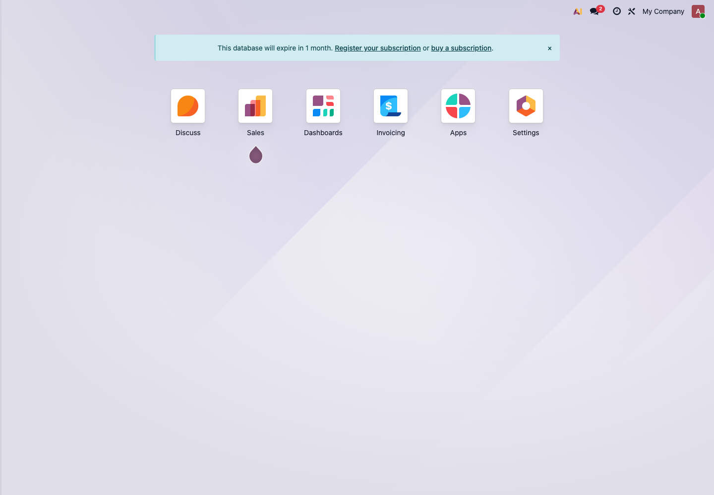
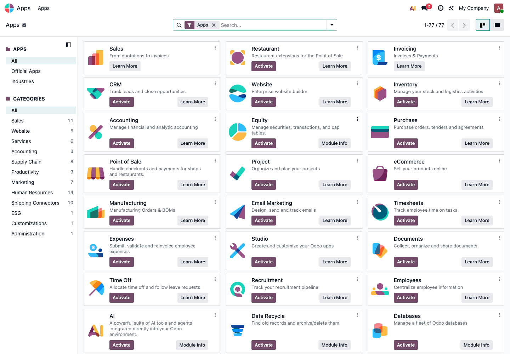

# 第一章 实施前准备

很多公司在实施 Odoo 时，会直接从“我要装哪些模块”开始讨论。这个思路并不坏，但还不够。真正影响项目成败的，往往不是某个按钮在哪里，而是上线前有没有把业务边界、数据和人员准备好。

本章先不讲复杂配置，只讲自主实施前必须想清楚的几件事。

## 先理解测试库的作用

测试库不是给技术人员看的，而是给业务人员试错用的。所有流程都应该先在测试库里跑通，再考虑正式上线。

下面是一套刚进入 Odoo 后的应用首页。客户在测试库中看到的第一个画面通常类似这样：

在这个页面里可以看到已经安装的应用。比如 Sales、Invoicing、Apps、Settings 等。自主实施时，不要急着把所有应用都打开，应该先围绕企业的主业务流程选择最少的一组模块。

## 第一步：写清楚上线目标

上线目标要尽量具体，不要写成“实现数字化管理”这种很大的话。小公司第一次上线，目标可以简单一点。

比较好的目标写法：

- 销售订单、发货和开票都在 Odoo 中完成；
- 仓库可以看到实时库存和待发货订单；
- 采购订单和供应商账单可以关联起来；
- 财务可以每周做一次银行对账；
- 老板可以看到销售额、应收账款和库存金额。

不建议第一期目标：

- 所有流程一次性全部自动化；
- 所有 Excel 都立刻取消；
- 所有报表都完全按旧系统重做；
- 一上来就要求大量定制页面。

第一期的重点不是完美，而是把主流程跑通。

## 第二步：确认业务主线

不同企业的主线不一样。自主实施前，先判断自己属于哪一种。

| 企业类型 | 第一条主线 | 优先模块 |
| --- | --- | --- |
| 贸易批发 | 报价 -> 销售订单 -> 采购 -> 入库 -> 发货 -> 开票 | 销售、采购、库存、财务 |
| 零售门店 | 产品 -> POS收银 -> 库存扣减 -> 收款 | POS、库存、财务 |
| 生产制造 | 销售预测/订单 -> 物料清单 -> 生产 -> 入库 -> 发货 | 销售、库存、生产、采购 |
| 服务公司 | 客户 -> 报价 -> 项目/任务 -> 工时/费用 -> 开票 | CRM、销售、项目、工时、财务 |
| 跨境电商 | 平台订单 -> 库存 -> 发货 -> 收款 -> 对账 | 销售、库存、物流接口、财务 |

如果一家公司同时有多个业务模式，也不要一开始全部上线。先选择收入占比最高、流程最稳定的一条线。

## 第三步：准备基础数据

Odoo 上线前最容易被低估的是基础数据。系统本身可以配置得很快，但脏数据会让后面的每一步都很痛苦。

至少要准备这些表：

- 公司资料：公司名称、地址、税号、电话、邮箱、银行账号；
- 用户资料：每个用户的姓名、邮箱、岗位、需要使用的模块；
- 客户资料：客户名称、联系人、电话、邮箱、发票地址、送货地址；
- 供应商资料：供应商名称、联系人、付款方式、采购币种；
- 产品资料：产品名称、内部编码、条码、单位、销售价格、成本、产品类别；
- 库存资料：仓库、库位、当前库存数量、批次/序列号；
- 财务资料：期初应收、期初应付、银行余额、税率、会计科目。

不要把旧系统里的所有字段都搬进 Odoo。先保留业务必须字段，其他字段等主流程稳定后再补。

## 第四步：先安装最少模块

在 Odoo 中安装模块的位置是 **Apps**。

在测试库中可以看到很多应用，例如 CRM、Website、Inventory、Purchase、Point of Sale、Manufacturing、Employees 等。小白客户最容易在这里“看到什么都想装”，这反而会让系统变复杂。

建议第一期只安装必要模块：

- 有销售流程：安装 Sales；
- 有采购流程：安装 Purchase；
- 有库存管理：安装 Inventory；
- 有收款开票：安装 Invoicing 或 Accounting；
- 有门店收银：安装 Point of Sale；
- 有生产加工：安装 Manufacturing。

暂时不建议第一期就安装太多营销、人事、网站、自动化模块，除非它们就是当前业务主线的一部分。

## 第五步：设置公司、用户和语言

基础设置通常从 **Settings** 开始。

这里需要先处理几件事：

- 公司信息是否正确；
- 文档版式是否已经配置；
- 系统语言是否符合使用习惯；
- 用户是否已经邀请；
- 权限是否按岗位分配；
- 计量单位、币种、税率是否符合实际业务。

不要让所有员工都使用管理员账号。管理员账号只用于配置和维护，日常业务应该用普通用户账号测试。

## 第六步：确定权限角色

权限不要按个人随意设置，而要按岗位设计。

常见角色可以这样拆：

- 老板：看报表和审批，不一定需要日常录单；
- 销售：客户、报价、销售订单；
- 采购：供应商、询价单、采购订单；
- 仓库：收货、发货、调拨、盘点；
- 财务：发票、付款、对账、报表；
- 门店员工：POS收银、退货、交班；
- 管理员：系统配置、应用安装、用户权限。

权限设置的原则是：够用就好。权限太大，容易误删或误改；权限太小，业务跑不起来。

## 第七步：准备测试用例

测试用例不需要写得很复杂，但必须覆盖真实业务。

建议每个模块至少准备 3 类测试：

- 正常流程：比如创建报价、确认订单、发货、开票、收款；
- 异常流程：比如取消订单、部分发货、退货、退款；
- 权限流程：普通员工能不能做，不能做的地方是否被限制。

如果测试库里所有流程都只由管理员操作，那不算真正测试。

## 上线前检查清单

正式上线前，至少确认以下事项：

- 公司信息、税率、币种、银行账号已经设置；
- 客户、供应商、产品资料已经导入并抽查；
- 期初库存和期初财务余额已经确认；
- 关键用户已经登录测试并完成自己的流程；
- 销售、采购、库存、财务至少跑通一条完整链路；
- 重要报表能看懂，数据口径已确认；
- 管理员账号、备份方式、邮件发送已经确认；
- 老系统停止录入和 Odoo 开始录入的时间点已经确定。

## 常见坑

- 一开始就追求“和旧系统一模一样”，导致大量不必要定制；
- 基础数据没有清洗，产品、客户、供应商重复严重；
- 财务没有参与前期设计，后面对账和报表口径不一致；
- 只测试了管理员账号，没有测试真实员工权限；
- 没有在测试库里做退货、退款、取消、部分收货等异常流程；
- 上线前没有明确哪一天开始用 Odoo 做正式数据。

## 什么时候需要找顾问

如果只是标准销售、采购、库存、财务流程，客户可以跟着本手册自己先做测试。但遇到下面情况，建议找顾问或开发人员一起评估：

- 多公司、多仓库、多币种同时上线；
- 需要和电商平台、物流、支付、外部财务系统对接；
- 要迁移大量历史数据；
- 需要复杂审批、价格计算、佣金、返利；
- 原生报表无法满足老板或财务的管理口径；
- 员工权限要求非常细，比如字段级限制、门店级限制。

Odoo 很灵活，但灵活不代表所有事情都应该第一天就定制。自主实施的第一原则是：先让原生流程跑起来，再决定哪里值得优化。

