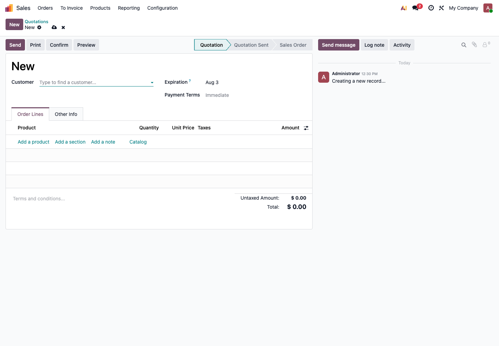

# 第四章 测试库演练方法

测试库不是用来“看看界面”的，而是用来模拟真实业务。只有真实岗位、真实数据、真实异常都跑过，才能判断 Odoo 是否可以上线。

这一章给出一套适合小白客户的测试方法。照着做，可以把“我感觉差不多了”变成“这些流程已经确认通过”。

## 什么是有效测试

有效测试不是管理员随便点几下。有效测试至少要满足四个条件：

- 使用接近真实业务的数据；
- 使用真实岗位账号，而不是只用管理员；
- 跑完整流程，而不是只创建一张单；
- 记录问题、负责人和处理结果。

如果只由实施人员或老板用管理员账号测试，很多权限问题、交接问题和异常流程都不会暴露。

## 测试前准备

测试前先准备一组最小数据。

| 数据 | 建议数量 | 用途 |
| --- | --- | --- |
| 客户 | 2 到 3 个 | 测试报价、销售订单、收款、对账 |
| 供应商 | 2 到 3 个 | 测试采购订单、收货、供应商账单 |
| 产品 | 5 到 10 个 | 覆盖商品、服务、不同税率或不同单位 |
| 仓库 | 1 到 2 个 | 测试收货、发货、调拨、盘点 |
| 用户 | 每个岗位 1 个 | 测试权限和岗位流程 |
| 银行流水 | 3 到 5 条 | 测试收款、付款和银行对账 |

产品可以先从 Sales 的 Products 菜单创建。不要一开始就导入几千个产品来测试，那样问题会被数据量淹没。


## 测试角色

建议至少准备这些测试角色：

| 角色 | 负责测试 |
| --- | --- |
| 销售 | 客户、报价、销售订单、销售发票申请 |
| 采购 | 供应商、询价单、采购订单 |
| 仓库 | 收货、发货、调拨、盘点 |
| 财务 | 客户发票、供应商账单、付款、银行对账 |
| 老板 | 报表、审批、关键业务查看 |
| 管理员 | 系统设置、权限调整、问题排查 |

每个角色都应该用自己的账号登录测试。这样才能知道权限是否够用。

## 流程一：销售到收款

这是大多数企业最先要跑通的流程。

```text
客户 -> 报价单 -> 销售订单 -> 发货 -> 客户发票 -> 收款 -> 对账
```

在 Sales 中新建报价单时，至少要测试客户、产品、数量、价格、税率和付款条件。



测试步骤：

1. 销售创建客户；
2. 销售创建报价单；
3. 销售添加产品、数量、单价和税率；
4. 销售发送或打印报价单；
5. 客户确认后，将报价单确认成销售订单；
6. 仓库处理发货；
7. 财务创建客户发票；
8. 财务登记客户付款；
9. 财务检查应收账款和对账状态。

验收标准：

| 检查项 | 通过标准 |
| --- | --- |
| 报价 | 客户、产品、价格、税率正确 |
| 订单 | 报价确认后状态变化正确 |
| 发货 | 库存数量按发货减少 |
| 开票 | 发票金额和订单金额一致 |
| 收款 | 客户应收减少 |
| 报表 | 销售额和应收账款能查到 |

## 流程二：采购到付款

采购流程用于验证供应商、采购价格、收货和供应商账单。

```text
供应商 -> 询价单 -> 采购订单 -> 收货 -> 供应商账单 -> 付款 -> 对账
```

测试步骤：

1. 采购创建供应商；
2. 采购创建询价单；
3. 采购添加产品、数量和采购价格；
4. 确认采购订单；
5. 仓库收货；
6. 财务创建供应商账单；
7. 财务登记供应商付款；
8. 财务检查应付账款。

验收标准：

| 检查项 | 通过标准 |
| --- | --- |
| 采购单 | 供应商、产品、数量、价格正确 |
| 收货 | 库存数量按收货增加 |
| 账单 | 账单金额能和采购订单匹配 |
| 付款 | 供应商应付减少 |
| 报表 | 应付账款和采购统计能查到 |

## 流程三：库存盘点和调拨

只要企业管理实物库存，就必须测试库存流程。

测试步骤：

1. 查询某个产品当前库存；
2. 做一次库存调整；
3. 做一次内部调拨；
4. 做一次销售发货；
5. 做一次采购收货；
6. 检查库存数量变化是否符合预期。

验收标准：

| 检查项 | 通过标准 |
| --- | --- |
| 现有库存 | 系统数量能解释来源 |
| 盘点 | 调整后数量正确 |
| 调拨 | 源库位减少，目标库位增加 |
| 收货 | 采购收货后库存增加 |
| 发货 | 销售发货后库存减少 |

如果企业有批次或序列号管理，必须额外测试批次追踪和序列号唯一性。

## 流程四：财务对账

财务测试不能只看发票是否能创建，还要测试付款和银行对账。

测试步骤：

1. 创建一张客户发票；
2. 登记一笔客户付款；
3. 导入或手工创建一条银行流水；
4. 将银行流水和付款或发票匹配；
5. 检查应收账款是否关闭；
6. 查看账龄报表。

验收标准：

| 检查项 | 通过标准 |
| --- | --- |
| 发票 | 金额、税率、客户正确 |
| 付款 | 付款金额和日期正确 |
| 银行流水 | 流水能进入银行日记账 |
| 对账 | 银行流水能匹配到发票或付款 |
| 账龄 | 已收款发票不再显示为未收 |

国内客户要特别注意：Odoo 的客户发票是会计应收单据，不等于中国税控发票。测试时要先确认企业是否需要单独对接开票平台。

## 异常流程测试

只测试顺利流程是不够的。真实业务一定会出错。

建议至少测试这些异常：

| 异常场景 | 要验证什么 |
| --- | --- |
| 报价单取消 | 取消后是否还能误发货或误开票 |
| 销售部分发货 | 未发数量是否保留 |
| 客户退货 | 库存是否增加，应收是否正确处理 |
| 客户部分付款 | 应收余额是否正确 |
| 采购部分收货 | 未收数量是否保留 |
| 供应商账单金额不一致 | 财务是否能发现差异 |
| 员工权限不足 | 系统是否阻止越权操作 |
| 产品价格错误 | 修改后新旧订单是否按预期处理 |

异常测试是最能发现问题的地方。不要怕测试库弄乱，测试库就是用来犯错的。

## 测试问题记录表

每次测试都要记录问题。不要只在微信群里说一句“这里不对”，很快就会忘。

建议使用下面格式：

| 编号 | 模块 | 角色 | 问题描述 | 期望结果 | 实际结果 | 处理方案 | 负责人 | 状态 |
| --- | --- | --- | --- | --- | --- | --- | --- | --- |
| T001 | 销售 | 销售 | 报价单税率不对 | 默认 13% | 显示 15% | 调整产品税率 | 财务 | 待处理 |
| T002 | 库存 | 仓库 | 发货后库存没减少 | 库存减少 | 未变化 | 检查产品类型 | 实施顾问 | 已解决 |

状态建议只用四种：

- 待确认；
- 待处理；
- 已解决；
- 暂不处理。

“暂不处理”也要写原因。比如这个问题属于二期优化，或原生 Odoo 暂不支持，需要后续定制。

## 测试通过标准

测试通过不是没有任何问题，而是关键流程可用，剩余问题有明确处理方案。

可以用下面标准判断：

| 项目 | 通过标准 |
| --- | --- |
| 主流程 | 销售、采购、库存、财务至少一条完整链路跑通 |
| 异常流程 | 取消、退货、部分收货、部分付款已测试 |
| 权限 | 每个岗位能完成自己的工作，不能做不该做的事 |
| 数据 | 客户、产品、库存和财务数据抽查正确 |
| 报表 | 老板和财务能看懂关键报表 |
| 问题 | 所有上线前必须解决的问题已经关闭 |
| 切换 | 已确定正式上线日期和旧系统停止录入规则 |

如果这些标准没有达到，不建议直接上线。

## 试运行和正式上线的区别

测试通过后，可以进入试运行。试运行和正式上线不是一回事。

| 阶段 | 目的 | 数据要求 |
| --- | --- | --- |
| 测试库演练 | 找问题、练流程 | 可以使用测试数据 |
| 试运行 | 用真实业务验证系统 | 使用接近真实的业务数据 |
| 正式上线 | 系统成为唯一业务来源 | 使用正式数据，旧系统停止新增 |

试运行期间可以保留旧系统查询，但不要长期双系统录入。同一笔业务同时录入两个系统，后面一定会对不上。

## 小白客户常见坑

- 只测试创建单据，不测试后续发货、开票、付款；
- 只测试正常流程，不测试取消、退货、部分付款；
- 只用管理员账号测试，没有用真实岗位账号；
- 问题只在聊天软件里说，没有形成问题清单；
- 测试数据太随意，和真实业务差异太大；
- 一边测试一边频繁改需求，导致永远无法验收；
- 老板没有参与报表验收，上线后才发现口径不对。

测试的目标不是证明系统完美，而是提前发现哪些地方需要配置、培训或二期优化。只要问题被看见，项目就已经向前走了一大步。
