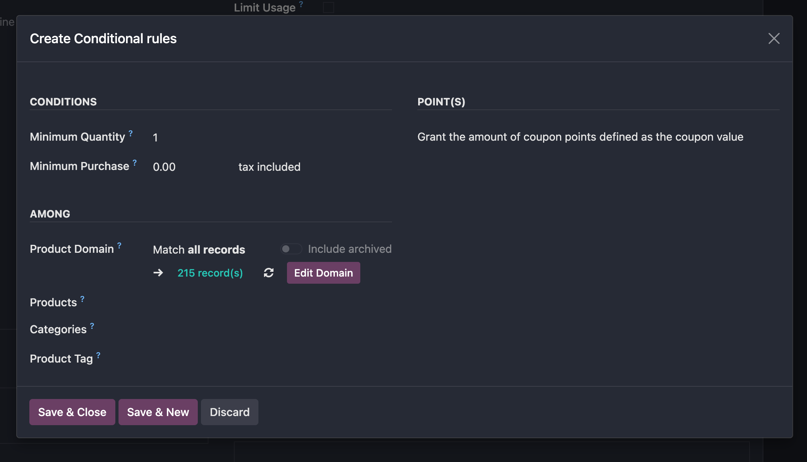
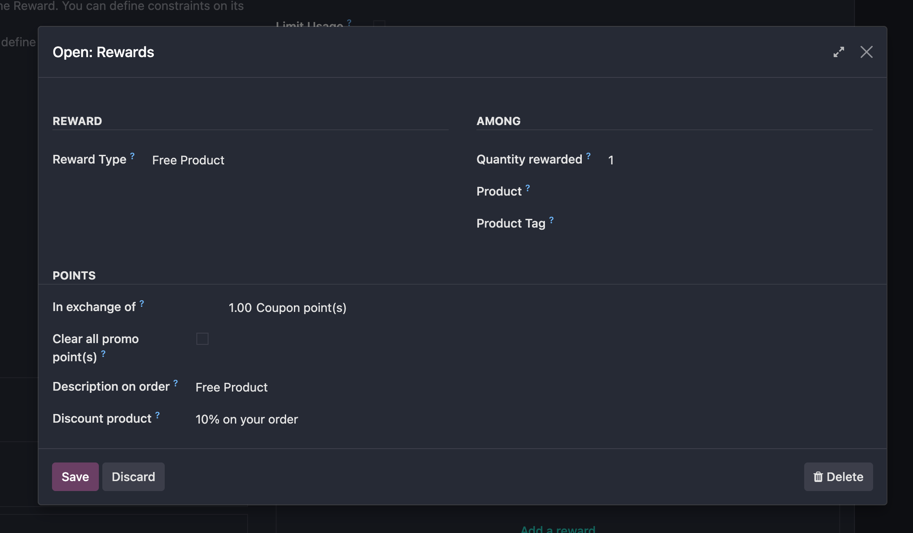

# 客户忠诚度

* [激活客户忠诚度](#激活客户忠诚度)
* [设置忠诚度方案](#设置忠诚度方案)
  * [卡券](#卡券)

Odoo内置了提高客户忠诚度的方案，本章我们就来看一下如何在Odoo中使用忠诚度方案。

## 激活客户忠诚度

首先我们需要在Odoo中激活客户忠诚度方案，方法是在Pos-设置中勾选**促销、卡券、礼品卡和忠诚度**选项。

## 设置忠诚度方案

odoo默认支持的忠诚度类型包含以下几种：

* 卡券(Coupons)
* 礼品卡(Gift_Card)
* 积分卡(Loyalty_Card)
* 促销(Promotions)
* 电子钱包(eWallet)
* 折扣(Discount_Code)
* 买送(Buy X Get Y)
* 再消费卡券(Next Order Coupons)

不同类型的方案对应不同的规则，下面我们一个一个来看。

### 卡券

卡券用来手动生成并分享券码，用户可以灵活地设置它的用途和条件。

卡券只能通过券码的方式进行抵扣，用户获取的积分只能在当前订单使用。

#### 设置条件

使用卡券前要设置满足的**条件**

1. 我们可以设置满足条件的最小数量或者至少要购买多少件才能使用。
2. 可以指定生效的产品范围、产品类型或者产品标签
3. 自定义过滤器(domain)来实现更精细地筛选

#### 设置奖励

奖励的类型分为**免费产品**和**折扣**两种。

对于免费产品类型的奖励来说，我们可以设置对于哪些产品或者包含指定标签的产品实施奖励。

积分兑换：我们可以设置要获取此奖励要消耗多少积分，以及是否清空剩余积分。

