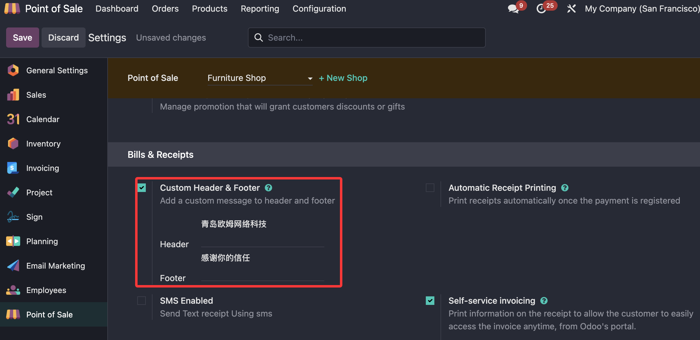
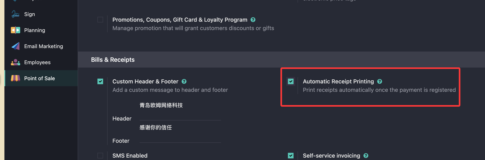
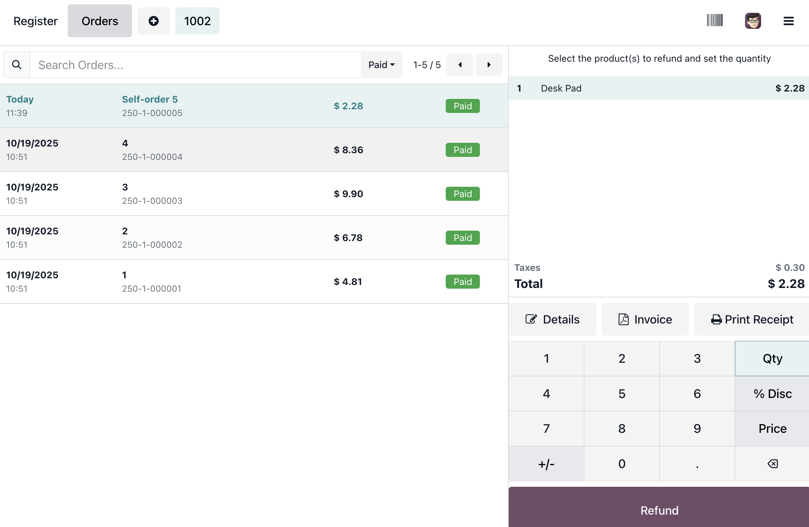
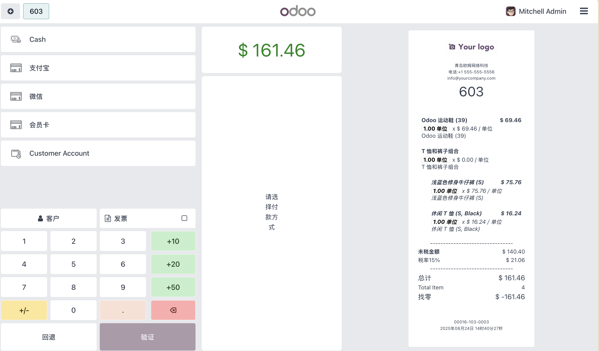
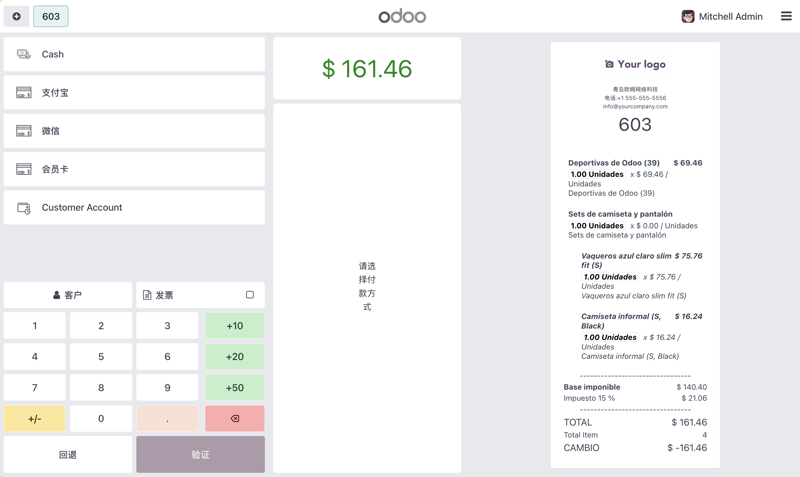

# POS小票

> 本文基于odoo18.0且安装了欧姆网络的pos解决方案模块[mommy_pos](https://apps.odoo.com/apps/modules/18.0/mommy_pos)

* [小票](#小票)
  * [页眉和页脚](#定制化小票页眉和页脚)
  * [自动打印](#自动打印)
  * [补打小票](#补打小票)
  * [小票预览](#小票预览)
  * [小票语言设置](#小票语言设置)
* [发票](#发票)
  * [设置](#配置)
  * [给客户开票](#给客户开票)
  * [后台开票](#后台开票)
  * [二维码开票](#二维码开票)

## 小票

小票是POS打印出来给客户的购物凭证。在Odoo中设置小票的方法：

销售点(Point of Sale) -> 设置 -> 销售点

然后选择一个销售点，然后下滑到**发票和小票**节点:

### 定制化小票页眉和页脚

如果想要自定义小票的页眉和页脚，勾选定制化页眉和页脚勾选项，然后在下面的输入框内输入想要显示的文字。

然后我们点击保存，回到POS前端，当我们打印小票的时候就会显示出我们自定义的页眉和页脚

### 自动打印

Odoo支持收款的时候自动打印POS小票，方法是在设置中勾选**自动打印小票**勾选项。

> 可能需要ePOS支持

### 补打小票

正常情况下小票在付款时候进行打印，如果客户丢了小票需要补打，则需要先加载已经支付的小票，然后选择**打印小票**

### 小票预览

odoo原生条件下，只有在完成支付之后才能显示出小票。但是有时候，用户希望在支付前就能预览小票的样子，为此，我们在POS的通用解决方案中加入了小票预览的选项。下面来看一下如何使用。

首先，我们在POS的门店设置中开启，小票预览:

选中此设置后，我们在POS界面选完产品进入支付界面的时候，就可以看到在最右侧显示了当前的小票预览。

### 小票语言设置

Odoo原生条件下小票语言使用的是当前用户选择的语言，大多数情况下是好用的。但是某些情况下，用户希望可以指定小票的语言，而给客户人的是另外一种语言。例如，收银人员使用中文，而小票打出来使用的是西语。

我们在解决方案中加入了对此功能的支持。在POS的门店设置中，选择小票使用的语言：

然后我们在回到POS预览小票：

## 发票

对于已经注册的客户，Odoo支持在POS端进行开票。

### 配置

首先我们需要给POS前台的票设置一个默认日记账。方法是在设置中，下拉到财务节点，然后定义默认日记账：

### 给客户开票

设置好默认日记账之后我们就可以在POS前端给客户进行开票操作了。

### 后台开票

也会到Odoo的POS后台进行开票，方法是在POS-订单-订单列表中找到要开票的订单，然后点击开票按钮完成开票。

### 二维码开票

客户也可以选择在小票中的二维码上扫码进行开票，客户需要在扫码后填写必要的信息然后点击获取发票按钮，然后选择下载发票。
