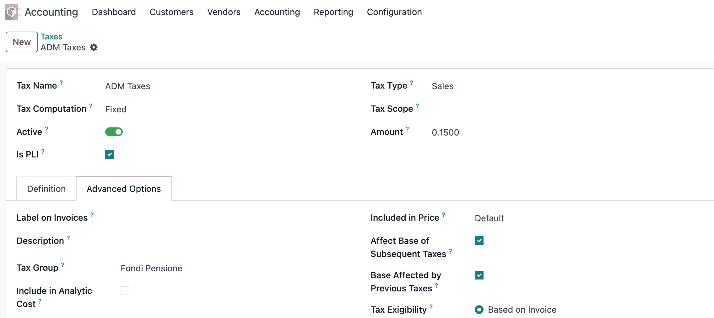
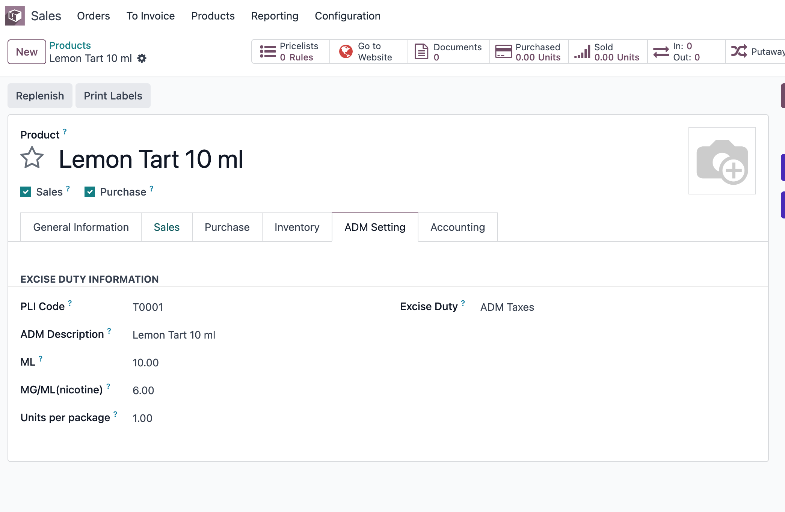
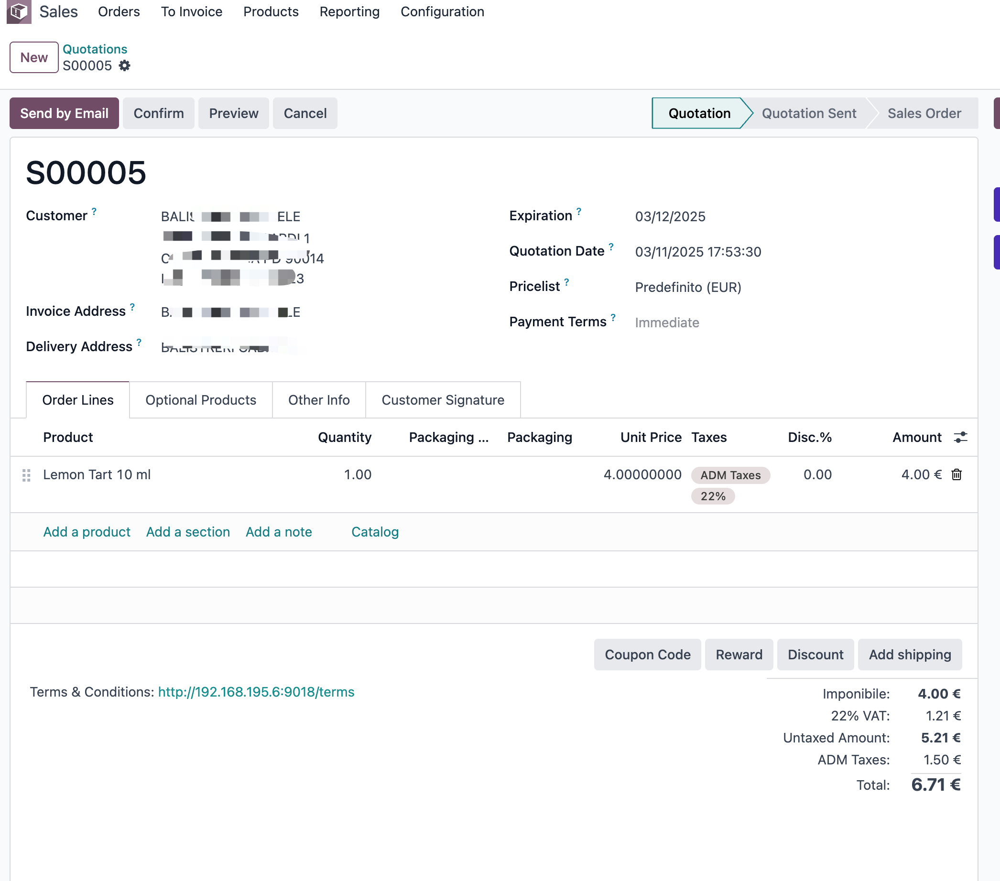

# 消费税

* [消费税计算逻辑](#消费税的计算逻辑)
* [在odoo中的实现](#在odoo中的实现)
  * [定义消费税](#定义消费税)
  * [创建产品](#创建产品)
  * [消费税计算](#消费税计算)

首先我们来明确**消费税**的定义, 消费税(Excise Duty)是对特定消费品（如烟草、酒类、燃油、奢侈品）在生产或进口环节征收的间接税。 在其他国家（如美国、澳大利亚、欧盟），消费税常被称为：

| 英文名称            | 中文含义  | 说明                           |
| --------------- | ----- | ---------------------------- |
| **Excise Duty** | 消费税   | 最常见的官方称呼                     |
| **Excise Tax**  | 特定商品税 | 美国常用                         |
| **Sin Tax**     | “罪恶税” | 政策或媒体中非正式称呼，意指抑制不良消费（烟、酒、赌博） |

## 消费税的计算逻辑

消费税通常是以产品的某种计量标准进行收取，比如对于酒类，通常的征收方式是根据酒精的含量。对于烟草，则是按支数或重量进行征收。具体的标准取决于当地税务部门的具体规定。

下面我们以意大利目前对烟油按含量（nicotine mg/ml）计价的做法，给出清晰的计算说明与几个常见示例：

> 关键税率（意大利、2025 起） 
> 含 ≤15 mg/ml 的烟油（含无尼古丁产品）：€0.15 / ml  
> 含 >15 mg/ml 的烟油：€0.20 / ml。

计算方法（规则）

1. 按瓶体积（毫升）计税：税额 = 税率（€ / ml） × 瓶体积（ml）。
（税率由该瓶中是否含超过 15 mg/ml 的尼古丁决定。）

2. 若要算每瓶应征消费税，直接用上式即可。

3. 若要计算到零售价上，通常先把消费税加入到价格基数，再按本地规则加上增值税（VAT），例如意大利标准 VAT 常见为 22%（在此示例中我们以 22% 做示范，但实际应按你适用的 VAT 率）。

> 注意：不同产品（如加热烟草、一次性电子烟等）和法规更新会有差异，最好以官方公告或税务顾问为准。

### 示例1 — 典型 10 ml 瓶（低浓度）

* 配置：10 ml, 6 mg/ml（≤15 mg/ml）

* 税率：€0.15 / ml（适用低浓度档）

计算：

* 消费税 = €0.15 × 10 = €1.50 / 瓶

* 若假设不含税出厂价（净价）为 €4.00，再加上消费税与 VAT（22%）：

* 含税前价格 = €4.00 + €1.50 = €5.50

* VAT = 22% × €5.50 = €1.21

* 最终含税零售价 ≈ €6.71（不含零售商加价）

### 示例 B — 10 ml 瓶（高浓度）

* 配置：10 ml, 20 mg/ml（>15 mg/ml）

* 税率：€0.20 / ml（高浓度档）

计算：

* 消费税 = €0.20 × 10 = €2.00 / 瓶

* 若同样假设不含税出厂价为 €4.00：

* 含税前价格 = €4.00 + €2.00 = €6.00

* VAT = 22% × €6.00 = €1.32

* 最终含税零售价 ≈ €7.32

## 在odoo中的实现

现在我们以低浓度的烟油产品Dinner Lady为实际例子来看一下如何在odoo中进行消费税的计算。

### 定义消费税

由于消费税的计量方式与普通的税率不同，因此我们需要在原有税率的基础上标识出这个税率是消费税。

> Is PLI此处用来标识包含烟油

### 创建产品

接下来我们来创建一个产品Lemon Tart 10 ml

此产品的尼古丁浓度为 6mg/ml, 烟油容量为10ML，产品售价为4€。

### 消费税计算

我们创建一个销售订单来计算消费税，使用意大利常见的VAT 22%的税率。

由此可见，Odoo中的计算结果与我们的理论值完全相同。其关键节点就在于消费税的计税数量为烟油含量而非销售订单数量。

