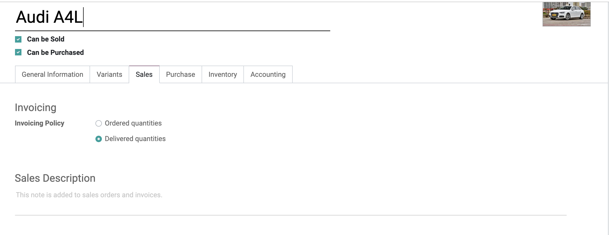
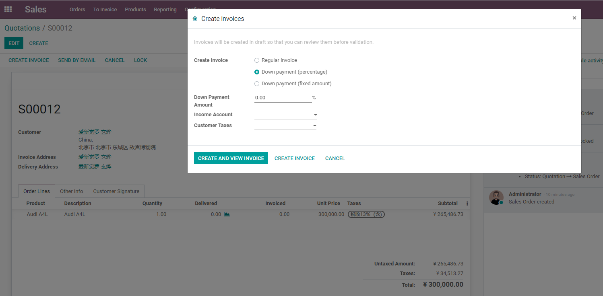
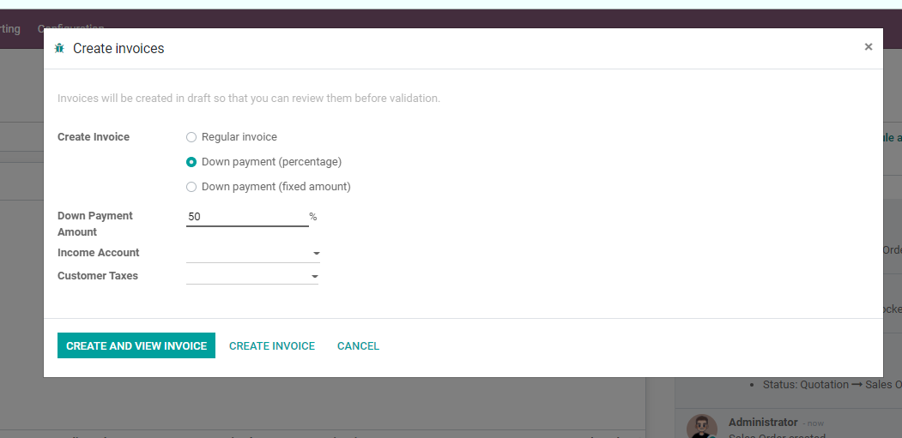
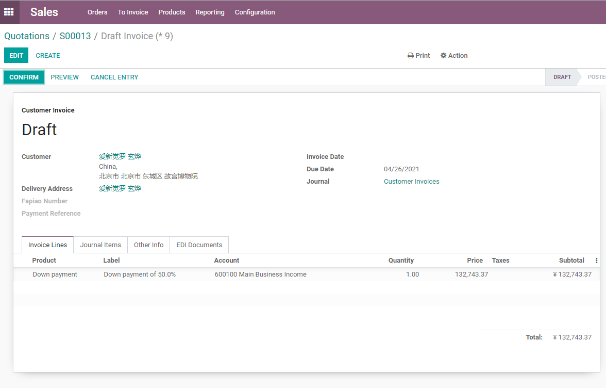
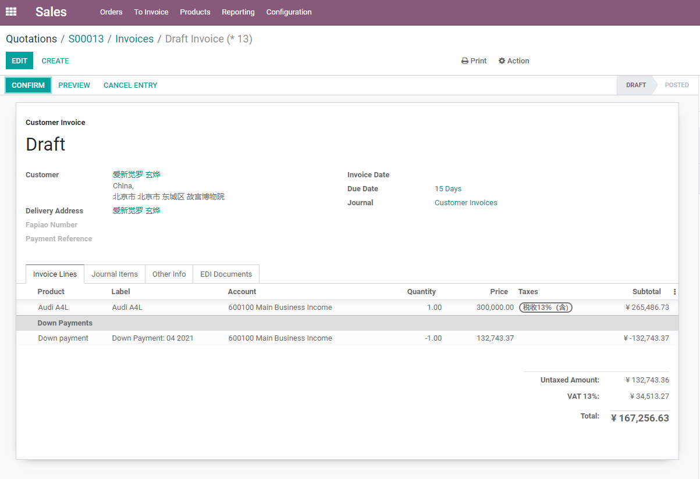

# 第五章 开票策略与预付款

销售订单确认以后，企业最关心的问题通常是：什么时候可以给客户开票，开多少，按订单数量开还是按交付数量开，客户预付款要怎么处理。Odoo原生通过产品上的开票策略、销售订单上的创建发票动作、预付款发票和形式发票来处理这些问题。

开票不是销售部门一个人的事，它会影响财务应收、收入确认、库存交付、项目服务和客户付款体验。本章我们就来看一下Odoo销售中的开票策略和预付款逻辑，帮助客户在上线前把“报价、交付、开票、收款”的口径讲清楚。

## 两种开票策略

Odoo原生支持两种核心开票策略：

开票策略通常在产品上维护。销售订单创建发票时，系统会根据产品开票策略和当前交付情况判断可开票数量。



| 策略 | 含义 | 适用场景 |
| --- | --- | --- |
| 按订购数量开票 | 销售订单确认后，就可以按订单数量开票 | 标准商品、预收款、按合同金额开票 |
| 按已交付数量开票 | 产品交付后，按实际交付数量开票 | 分批发货、散装材料、按实际交付结算 |

开票策略可以在销售设置中设置默认值，也可以在产品资料中单独调整。设置默认策略只会影响之后新建或更新的产品，已经存在的产品通常需要单独确认。

## 按订购数量开票

按订购数量开票的逻辑比较直接。

```text
报价确认 -> 销售订单 -> 创建发票 -> 确认发票 -> 登记付款
```

这种方式适合：

- 客户确认订单后即可开票；
- 先收款再发货；
- 标准服务费；
- 固定金额合同；
- 不需要等仓库交付后再结算的业务。

优点是流程简单，财务可以更早开票。缺点是如果实际交付数量变化较大，后续可能需要退款、贷项通知单或补开发票。

## 按已交付数量开票

按已交付数量开票会把开票动作和交付结果绑定。

```text
报价确认 -> 销售订单 -> 发货/交付 -> 创建发票 -> 按交付数量开票
```

这种方式适合：

- 分批发货；
- 实际交付数量可能和订单数量不同；
- 材料、液体、食品等按实际数量结算；
- 服务需要交付完成后再开票；
- 项目、工时、里程碑等交付驱动业务。

如果产品设置为按交付数量开票，但还没有交付，销售订单上可能不会有可开票数量。客户看到“为什么不能开票”时，通常要先检查产品开票策略和交付数量。

## 创建常规发票

销售订单确认后，可以点击 **创建发票**。

创建发票时，系统会弹出向导。选择常规发票时，系统会根据当前可开票数量创建客户发票草稿。



常规发票会根据可开票数量生成发票草稿。财务确认后，发票进入正式应收流程，再登记客户付款。

在销售菜单的待开票列表中，可以集中查看哪些销售订单已经满足开票条件。财务或销售主管可以从这里批量进入开票处理。


要注意：

- 销售订单不是会计发票；
- 发票草稿还不是正式应收；
- 发票确认后才会进入会计账务；
- 登记付款后才表示客户付款已经记录；
- 银行对账和付款状态还会受财务配置影响。

销售人员不需要掌握所有会计细节，但要知道销售订单、发票、付款是三个不同阶段。

## 预付款

预付款适合客户先支付一部分金额，再根据交付或最终结算开尾款。

选择预付款百分比或固定金额后，系统会生成一张预付款发票。



Odoo创建发票时，可以选择：

| 方式 | 说明 |
| --- | --- |
| 预付款百分比 | 按销售订单总额的一定比例开票，例如30% |
| 预付款固定金额 | 开固定金额预付款，例如5000元 |
| 常规发票 | 按可开票数量创建普通发票 |

预付款常见场景：

- 定制产品；
- 高价值设备；
- 项目实施；
- 跨境订单；
- 租赁押金或订金；
- 客户信用不足时先收款。

预付款发票确认并收款后，后续创建最终发票时，系统会把已经开过的预付款进行抵扣，避免重复收款。

下图是一张预付款发票示例。它代表客户先支付的一部分金额，不等同于最终结算完成。



## 100%预付款不是最终发票

Odoo官方文档中特别容易被忽略的一点是：100%预付款不等于销售订单已经完成最终开票。

它仍然是预付款流程。系统后续可能还需要生成最终发票，用来完成销售订单的结算关系。

所以如果企业只是想“一次性开完整发票”，通常应使用常规发票；如果业务上确实是先收全款、后交付、后结算，可以使用100%预付款。

这个区别在实施时要讲清楚，否则财务可能会疑惑为什么已经收了100%，系统还允许继续创建发票。

创建尾款或最终发票时，系统会自动抵扣已经开过的预付款，避免重复收款。



## 形式发票

形式发票通常用于提前给客户查看付款信息或进口清关资料，它不是正式会计发票。

适合场景：

- 外贸客户付款前需要Pro-forma Invoice；
- 客户内部审批需要付款文件；
- 货物发出前需要商业文件；
- 不希望先生成正式应收发票。

形式发票不要和正式发票混淆。它可以作为商业预览文件，但真正进入财务应收的仍然是客户发票。

## 销售开票和库存的关系

开票策略会影响销售和库存的配合。

| 产品开票策略 | 库存影响 | 开票影响 |
| --- | --- | --- |
| 按订购数量 | 是否发货不影响可开票数量 | 确认订单后通常可开票 |
| 按已交付数量 | 需要完成交付数量 | 交付后才出现可开票数量 |

如果企业启用库存，销售订单确认后通常会生成发货单。仓库完成发货后，已交付数量更新，财务再按策略开票。

如果企业销售的是服务，已交付数量可能来自手工交付、项目里程碑、工时或其他服务交付机制。

销售订单行中的已交付数量和已开票数量，是判断后续能否开票的重要依据。


## 实施建议

开票策略不要只由销售决定，必须让财务和业务负责人一起确认。

推荐做法：

| 产品类型 | 常见建议 |
| --- | --- |
| 标准现货商品 | 可按订购数量或交付数量，取决于是否先款后货 |
| 分批发货商品 | 通常按已交付数量 |
| 定制产品 | 常用预付款+尾款 |
| 服务产品 | 根据服务交付方式选择订购数量、工时或里程碑 |
| 项目实施 | 常用预付款、阶段款、里程碑开票 |
| 外贸订单 | 常结合形式发票、预付款和最终发票 |

本章我们把销售开票策略、常规发票、预付款、100%预付款、形式发票和库存交付之间的关系讲清楚了。下一章会继续看价格表、折扣和多币种，解决不同客户、不同市场、不同币种下的销售定价问题。
