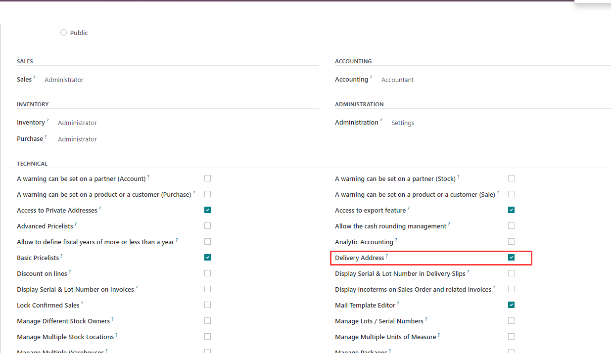
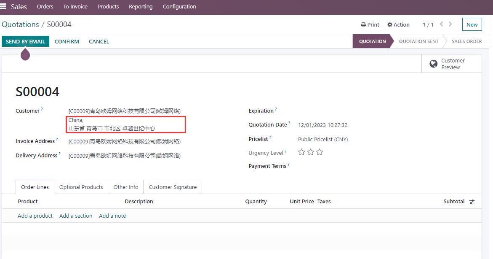
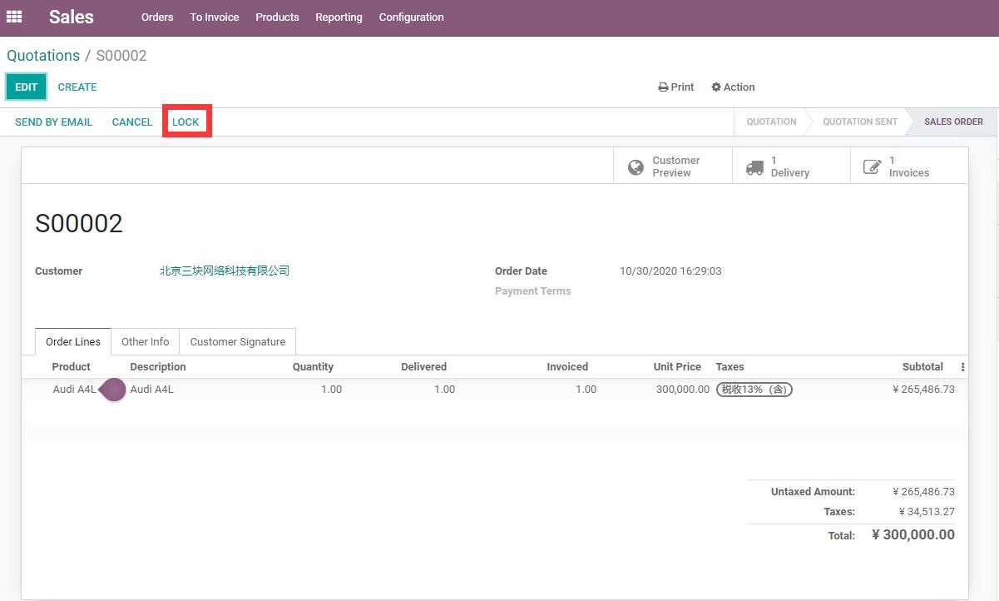
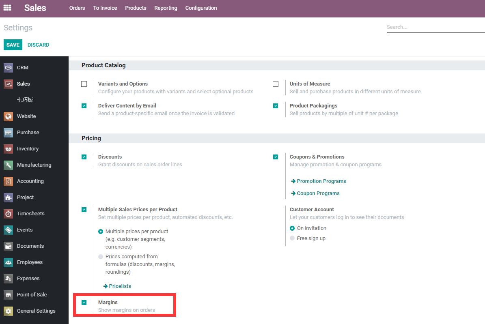
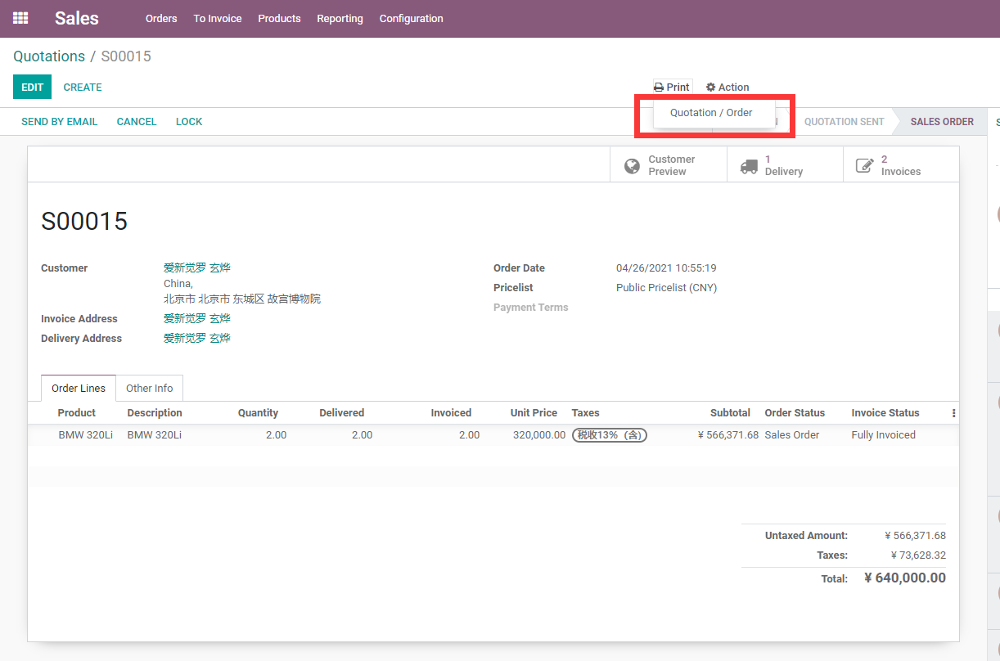
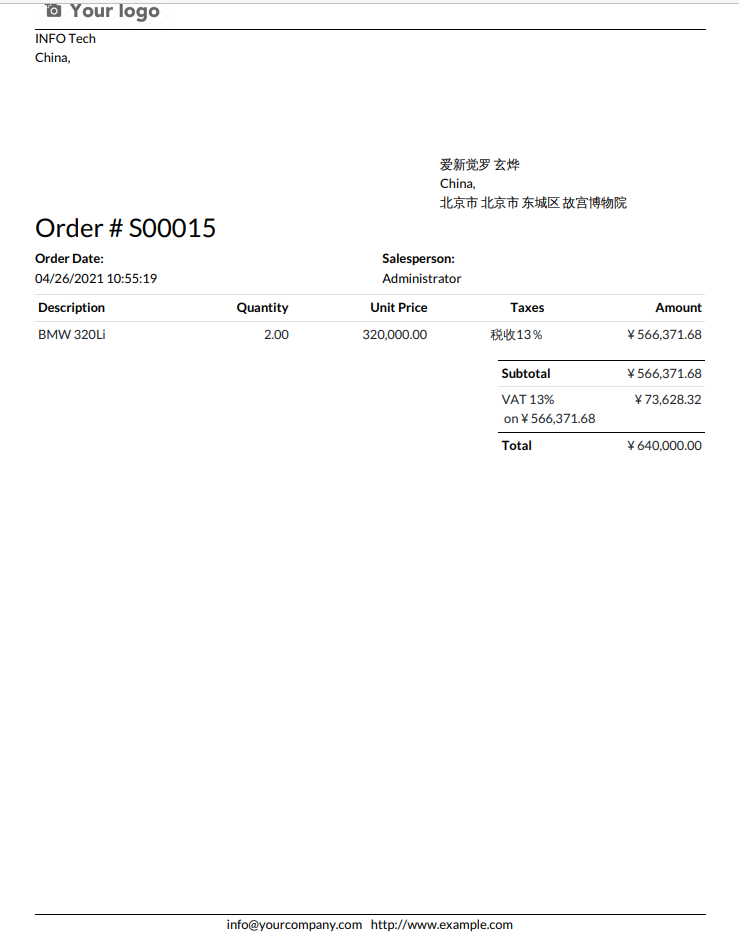

# 第一章 销售管理总览

Odoo原生销售模块用于管理从客户报价到销售订单，再到交付、开票和收款的完整流程。它不是单独的一张订单表，而是连接CRM、联系人、产品、价格表、库存、会计、网站、租赁和项目服务的核心模块。

企业实施Odoo销售管理时，最重要的不是先把旧系统里的订单界面照搬过来，而是先理解Odoo的标准销售链路：什么阶段是报价，什么阶段是订单，什么时候触发库存，什么时候可以开票，价格、税率、付款条件和交付承诺分别在哪里决定。本章先建立整体框架，后续章节再逐步展开每一块。

## 销售管理的标准流程

Odoo销售流程可以简单理解为：

```text
客户/商机 -> 报价单 -> 客户确认 -> 销售订单 -> 交付 -> 开票 -> 收款 -> 售后
```

不同企业会有不同变体：

| 企业类型 | 常见流程 |
| --- | --- |
| 贸易公司 | 报价 -> 确认订单 -> 采购/备货 -> 发货 -> 开票收款 |
| 服务公司 | 商机 -> 报价 -> 项目/工时 -> 阶段开票 -> 收款 |
| 外贸公司 | 报价 -> 形式发票 -> 预付款 -> 发货 -> 尾款发票 |
| 门店/零售 | POS直接销售，必要时和销售订单衔接 |
| 租赁业务 | 租赁订单 -> 出租 -> 归还 -> 开票 |
| 定制生产 | 报价 -> 确认订单 -> 生产/采购 -> 发货 -> 开票 |

Odoo的优势在于这些流程并不是孤立的。销售订单确认后，可以根据产品和配置自动生成发货、采购、生产、项目任务或发票。

## 销售模块和其他模块的关系

销售模块经常会和其他模块一起使用。

| 相关模块 | 和销售的关系 |
| --- | --- |
| 联系人 | 客户、开票地址、送货地址、联系人 |
| CRM | 商机转报价，统计销售漏斗和赢单率 |
| 产品 | 决定是否可销售、价格、税率、开票策略、交付方式 |
| 库存 | 销售订单确认后生成发货单，影响可用库存 |
| 会计 | 销售订单创建客户发票，登记收款和应收账款 |
| 网站/门户 | 客户在线查看、签名、支付和下载单据 |
| 项目/工时 | 服务销售、按工时或里程碑开票 |
| 采购/生产 | 按订单采购、按订单生产、补货 |
| 租赁 | 基于销售订单扩展出租和归还流程 |

所以销售模块实施不能只问“销售要填哪些字段”，还要问库存怎么发货、财务怎么开票、客户怎么确认、产品怎么定价。

## 报价单和销售订单

报价单是尚未被客户确认的销售提案。客户接受后，报价单确认为销售订单。

下面是一张典型的报价单。此时订单还没有正式成立，系统顶部仍然显示发送邮件、确认、取消等操作按钮。


| 阶段 | 业务含义 | 系统影响 |
| --- | --- | --- |
| 报价单 | 给客户的价格和条件提案 | 可以修改、发送、设置有效期 |
| 已发送报价 | 已经发给客户等待确认 | 可跟进、可在线签名或支付 |
| 销售订单 | 客户已经确认 | 触发交付、开票、采购、生产或项目 |
| 已取消 | 交易取消 | 相关下游单据需要同步处理 |
| 已锁定/完成 | 订单不再随意修改 | 适合归档或流程完成 |

从技术角度看，报价单和销售订单通常是同一个对象的不同状态。对业务人员来说，关键是理解：确认订单以后，系统会开始产生后续业务动作。

确认后的销售订单会出现交付、客户预览等智能按钮，订单行也会显示已交付、已开票等履约字段。


## 销售设置先看哪些

进入 **销售 -> 配置 -> 设置**，常见设置包括：

| 设置 | 作用 |
| --- | --- |
| 报价模板 | 快速生成标准报价内容 |
| 在线签名 | 客户在门户中签署确认报价 |
| 在线支付 | 客户付款后确认订单 |
| 报价有效期 | 控制报价默认有效天数 |
| 价格表 | 启用客户等级价、多币种、促销价 |
| 折扣 | 允许在订单行中显示折扣字段 |
| 利润 | 在销售订单中查看成本和毛利 |
| 发货地址 | 客户、开票地址、送货地址分开管理 |
| 开票策略 | 默认按订购数量或已交付数量开票 |
| 销售警告 | 对特定客户或产品给销售提醒 |

不建议一开始把所有开关都打开。第一期可以先启用报价、产品、价格、交付、开票必需的设置；等流程稳定后，再逐步启用在线签名、在线支付、报价模板、复杂价格表等能力。

## 客户地址

一个客户可能有多个地址：总公司、开票地址、送货地址、联系人地址。销售订单中常见的三个角色是：

| 地址 | 用途 |
| --- | --- |
| 客户 | 当前销售订单所属客户 |
| 开票地址 | 发票抬头、税号、账务往来对象 |
| 送货地址 | 仓库发货和物流配送地址 |

很多客户初期会把所有地址都写在一个联系人里。这样小规模使用没问题，但当一个集团客户有多个门店、仓库、开票主体时，就应该使用联系人层级和不同地址类型。

在用户权限或销售设置中启用相关能力后，销售订单可以显示单独的开票地址和送货地址。



如果希望销售员在订单上直接看到完整地址，也可以通过方案增强把详细地址展示出来，减少仓库发货前反复点开客户资料的动作。



## 交付承诺和提前期

销售订单不仅记录客户买什么，也记录企业承诺什么时候交付。

常见概念：

| 概念 | 说明 |
| --- | --- |
| 销售提前期 | 产品从下单到可交付需要的时间 |
| 承诺交货日期 | 销售对客户承诺的交付日期 |
| 预计日期 | 系统根据提前期和策略计算出的交付日期 |
| 交付策略 | 尽快交付，或等全部产品就绪再交付 |

如果企业有库存、采购或生产，交付日期就不能只靠销售随手填写。销售承诺会影响仓库计划、采购补货和客户满意度。

订单中可以设置交付策略，例如尽快交付，或等所有产品就绪后再交付。


如果销售承诺的日期早于系统根据提前期计算出的可交付日期，系统会提示可能存在延误风险。


## 锁定销售订单

销售订单确认后，后续可能已经关联发货单、发票、采购单或生产单。为了避免历史订单被随意修改，Odoo支持锁定订单。

锁定的意义是：

- 防止确认后的订单被无意修改；
- 让销售和财务数据更稳定；
- 对已完成订单形成归档状态；
- 需要修改时再由有权限人员解锁。

锁定不是必须每个企业都立刻使用，但订单量变大后，建议启用更严格的修改控制。

锁定后的订单会显示解锁按钮，提示用户当前订单已经不适合随意编辑。



## 销售利润和成本

销售人员和管理者经常需要看毛利。Odoo可以启用销售利润功能，在销售订单中显示成本和利润。

启用后要注意：

- 成本来自产品成本或库存估值逻辑；
- 成本不准确时，毛利也不准确；
- 不同成本方法会影响毛利口径；
- 销售员是否能看到成本，需要结合权限管理。

毛利不是一个简单字段，它连接产品、库存、会计和销售绩效。

启用利润功能后，销售订单行可以显示成本和利润信息，方便销售主管查看订单是否有足够毛利空间。



## 打印和发送销售单据

Odoo可以打印报价单、销售订单，也可以通过邮件发送给客户。PDF版式受文档布局和报表模板影响。

销售单据常见输出方式：

- 打印PDF；
- 邮件发送；
- 客户门户查看；
- 在线签名；
- 在线支付；
- 下载或归档附件。

如果客户对报表格式要求很高，优先使用原生文档布局和QWeb报表机制做轻度调整，不建议一开始引入复杂报表插件。报表章节已经解释过这个原则。

销售订单右上角可以直接打印报价单或销售订单。



打印出的PDF会使用公司文档布局，包括Logo、公司信息、页眉页脚和订单明细。



## 实施顺序建议

销售模块建议按下面顺序实施：

| 阶段 | 重点 |
| --- | --- |
| 第一阶段 | 客户、产品、税率、价格、报价单、销售订单 |
| 第二阶段 | 交付、发票、付款、取消、退货 |
| 第三阶段 | 报价模板、价格表、折扣、多币种 |
| 第四阶段 | 在线签名、在线支付、客户门户 |
| 第五阶段 | CRM、采购、库存、生产、项目、租赁联动 |
| 第六阶段 | 行业增强，例如第二单位、消费税、特殊报表 |

对小白客户来说，先把标准报价到订单、交付、开票、收款跑通，比一开始追求所有高级功能更重要。对顾问来说，销售模块的关键是把商业承诺、库存履约和财务开票放在同一条线上设计。

本章建立了销售管理的整体框架。下一章会进入销售产品与变体，继续看产品资料如何影响报价、价格、库存、开票和后续履约。
