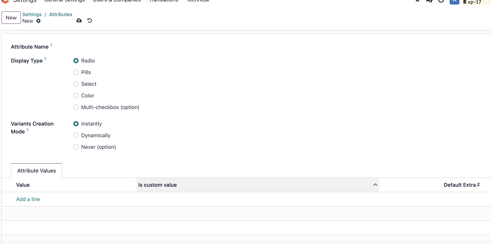
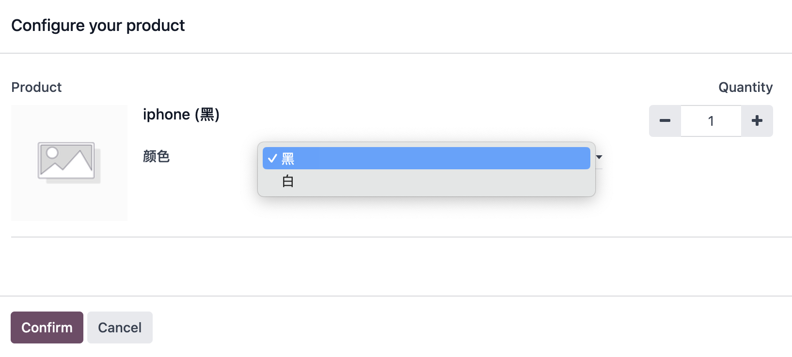
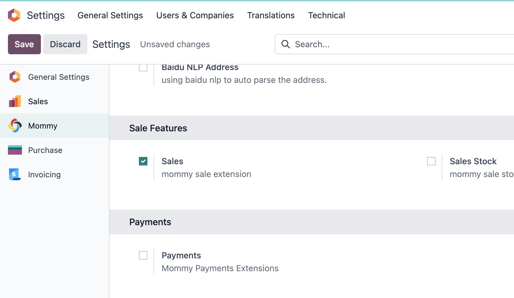
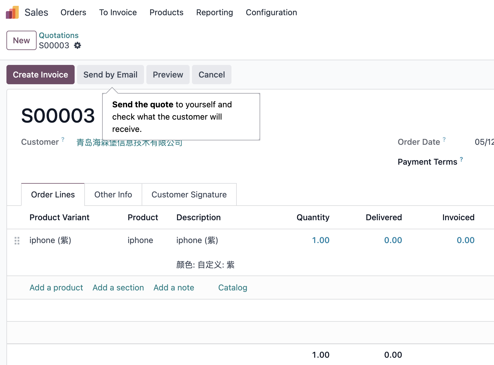

# 第二章 产品管理

* [产品变体的概念](#产品变体的概念)
  * [变体属性](#变体属性)
    * [变体属性的类型](#变体属性的类型)
    * [自定义变体属性至](#自定义变体属性值)
    * [变体的创建模式](#变体的创建模式)
  * [产品变体的配置模式](#产品变体的配置模式)
* [通用属性](#通用属性)
  * [产品类型](#产品类型)
  * [产品分类](#产品分类)
  * [内部参考](#内部参考)
  * [编码](#编码)
  * [产品图片](#产品图片)

Odoo中的产品概念分为两种，产品模板和产品变体。所谓产品模板，就是一种产品的抽象，而产品变体就是产品模板的具象化，举例来说，在Odoo中我们把iphone称为产品模板，而具体的白色的256G的iphone成为产品变体。所有的销售、采购、仓库使用的都是产品变体，产品模板只作为统一的管理入口。

## 产品变体的概念

Odoo默认是没有启用变体的，只有在设置-销售-产品中勾选了使用变体，才会显示变体的相关菜单和设置。

启用变体之后，可以在菜单中看到两个菜单，一个叫**产品模版**，一个叫**产品变体**。从技术角度讲，对应于两个不同的技术模型。产品模板对应的是product.template，产品变体对应的是product.product。 两者在界面上基本相同，修改产品模板和变体的共同拥有的属性，修改一方，另一方也会同时修改。只有一些特殊的属性，仅变体拥有的属性，不会在产品模板上反应出来。

### 变体属性

**变体属性**用来描述一个产品可配置的变体属性信息，例如iphone所拥有的变体属性名可能有颜色，内存大小，版本，而对应的属性值可能是白色、128G和iphone15等等。

#### 变体属性的类型

原生支持的变体属性类型有一下几个：

* Radio: 单选框

* Pills：药丸式

* Select: 下拉框

* Color: 颜色

#### 自定义变体属性值

还有另外一种变体的创建方式，即让用户自定义变体的属性值，我们在前面的属性值中可以看到有一个字段叫做"是否自定义",当我们勾选了此选项后，即可让用户在下单的时候可以输入自定义的变体属性值。

举例来说，假如目前我们系统中可以下单的iphone的颜色有黑色和白色，我们同时增加了第三种值，叫做自定义，选中是否自定义字段。

然后我们在下单的时候就可以看到多出一个自定义的选项值:

用户可以根据自己的需求填写自己的属性值，然后创建订单。

需要注意的是，虽然我们自定义了变体的值，但是系统中并没有真正创建这个属性值的变体，而仅仅是将自定义属性作为订单的备注写到了订单明细中，变体依旧使用的是“自定义”的这个产品变体。

如果想要真正在系统中创建这个变体，一种方式是手动创建，另外一种是使用我们在销售解决方案提供的自动创建功能，在设置-欧姆-销售特性中选中销售拓展:

然后我们到用户的设置中，选中“根据自定义属性创建变体”权限:

然后我们在变体的属性值列表中会看到新增的一列：

选中"创建变体"选项即可在确认订单时自动创建自定义属性的变体。

可以看到当我们确认了订单，系统自动帮我们创建了紫色的iphone。

#### 变体的创建模式

* Instantly: 立即创建，产品保存的时候立刻创建变体
* Dynamically: 动态创建变体，产品创建时不立即创建变体而是在订单中实际用到时才会创建变体
* Never: 此选项不创建变体

变体的创建模式在产品中使用之后就将不可再编辑。

### 产品变体的配置模式

变体在订单的中的配置模式可以支持两种：

* Product Configurator: 产品配置器，即我们前面看到那种形式的配置向导。
* Order Grid Entry: 网格形式的配置器，即可以在一个向导中同时配置多个属性的变体和数量。

## 通用属性

产品管理界面种包含了若干关于产品设置的信息，我们首先来看一下通用设置。

### 产品类型

首先产品模板里可以设置此产品是可供销售还是可供采购的， 然后在通用信息里，我们可以设置产品的类型、售价等信息。这种重点要说的是产品类型。

Odoo中的产品类型可以分为两种**商品**和**服务**:

* 商品：包括可库存的产品和不计库存的产品
* 服务：不存在库存中的产品 

其中商品可以设置为可库存或不可库存， 如果商品设置为了可库存，那么可以根据下面三个选项及进行选择:

* 根据批次：
* 根据序列号：
* 根据数量：

在17.0及之前的版本中，产品类型分为三种：

* 可消耗产品：可以无限使用，不必统计其消耗量的产品，例如，沙子和水等。
* 服务产品： 没有实体的产品，例如，咨询服务。
* 可库存产品： 具有实体的产品，可以控制其出入库。

### 产品分类

产品分类，此产品归属的分类，产品分类上可以设置父级分类，下架逻辑，库存方法和财务科目等高级属性。

强制下架策略：如果在分类上设置了下架策略，那么改分类下的产品的下架策略将忽略掉库位上的下架策略。默认情况下，可选的下架策略有两种，FIFO和LIFO。详细策略介绍，请参考库存管理-库位-上架策略一节。

### 内部参考

内部参考(default_code)，就是我们通常说的SKU，Odoo默认没有添加唯一性标识，我们可以通过技术性手段添加唯一性标识*。在内部参考的下面是条码，即产品的统一商品码，这个同样也没有设置唯一性标识。

销售价格，产品的销售价格。默认只有一个销售价格，如果需要更多的价格，可以使用价格表的功能(参考价格表一章)。

销售税种，销售此产品时默认的销售税，更多关于税种的设置，请参阅财务-税种一章。

### 编码

> 18.0新增

出了内部参考，odoo还使用了另外一个字段编码(code)来表示SKU，不过与内部参考不同的是，编码是个计算字段，也就是不支持用户手动更新，它的取值来源于产品信息中的供应商列表。

说人话就是，如果当前合作伙伴是供应商，那么编码的取值就等于此产品供应商产品列表中的该供应商的产品编码，否则等于内部编码。

### 产品图片

产品的图片默认可以上传一张。

