# 第二章 销售产品与变体

* [产品变体的概念](#产品变体的概念)
  * [变体属性](#变体属性)
    * [变体属性的类型](#变体属性的类型)
    * [自定义变体属性值](#自定义变体属性值)
    * [变体的创建模式](#变体的创建模式)
  * [产品变体的配置模式](#产品变体的配置模式)
* [通用属性](#通用属性)
  * [产品类型](#产品类型)
  * [产品分类](#产品分类)
  * [内部参考](#内部参考)
  * [编码](#编码)
  * [产品图片](#产品图片)
  * [产品价格](#产品价格)

Odoo销售订单上的每一行都离不开产品。产品决定了它是否可以销售、是否需要库存、使用什么价格、税率和开票策略；如果产品有颜色、尺码、容量、规格等差异，还会涉及产品变体。

本章重点从销售角度理解产品：哪些字段会影响报价和销售订单，什么时候需要产品变体，什么时候只需要普通产品，如何避免因为产品资料设计不清导致后续价格、库存和开票混乱。

## 产品变体的概念

Odoo默认是没有启用变体的，只有在设置-销售-产品中勾选了使用变体，才会显示变体的相关菜单和设置。

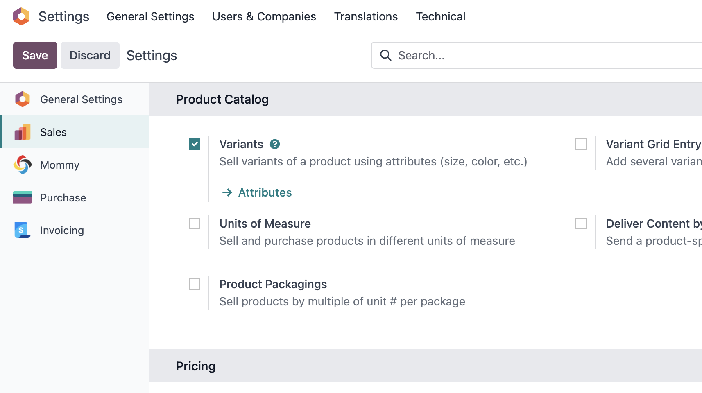

启用变体之后，可以在菜单中看到两个菜单，一个叫**产品模版**，一个叫**产品变体**。从技术角度讲，对应于两个不同的技术模型。产品模板对应的是product.template，产品变体对应的是product.product。 两者在界面上基本相同，修改产品模板和变体的共同拥有的属性，修改一方，另一方也会同时修改。只有一些特殊的属性，仅变体拥有的属性，不会在产品模板上反应出来。

### 变体属性

**变体属性**用来描述一个产品可配置的变体属性信息，例如iPhone可能有颜色、内存大小、版本等属性，对应的属性值可能是白色、128G、iPhone15等。

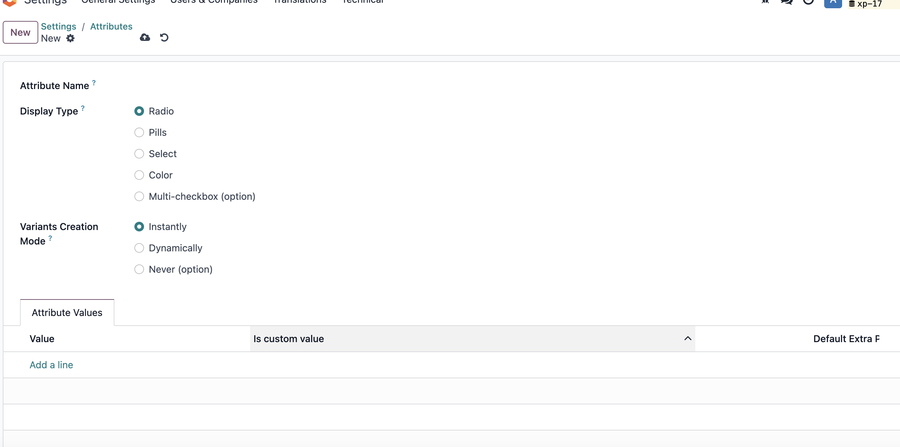

#### 变体属性的类型

原生支持的变体属性类型有以下几种：

* Radio: 单选框

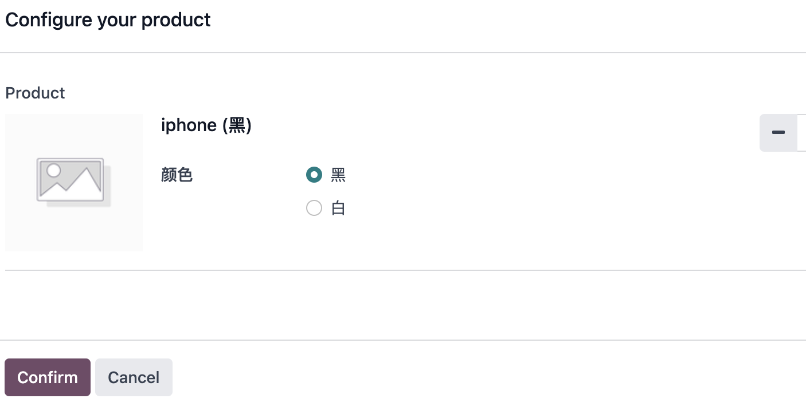

* Pills：药丸式

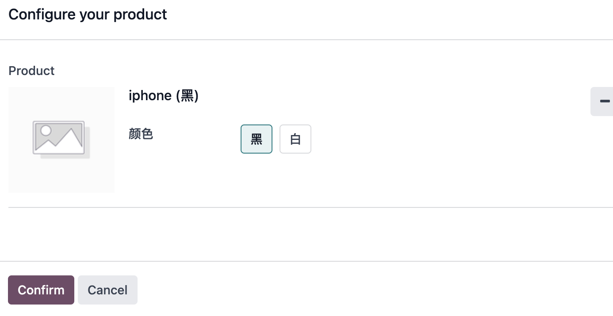

* Select: 下拉框

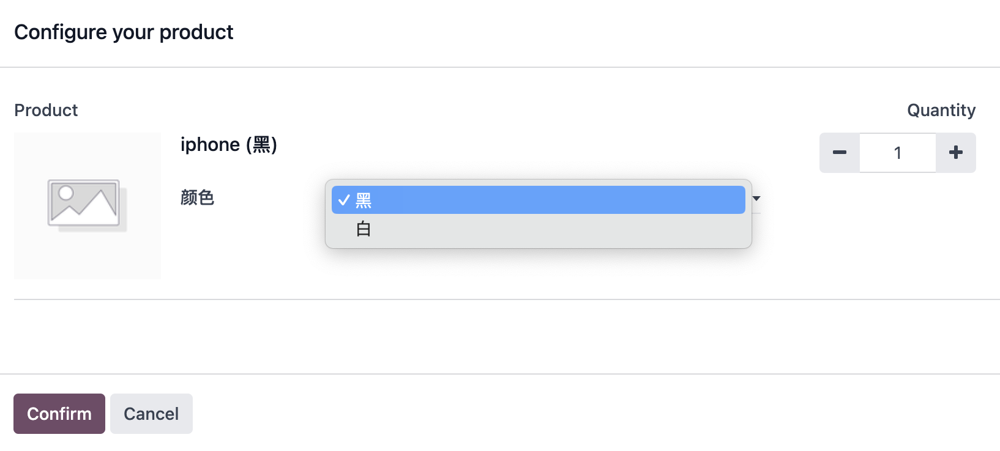

* Color: 颜色

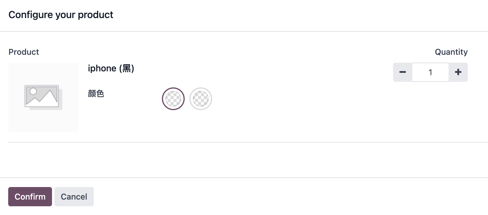

#### 自定义变体属性值

还有一种变体使用方式，是允许用户自定义变体属性值。属性值中有一个“是否自定义”字段，勾选后，用户在下单时可以输入自定义内容。

例如系统中iPhone颜色只有黑色和白色，如果还希望销售在下单时输入特殊颜色，可以增加一个“自定义”属性值，并勾选“是否自定义”。

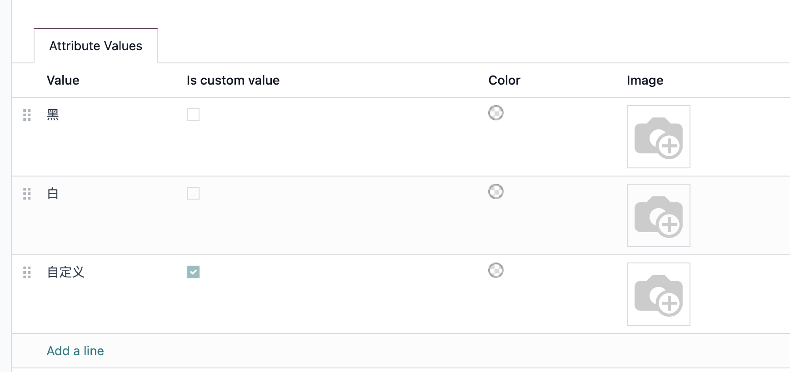

然后我们在下单的时候就可以看到多出一个自定义的选项值:

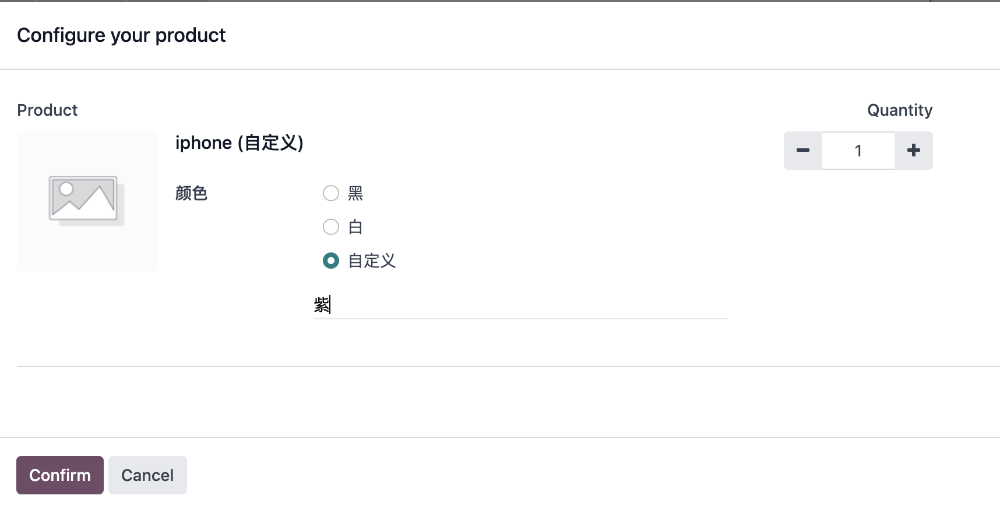

用户可以根据自己的需求填写自己的属性值，然后创建订单。

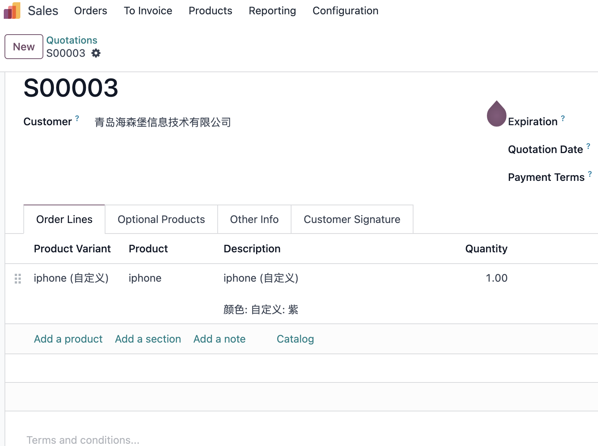

需要注意的是，虽然我们自定义了变体的值，但是系统中并没有真正创建这个属性值的变体，而仅仅是将自定义属性作为订单的备注写到了订单明细中，变体依旧使用的是“自定义”的这个产品变体。

如果想要真正在系统中创建这个变体，一种方式是手动创建，另一种方式是使用我们销售解决方案中的自动创建功能，在设置-欧姆-销售特性中启用销售扩展：

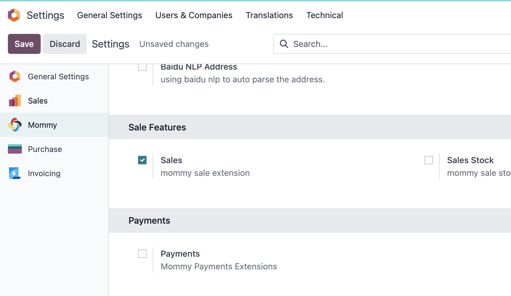

然后我们到用户的设置中，选中“根据自定义属性创建变体”权限:

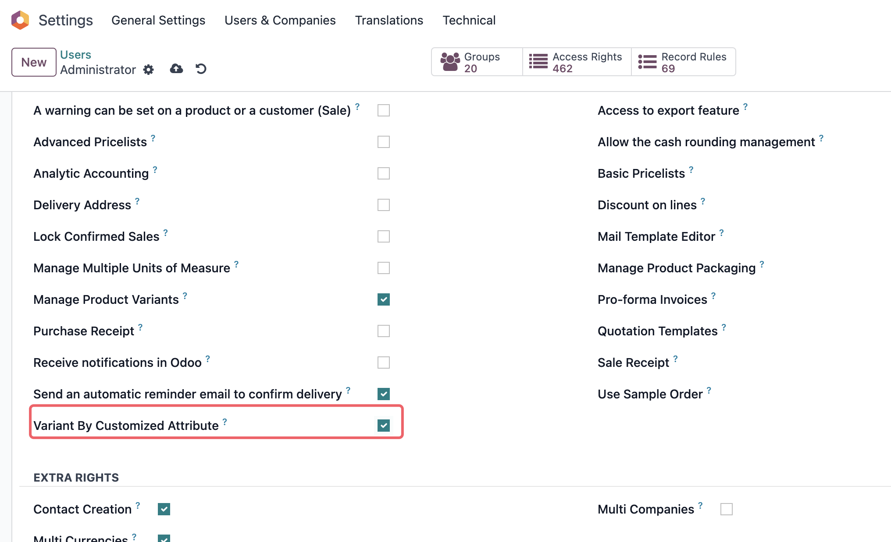

然后我们在变体的属性值列表中会看到新增的一列：

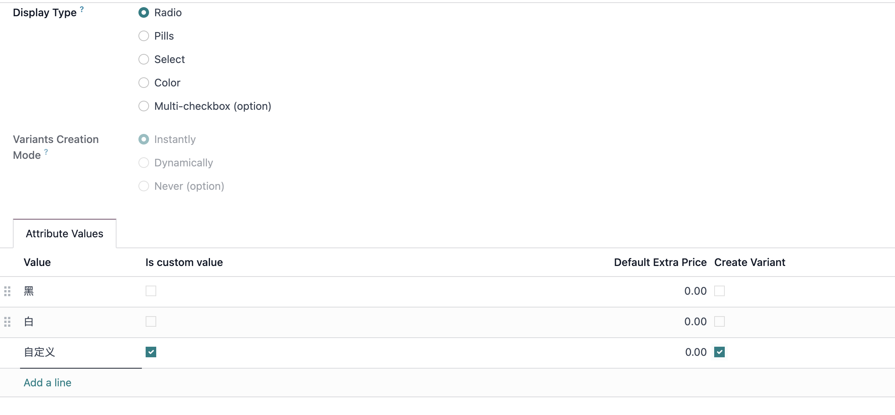

选中"创建变体"选项即可在确认订单时自动创建自定义属性的变体。

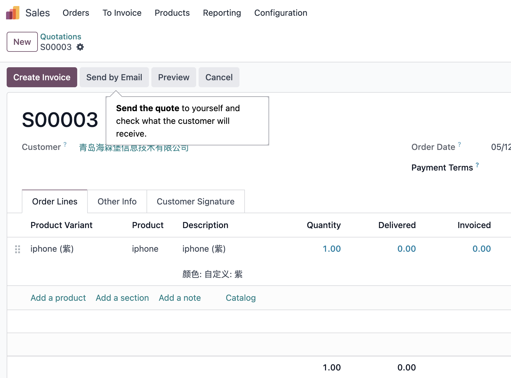

可以看到当我们确认了订单，系统自动帮我们创建了紫色的iphone。

#### 变体的创建模式

* Instantly: 立即创建，产品保存的时候立刻创建变体
* Dynamically: 动态创建变体，产品创建时不立即创建变体而是在订单中实际用到时才会创建变体
* Never: 此选项不创建变体

变体的创建模式在产品中使用之后就将不可再编辑。

### 产品变体的配置模式

变体在订单中的配置模式支持两种：

* Product Configurator: 产品配置器，即我们前面看到那种形式的配置向导。
* Order Grid Entry: 网格形式的配置器，即可以在一个向导中同时配置多个属性的变体和数量。

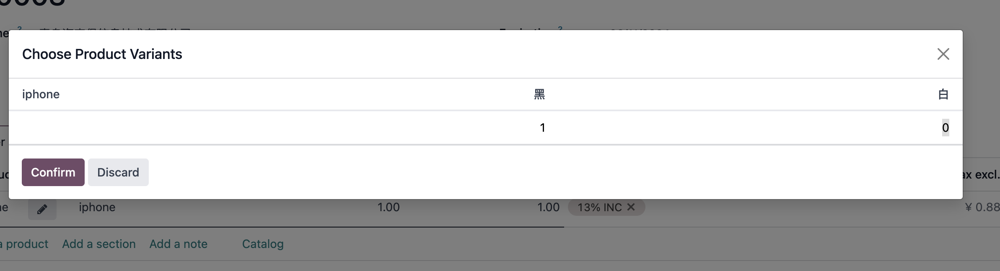

## 通用属性

产品管理界面中包含若干会影响销售流程的设置，我们先看通用设置。

### 产品类型

产品模板可以设置产品是否可销售、是否可采购，也可以设置产品类型、售价、成本、税率等信息。其中最需要先理解的是产品类型。

Odoo中的产品类型可以分为两种**商品**和**服务**:

* 商品：包括可库存的产品和不计库存的产品
* 服务：不存在库存中的产品

其中商品可以设置为是否跟踪库存。如果商品需要库存管理，还可以继续设置追踪方式：

* 根据批次：
* 根据序列号：
* 根据数量：

在17.0及之前的版本中，产品类型分为三种：

* 可消耗产品：可以无限使用，不必统计其消耗量的产品，例如，沙子和水等。
* 服务产品： 没有实体的产品，例如，咨询服务。
* 可库存产品： 具有实体的产品，可以控制其出入库。

### 产品分类

产品分类，此产品归属的分类，产品分类上可以设置父级分类，下架逻辑，库存方法和财务科目等高级属性。

强制下架策略：如果在分类上设置了下架策略，那么改分类下的产品的下架策略将忽略掉库位上的下架策略。默认情况下，可选的下架策略有两种，FIFO和LIFO。详细策略介绍，请参考库存管理-库位-上架策略一节。

### 内部参考

内部参考(default_code)，就是我们通常说的SKU，Odoo默认没有添加唯一性标识，我们可以通过技术性手段添加唯一性标识*。在内部参考的下面是条码，即产品的统一商品码，这个同样也没有设置唯一性标识。

销售价格，产品的销售价格。默认只有一个销售价格，如果需要更多的价格，可以使用价格表的功能(参考价格表一章)。

销售税种，销售此产品时默认的销售税，更多关于税种的设置，请参阅财务-税种一章。

### 编码

> 18.0新增

除了内部参考，Odoo还使用了另外一个字段编码(code)来表示SKU，不过与内部参考不同的是，编码是个计算字段，也就是不支持用户手动更新，它的取值来源于产品信息中的供应商列表。

简单理解：如果当前合作伙伴是供应商，编码会取该供应商产品列表中的供应商产品编码；否则使用内部编码。

### 产品图片

产品的图片默认可以上传一张。

### 产品价格

* 销售价格(list price): 产品的标准售价

> 18.0及之前版本的售价精度由系统设置中的Product Price控制，默认保留2位小数。2026.02之后，产品标准售价可以支持更高精度，但最小精度仍默认为2位。

## 实施建议

销售产品设计要服务后续流程。第一期不要急着把所有历史产品和所有规格一次性导入系统，建议先整理仍在销售、仍有库存、仍需要开票的有效产品。

产品变体也不要滥用。颜色、尺码、容量这类标准组合适合变体；每个客户都不同、每张订单都不同的定制规格，更适合用备注、配置器、第二单位或定制方案处理。

本章讲清楚了销售产品、产品模板、产品变体和常见字段。下一章会进入报价单与客户确认，看看这些产品如何被放进报价单，并通过模板、有效期、在线签名和在线支付形成正式销售机会。
