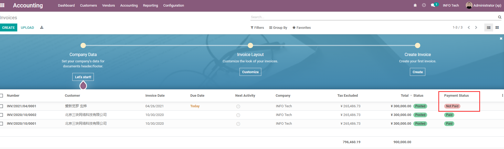
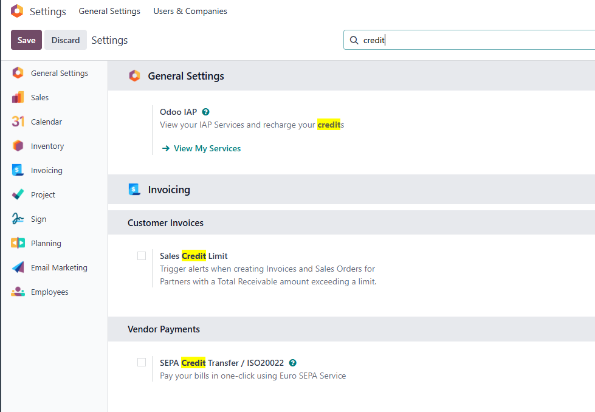
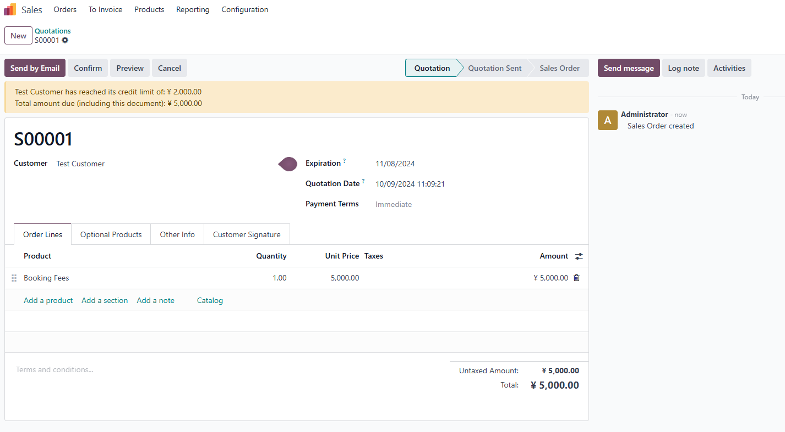

# 第四章 销售订单流程

客户接受报价后，报价单会确认成销售订单。销售订单是Odoo销售流程的核心节点：它会根据产品和配置触发发货、开票、采购、生产、项目任务或租赁流程。

很多企业的问题不是不会创建订单，而是不清楚确认订单以后系统会自动做什么。本章我们就从一张标准销售订单出发，讲清楚确认、交付、开票、付款、取消、删除、锁定和状态变化这些日常操作。

## 标准销售流程

标准流程可以概括为：

```text
创建报价 -> 发送报价 -> 客户确认 -> 销售订单 -> 发货/交付 -> 开票 -> 收款 -> 完成
```

不同产品会让流程发生变化：

| 产品类型 | 确认订单后常见动作 |
| --- | --- |
| 实物产品 | 生成发货单，走库存交付 |
| 服务产品 | 通常不生成库存移动，可能关联项目或工时 |
| 租赁产品 | 进入出租和归还流程 |
| 按订单采购产品 | 可能触发采购需求 |
| 按订单生产产品 | 可能触发生产订单 |

所以确认订单前，要先确认产品类型、路线、开票策略和库存设置是否正确。

## 创建报价和默认信息

创建销售订单前，通常先创建报价单。

报价单阶段，系统顶部通常显示“发送邮件”和“确认”按钮，表示这张单据还没有变成正式订单。


报价单上常见字段包括：

- 客户；
- 开票地址；
- 送货地址；
- 报价日期；
- 价格表；
- 付款条件；
- 销售员；
- 销售团队；
- 订单行；
- 条款和备注。

默认销售员一般来自当前用户、客户资料或CRM商机。实施时要统一规则，否则后续销售业绩统计会不准。

## 确认订单

点击确认后，报价单变成销售订单。

确认后，状态条会进入销售订单阶段，系统也会出现交付等智能按钮。下图中可以看到订单已经确认，并生成了一个交付单。


确认订单可能触发：

- 生成发货单；
- 更新已订购数量；
- 生成采购需求或生产需求；
- 允许创建发票；
- 通知相关人员；
- 客户门户显示订单状态。

确认订单代表商业承诺成立。不要把确认当成“保存”。如果客户只是询价，还没有确认购买，应停留在报价单阶段。

## 发货和交付

销售订单确认后，如果包含需要库存管理的产品，系统通常会生成发货单。

发货状态常见含义：

| 状态 | 含义 |
| --- | --- |
| 等待 | 库存不足或等待其他作业 |
| 就绪 | 库存满足，可以发货 |
| 已完成 | 仓库已经验证出库 |
| 已取消 | 发货单取消 |

销售订单上的已交付数量会根据发货结果更新。这个数量会影响按交付数量开票的产品。

销售订单行中可以看到已交付数量和已开票数量。销售人员判断订单是否已经履约时，不要只看订单状态，也要看这两个数量。


如果订单包含多件产品，还要看交付策略：是尽快发可用产品，还是等所有产品齐备后一起发。

## 创建发票

销售订单确认后，可以根据开票策略创建发票。

点击创建发票后，系统会弹出向导，选择常规发票、预付款百分比或预付款固定金额。


发票相关状态包括：

| 状态 | 含义 |
| --- | --- |
| 没有要开票的 | 当前没有可开票数量或订单还未到开票条件 |
| 等待开票 | 存在可开票金额或数量 |
| 已全部开票 | 订单已经完成开票 |
| 额外销售 | 已交付数量超过已开票或订购逻辑，需要进一步处理 |

开票策略和预付款已经在下一章详细展开。这里先记住：销售订单不是正式发票，发票确认后才进入会计应收。

## 登记付款

发票确认后，财务可以登记付款。

```text
销售订单 -> 客户发票 -> 登记付款 -> 银行对账
```

在正式项目中，付款状态还会受会计设置、银行对账、支付方式和收款流程影响。销售人员可以看到发票和付款结果，但不建议绕过财务流程直接改状态。

发票确认后可以登记付款。付款登记完成后，财务还需要结合银行流水对账，才能形成更完整的资金闭环。



## 取消订单

订单取消要看当前进度。

| 当前状态 | 建议处理 |
| --- | --- |
| 未发货、未开票 | 可以取消销售订单和相关发货单 |
| 已发货、未开票 | 需要考虑库存退货 |
| 已开票、未收款 | 需要考虑贷项通知单 |
| 已开票、已收款 | 需要考虑退款和财务处理 |
| 已触发采购/生产 | 需要同步处理下游单据 |

不要随意删除已经确认或已经履约的订单。业务已经发生后，应通过取消、退货、退款等反向流程留下记录。

如果订单已经发货，再取消销售订单就不只是销售动作，还要考虑库存是否需要退货、财务是否需要退款。


## 锁定和解锁

Odoo支持将确认后的销售订单锁定。锁定后，订单不再随意编辑。

适合锁定的场景：

- 订单已经发货；
- 订单已经开票；
- 财务希望历史订单稳定；
- 管理层希望避免销售事后修改价格和数量。

需要修改时，可以由有权限人员解锁。是否允许普通销售解锁，要根据企业管理要求决定。

## 客户信用额度

Odoo原生支持客户信用额度提醒。当客户未付款余额超过信用额度时，销售订单可能出现提示。

这类提示的价值是让销售在接单前看到风险。

要注意：原生额度控制在一些场景下偏提醒性质，是否强制阻止下单，要结合版本、配置和企业管理要求确认。如果企业需要严格信用控制，可能需要财务规则或定制增强。

可以在销售或会计设置中启用信用额度提醒，并在客户资料上维护信用额度。



当订单金额超过信用额度时，销售订单会给出风险提示，帮助销售提前识别收款风险。



## 订单删除的边界

草稿报价可以删除。但已确认、已发货、已开票的订单，不建议删除。

删除会带来风险：

- 历史销售记录丢失；
- 库存交付难以追溯；
- 财务应收对不上；
- 客户沟通记录丢失；
- 报表统计被破坏。

实施时要培训用户：取消和删除不是一回事。已经发生的业务，应保留历史并走反向流程。

## 常见问题

| 问题 | 常见原因 | 处理方向 |
| --- | --- | --- |
| 确认订单后没有发货单 | 产品是服务，或未启用库存/路线 | 检查产品类型和库存配置 |
| 不能开票 | 产品按交付数量开票但未交付 | 检查开票策略和已交付数量 |
| 发货单不就绪 | 库存不足或等待补货 | 查看预测库存和补货规则 |
| 客户收到错误价格 | 价格表、折扣或税率错误 | 回到价格和税率配置 |
| 已完成订单还被修改 | 未启用锁定或权限太宽 | 设计锁定和权限规则 |

## 实施建议

销售订单流程建议先用一个简单产品完整跑通：

```text
报价 -> 发送 -> 确认 -> 发货 -> 开票 -> 收款 -> 退货/退款演练
```

不要只测试“创建订单成功”。真正上线要看销售、仓库、财务、客户门户之间是否能连起来。

本章讲清楚了销售订单确认后的主要状态和动作。下一章会继续深入开票策略、预付款和形式发票，解决“什么时候开票、开多少、怎么收预付款”的问题。
