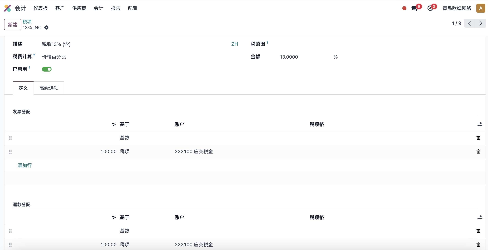
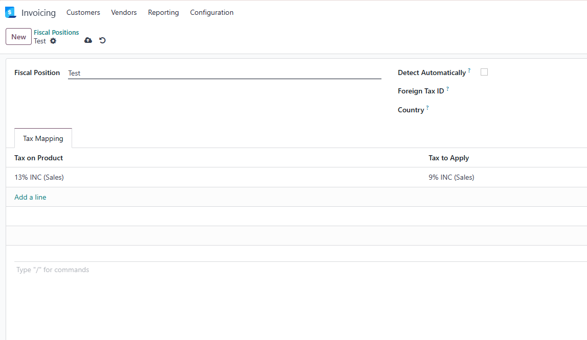

# 第七章 税率与财政结构

销售订单上的税率会影响报价金额、客户发票、财务报表和合规申报。Odoo原生通过税率、财政结构和产品/客户默认税率来处理销售税务。对客户来说，税率看起来只是订单行上的一个字段；对实施顾问来说，它背后连接的是国家地区、会计科目、发票和客户类型。

本章我们先讲销售中最常用的税率和财政结构。消费税这类特定行业税种会在后面的行业扩展章节单独说明。

## 销售税从哪里来

销售订单行上的税率通常来自产品资料。

常见来源：

| 来源 | 作用 |
| --- | --- |
| 产品销售税 | 产品默认销售税率 |
| 客户财政结构 | 根据客户地区或税务身份映射税率 |
| 公司本地化包 | 创建数据库时根据国家地区预置税率 |
| 手工调整 | 特殊业务下人工修改订单行税率 |

实施时不要让销售员随意改税率。税率应由财务确认，销售只是使用。

## 税率配置

税率通常在 **会计 -> 配置 -> 税** 中维护。

下图是一张税率配置示例。税率不只是一个百分比，还会涉及税的计算方式、适用范围、会计影响和显示方式。

税率会影响：

- 销售订单税额；
- 客户发票税额；
- 会计分录；
- 税务报表；
- 含税/不含税显示。

如果公司安装了本地化会计包，系统会自动创建一批常用税率。不要轻易删除原生税率，必要时可以归档或新增。

## 产品税率

产品上通常有销售税和采购税。

| 字段 | 用途 |
| --- | --- |
| 销售税 | 销售订单和客户发票使用 |
| 采购税 | 采购订单和供应商账单使用 |

如果产品税率设置错误，销售报价和发票都会错。产品上线前，财务应参与确认关键产品税率。

销售税和采购税不要混用。销售税用于客户报价和客户发票，采购税用于供应商账单。很多客户导入产品时只关注销售价格，忽略税率，后面开票时才发现所有税额都需要返工。

产品税率可以先按产品类别统一整理，例如：

- 标准税率商品；
- 免税商品；
- 出口商品；
- 服务类产品；
- 特殊税率产品。

产品数量多时，不建议逐个手工检查。可以先导出产品，批量核对税率，再导入修正。

## 财政结构

财政结构用于根据客户、国家地区或税务身份自动替换税率和科目。

下图是财政结构示例。财政结构可以根据客户或业务场景，把订单上的默认税率映射成另一套税率。

例如：

- 国内客户使用本地标准税率；
- 出口客户使用0税率；
- 欧盟客户根据VAT规则处理；
- 免税客户映射到免税税率；
- 不同国家客户使用不同会计科目。

财政结构可以在客户资料上设置，也可以根据规则自动匹配。

当销售订单选择了财政结构后，订单行税率会根据映射规则替换。

销售订单上的税率显示在订单行中。销售人员通常不需要理解每个税的会计分录，但必须知道税率从产品和财政结构中带出，不能随意手工改。

## 财政结构适合解决什么

财政结构适合解决“同一个产品卖给不同客户，税务处理不同”的问题。

| 场景 | 示例 |
| --- | --- |
| 出口销售 | 本地13%税率映射为出口0税率 |
| 跨地区销售 | 根据客户国家切换税率 |
| 免税客户 | 标准税率映射为免税 |
| 特殊行业 | 某些产品或客户使用特殊税率 |
| 科目映射 | 收入或税额进入不同会计科目 |

不要为每个税务场景复制一套产品。优先用财政结构映射税率。

举例来说，同一个产品在国内销售时可能使用标准税率，出口销售时可能使用0税率。产品本身不应该复制成“国内版产品”和“出口版产品”，而是通过客户财政结构或订单财政结构把税率映射过去。

财政结构还可以和客户资料结合使用。对经常出口的客户，可以在客户资料上设置默认财政结构；对偶发业务，可以在订单上手动选择财政结构。

## 含税价和不含税价

销售报价中要明确价格是含税还是不含税。

| 场景 | 常见做法 |
| --- | --- |
| B2B销售 | 不含税单价+税额 |
| 零售 | 含税价 |
| 跨境 | 可能显示不含税或0税率 |
| 门店/POS | 常见含税价 |

含税价会影响客户看到的价格，也会影响价格表设计。销售和财务必须统一口径。

一个常见误区是：销售说“这个产品100元”，财务理解为不含税100元，客户理解为含税100元。系统不会替团队做业务解释，实施前必须统一对外报价口径。

如果使用多币种和价格表，还要进一步确认：价格表里的金额是含税还是不含税，销售订单PDF是否清楚显示税额，客户发票是否与报价一致。

## 税率和发票

销售订单上的税率会带入客户发票。发票确认后会生成会计影响。

如果发票已经确认，税率错误就不能只改销售订单。通常需要根据财务规范处理更正、贷项通知单或重新开票。

所以在销售订单确认和开票前，应尽量确保：

- 客户税务资料正确；
- 产品税率正确；
- 财政结构正确；
- 价格含税/不含税口径正确。

如果税率错误已经进入正式发票，通常不能简单删除或修改。财务需要根据当地合规要求决定是否红冲、重开、作废或开具贷项通知单。因此，销售订单阶段的税率检查非常重要。

## 实施建议

销售税务实施建议：

| 阶段 | 建议 |
| --- | --- |
| 第一阶段 | 使用本地化包预置税率，不随意删除 |
| 第二阶段 | 让财务确认产品销售税和采购税 |
| 第三阶段 | 为出口、免税、跨地区客户设计财政结构 |
| 第四阶段 | 测试报价单、发票、税额和报表是否一致 |
| 第五阶段 | 特殊税种如消费税、环保税、酒税等单独评估 |

本章讲清楚了销售税率、产品税、财政结构和含税价的关系。下一章会继续看销售与库存交付，解释销售订单确认后如何影响库存、发货和可开票数量。
