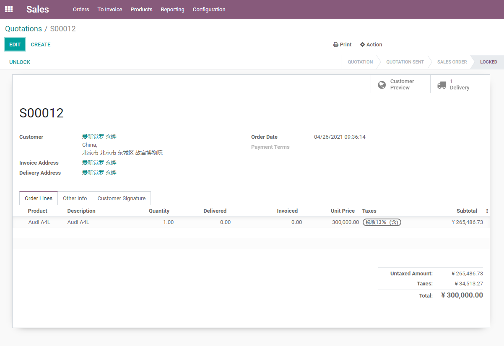
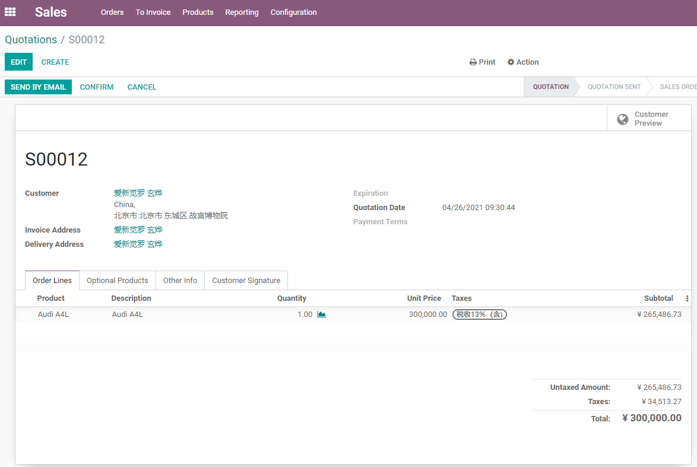
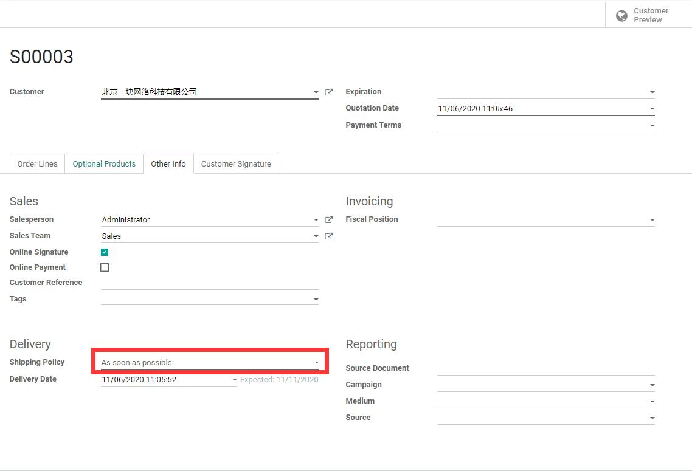
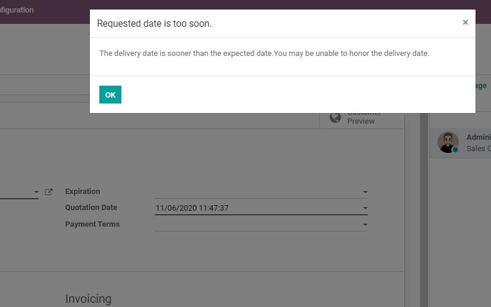
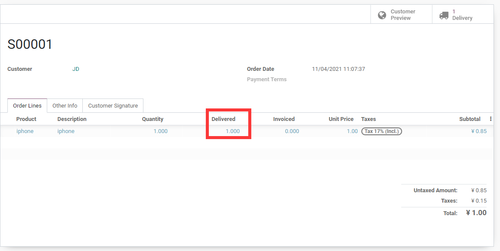

# 第八章 销售与库存交付

销售订单确认后，Odoo会根据产品类型、库存路线和仓库配置决定是否生成发货单。对销售人员来说，客户买了什么、什么时候能发货、库存够不够，是每天都要回答的问题；对仓库来说，销售订单是出库作业的重要来源。

本章只讲销售相关的库存交付逻辑。更完整的库位、路线、批次、盘点和补货，会在仓库管理部分展开。

## 哪些销售会影响库存

不是所有销售订单都会生成发货单。

| 产品类型 | 是否通常生成发货 |
| --- | --- |
| 实物产品 | 通常会生成发货单 |
| 服务产品 | 通常不生成库存移动 |
| 消耗品/非库存商品 | 取决于版本和配置，通常不严格管理库存 |
| 租赁产品 | 走出租和归还流程 |
| 套件/组合 | 取决于BOM和路线 |

如果确认订单后没有发货单，先检查产品类型、库存应用是否安装、产品是否可库存、路线是否正确。

## 发货单如何产生

标准库存销售流程：

```text
销售订单确认 -> 系统生成发货单 -> 仓库拣货/打包/发货 -> 验证出库 -> 已交付数量更新
```

发货单状态会告诉销售当前是否能发货：

| 状态 | 含义 |
| --- | --- |
| 等待 | 库存不足或等待上游作业 |
| 就绪 | 库存满足，可以处理发货 |
| 已完成 | 仓库已完成出库 |
| 已取消 | 发货单取消 |

销售人员不要只看订单状态，也要看发货单状态。

销售订单确认后，如果产品需要库存交付，右上角会出现交付智能按钮。销售可以通过这个按钮进入对应发货单，查看仓库处理情况。



## 库存预测小部件

启用库存后，销售订单行可能显示库存预测相关信息。它用于帮助销售判断当前库存是否足够，以及未来是否有入库或出库会影响交付。

在订单行中，库存预测小图标可以帮助销售查看当前产品的可用情况。这个信息对判断能否按时交付非常有用。



库存预测通常会考虑：

- 当前在手数量；
- 已预留数量；
- 已确认销售需求；
- 采购在途；
- 生产在制；
- 补货规则；
- 预计交付日期。

预测库存不是简单的“现在仓库里有多少”。它更像一个计划视角，帮助销售判断订单是否能按时交付。

## 交付策略

销售订单可以设置交付策略。

交付策略可以在订单的其他信息或发货相关区域中设置。不同版本界面位置可能略有差异，但业务含义一致。



| 策略 | 含义 | 适用场景 |
| --- | --- | --- |
| 尽快 | 有货的产品先发 | 客户接受分批发货 |
| 全部就绪后发货 | 等所有产品齐备再发 | 客户要求一次收货 |

交付策略会影响发货安排，也会影响客户体验。若客户不接受分批发货，就不要随便选择尽快交付。

## 承诺交货日期

销售订单可以记录承诺交货日期。这个日期代表企业对客户的交付承诺。

如果承诺日期早于系统预计可交付日期，Odoo会给出风险提示，提醒销售不要轻易向客户承诺无法完成的交付时间。



承诺交货日期会和产品销售提前期、库存可用性、采购/生产计划一起影响交付安排。

实施建议：

- 不要让销售随意承诺无法实现的日期；
- 产品提前期要维护真实；
- 库存不足时要结合采购和生产计划；
- 对外贸或项目订单，交付日期最好和合同条款一致。

## 已交付数量和开票

销售订单行中的已交付数量非常重要。

订单行中可以看到订购数量、已交付数量、已开票数量。对按交付数量开票的产品来说，已交付数量会直接影响可开票数量。



它会影响：

- 客户是否已经收到货；
- 按交付数量开票的产品是否可以开票；
- 退货后实际交付数量；
- 销售履约统计。

如果产品开票策略是按已交付数量，仓库不完成发货，财务就可能无法开票。这就是销售、仓库、财务必须协同的原因。

## 按订单采购和按订单生产

有些产品不是现货销售，而是客户下单后采购或生产。

常见路线：

| 路线 | 说明 |
| --- | --- |
| 按订单采购 | 销售确认后触发采购需求 |
| 按订单生产 | 销售确认后触发生产订单 |
| 直运 | 供应商直接发给客户 |
| 补货规则 | 库存低于规则后生成采购或生产建议 |

这些内容属于库存、采购、生产模块的交叉范围。销售人员至少要知道：订单确认后不一定马上有货，系统可能需要等待采购或生产。

## 退货对交付数量的影响

客户退货后，库存退货会影响已交付数量和后续开票判断。

例如客户订购10件，已发10件，退回2件。系统中的交付数量和可开票数量可能需要根据退货结果重新计算。

售后章节会继续讲退货、退款和贷项通知单。这里先记住：退货不是删除销售订单，而是通过库存反向作业处理。

## 实施建议

销售与库存交付建议这样落地：

| 阶段 | 建议 |
| --- | --- |
| 第一阶段 | 先用一个现货产品跑通订单确认、发货、开票 |
| 第二阶段 | 测试库存不足、分批发货和全部就绪发货 |
| 第三阶段 | 维护产品提前期和承诺交货日期 |
| 第四阶段 | 再引入按订单采购、按订单生产、直运等路线 |
| 第五阶段 | 结合退货、批次、序列号和条码完善仓库流程 |

本章讲清楚了销售订单与库存交付之间的关系。下一章会进入退货、退款与售后处理，继续看订单发生问题后如何用Odoo的反向流程保留业务记录。
