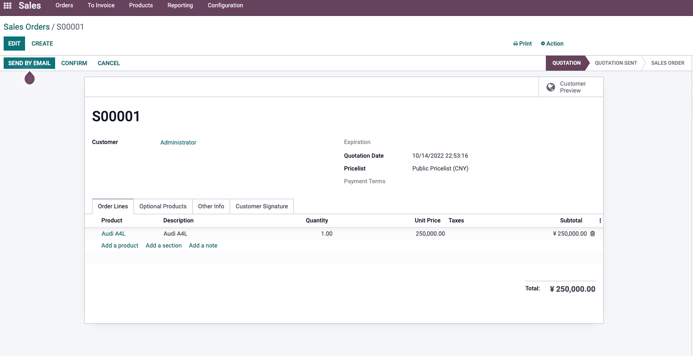
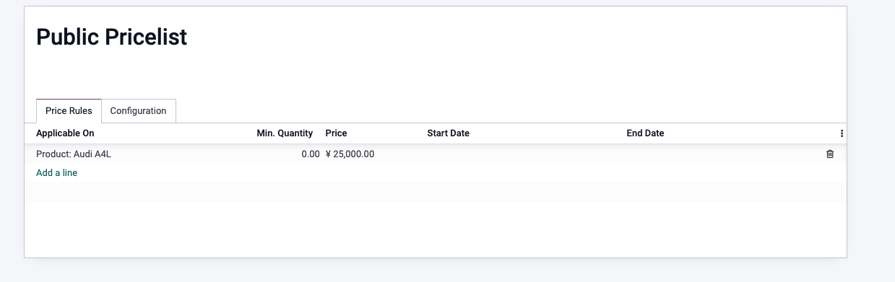
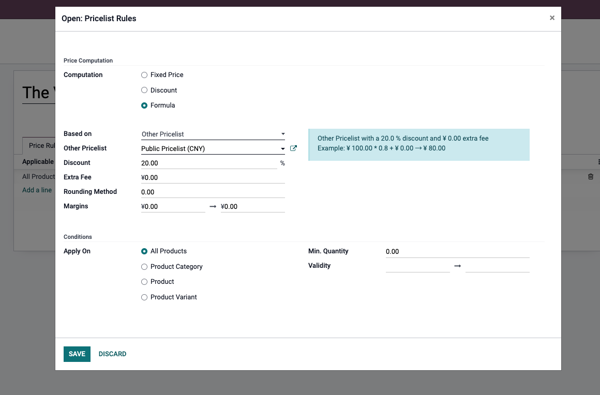
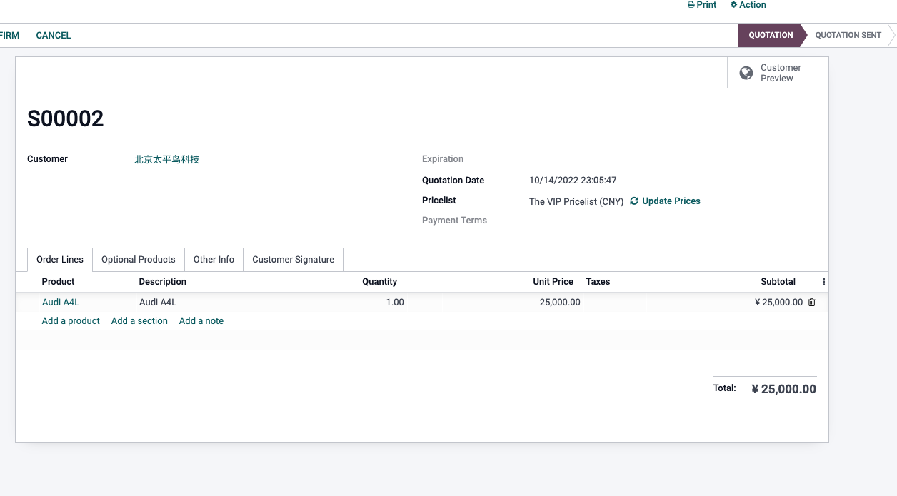
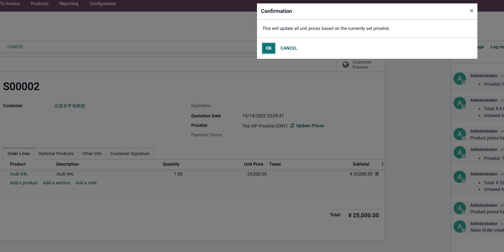
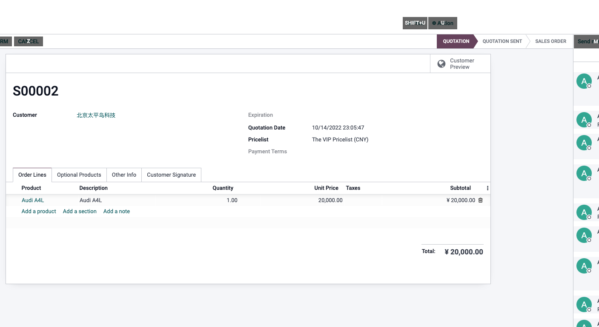

# 第六章 价格表、折扣与多币种

价格是销售管理中最敏感的部分。不同客户等级、不同渠道、不同币种、不同数量、不同促销活动，都会影响最终报价。Odoo原生通过价格表、折扣、付款条件和币种配置，帮助企业把价格规则从人工Excel中沉淀到系统里。

本章我们重点讲Odoo原生价格体系应该怎么理解。最佳实践仍然是先使用原生价格表和折扣能力，把规则设计清楚；只有当原生规则无法表达业务时，再考虑定制价格计算或外部价格引擎。

## 价格从哪里来

销售订单行上的单价通常来自多个因素：

| 因素 | 说明 |
| --- | --- |
| 产品销售价格 | 产品资料中的基础售价 |
| 价格表 | 根据客户、币种、数量、时间、产品等规则计算价格 |
| 折扣 | 订单行上的折扣比例 |
| 税率 | 决定含税/不含税和税额 |
| 币种 | 影响报价币种和汇率 |
| 客户条件 | 客户默认价格表、付款条件、财政结构 |

销售人员看到的最终价格，不一定只是产品上的销售价格。实施时要把价格来源讲清楚，否则客户会觉得“系统价格乱跳”。

## 启用价格表

价格表可以在 **销售 -> 配置 -> 设置 -> 价格** 中启用。

启用后，销售订单上可以选择价格表。

价格表适合：

- VIP客户价格；
- 批发价；
- 经销商价格；
- 促销价；
- 阶梯价；
- 多币种销售；
- 按产品类别定价；
- 按数量或日期定价。

不要为每个客户复制一套产品价格。优先用价格表规则表达价格差异。

## 切换价格表

销售订单上切换价格表后，系统通常会提示是否更新订单行价格。

例如，一台A4L公开价格为250000元。

给VIP客户设置8折价格表。

在报价单上切换到VIP价格表后，系统出现更新价格按钮。

确认更新后，订单行价格会按新价格表重新计算。

这个动作要谨慎。如果销售已经手工调整过某些行价格，切换价格表可能覆盖原来的价格。

## 价格表规则

常见价格表规则包括：

| 规则 | 示例 |
| --- | --- |
| 固定价格 | 某产品对VIP客户固定为200元 |
| 百分比折扣 | 所有产品8折 |
| 基于成本加价 | 成本价加20% |
| 基于其他价格表 | 在公开价基础上打折 |
| 最小数量 | 购买10件以上享受批发价 |
| 有效日期 | 促销价只在本月有效 |
| 产品类别 | 某一类产品统一折扣 |

规则越复杂，越要提前设计优先级。否则销售会很难解释为什么某个产品最终价格是这个数。

## 折扣

折扣可以理解为订单行层面的价格调整。

适合折扣的场景：

- 销售临时让利；
- 单张订单谈判折扣；
- 清仓折扣；
- 客户投诉补偿；
- 手工处理特殊价格。

适合价格表的场景：

- 长期客户等级价；
- 批发规则；
- 渠道价格；
- 多币种价格；
- 有效期促销；
- 可复用的标准规则。

简单说：长期规则用价格表，临时让利用折扣。

## 多币种销售

Odoo可以通过价格表管理不同币种的销售价格。多币种销售通常需要会计模块支持币种和汇率。

常见场景：

- 外贸订单使用美元、欧元、澳元；
- 不同国家客户使用不同报价币种；
- 同一产品在不同市场有不同价格；
- 汇率变化影响报价有效期。

实施时要确认：

| 问题 | 说明 |
| --- | --- |
| 报价币种 | 客户看到哪种币种 |
| 汇率来源 | 手工维护还是自动更新 |
| 开票币种 | 是否与报价币种一致 |
| 收款币种 | 是否存在汇兑损益 |
| 价格有效期 | 汇率波动时报价多久有效 |

多币种不是只改一个符号。它会影响报价、开票、收款和财务汇兑。

## 税前价和含税价

价格表和税率还会影响客户看到的是税前价格还是含税价格。

在B2B场景，报价常用不含税单价，再单独显示税额。在零售或部分国家地区，客户更习惯看到含税价。

实施时要让销售、财务确认：

- 产品价格是含税还是不含税；
- 报价单PDF如何显示税额；
- 发票税率是否和销售订单一致；
- 不同国家客户是否通过财政结构映射不同税率。

税前税后口径如果没讲清楚，客户很容易认为报价和发票金额不一致。

## 什么时候需要定制价格

原生价格表能处理大量常见规则，但以下情况可能需要定制：

- 价格依赖实时成本、库存、汇率或外部系统；
- 多维度复杂公式，例如长度、面积、重量、加工工艺一起计算；
- 客户合同价需要审批后生效；
- 价格规则和返利、佣金、预算联动；
- 行业报价需要配置器或CPQ能力；
- 需要从电商平台或第三方价格系统同步。

定制前建议先问：这个规则能不能拆成价格表、折扣、产品属性、第二单位或报价模板？如果能用原生表达，就不要先写复杂代码。

## 实施建议

价格体系建议按下面顺序设计：

1. 先确认产品基础售价；
2. 再确认是否需要客户等级价；
3. 再确认是否需要多币种；
4. 再确认数量阶梯和促销有效期；
5. 最后处理特殊客户、特殊公式和行业报价。

第一期不要把所有历史特价都导进系统。先让当前仍在使用、能解释清楚、能被销售执行的价格规则上线。

本章讲清楚了价格表、折扣、多币种和税前税后价格的基本逻辑。下一章会继续看税率与财政结构，解决不同地区、不同客户、不同产品税率如何自动匹配的问题。
