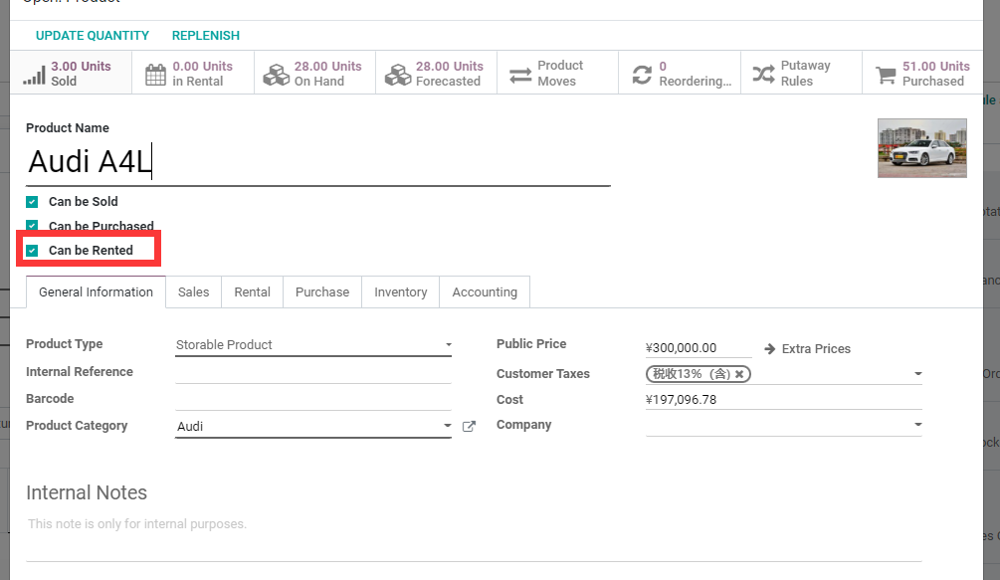
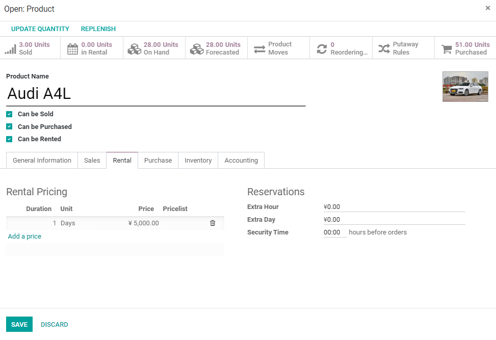
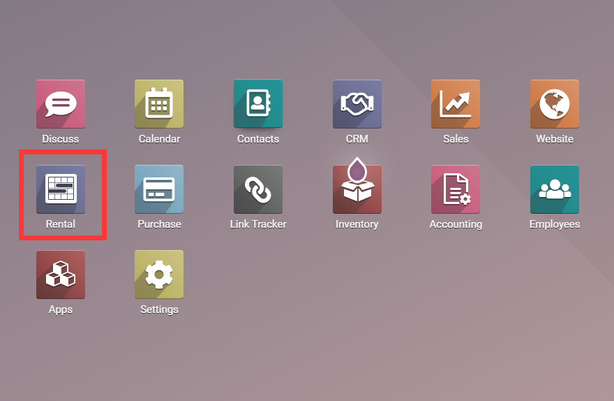
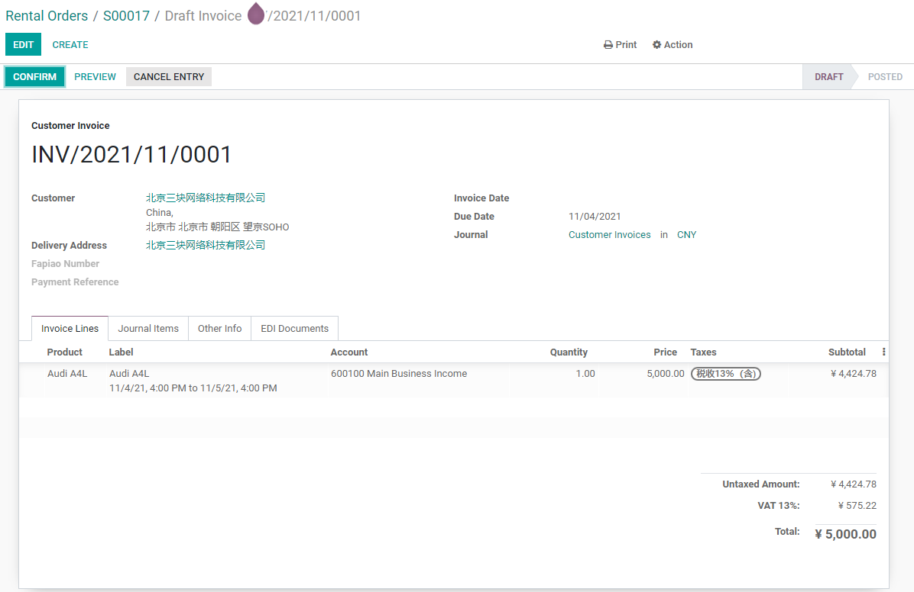

# 第七章 租赁业务

odoo中的租赁业务是通过销售订单来完成的，租赁单的本质就是一张销售订单。租赁单与销售订单的区别在于销售订单对象(sale.order)中有一个字段is_rental_order来标识，该订单是否为租赁订单。

## 租赁业务

### 1. 定义租赁产品

首先，我们需要定义一个租赁产品，并设置它的租赁价格，这里以A4L为例，首先我们在产品信息中将可被租赁的勾打上，意味着该产品可以被租赁。

然后再租赁选项卡中设置它的租赁价格：

### 1. 创建租赁单

在App中安装租赁模块(Rental)后，在开始菜单中会出现一个租赁菜单，点击进入租赁模块：

然后，我们创建一个租赁订单。假设我们要将A4L租给北京三块网络科技有限公司一天，租金5000，那么我们的可以这么创建：

当我们选择了要被租借的产品之后，系统会弹窗提示我们租赁的期限：

这里的订单单价为我们租赁的单价。

### 2. 出租产品

之后我们确认该订单：

此时会显示该订单已被确认，然后我们点击租借，将产品正式出借给客户，系统将创建出库单并自动完成。

如果这时我们查看产品的出入库记录，就可以看到A4L已经被租借至租赁库位(Rental)。

> Rental库位的类型是内部库位而不是客户库位，这就是说，该产品的所属权还是在我们这里，与租赁的概念相对应。

### 3.归还产品

当客户归还产品之后，我们在此订单中操作归还按钮，将产品归还到仓库中。点击归还按钮，弹出归还向导页面：

确认归还以后，我们可以看到订单的状态已经变为已归还：

### 3. 开票

订单完成以后，我们可以给客户开具收据，流程与销售单开票流程一致，不再赘述。

## 总结

odoo中的租借流程相对比较简单，适合流程不是特别复杂的情况。如果涉及到更为复杂的业务流程，那么二开就是不可避免的了。

本章内容，读者也可以到我的[B站](https://www.bilibili.com/video/BV1Bb4y1b7wf)视频学习。