# 第十章 租赁

Odoo租赁应用把“按时间出租产品”纳入销售体系。租赁单本质上仍然围绕销售订单展开，只是订单会带有出租、归还、租赁周期和租赁价格等额外信息。

租赁业务适合设备、工具、车辆、服装、摄影器材、活动用品等需要借出和归还的场景。本章我们先用Odoo原生租赁流程理解它的标准能力，再判断复杂租赁是否需要额外方案设计。

## 租赁业务

租赁流程和普通销售流程最大的区别是：普通销售通常是产品所有权转移给客户，而租赁是产品借出一段时间后还要回到公司。系统不仅要记录客户是谁、租金多少，还要记录租赁开始时间、结束时间、出租状态和归还状态。

标准租赁流程可以理解为：

```text
创建租赁产品 -> 创建租赁单 -> 确认出租 -> 产品进入租赁库位 -> 客户归还 -> 产品回到仓库 -> 开票
```

### 1. 定义租赁产品

首先，需要定义一个租赁产品，并设置租赁价格。这里以A4L为例，在产品信息中勾选可被租赁，表示该产品可以用于租赁业务。

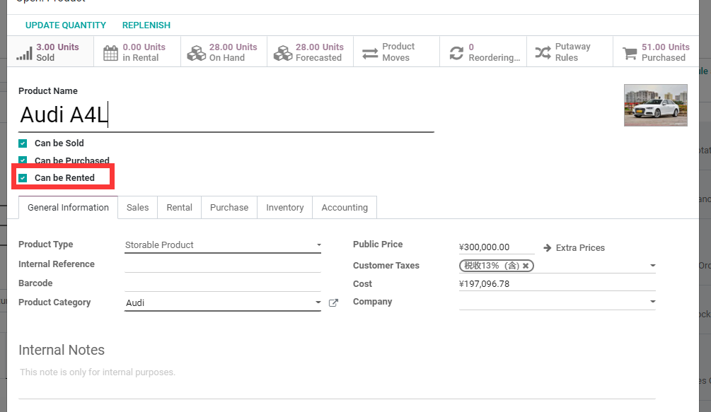

然后在租赁选项卡中设置租赁价格：

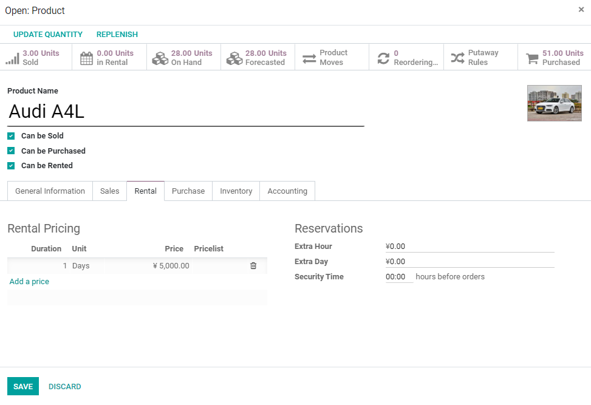

### 2. 创建租赁单

在应用中安装租赁模块后，系统会出现租赁菜单，点击进入租赁模块。

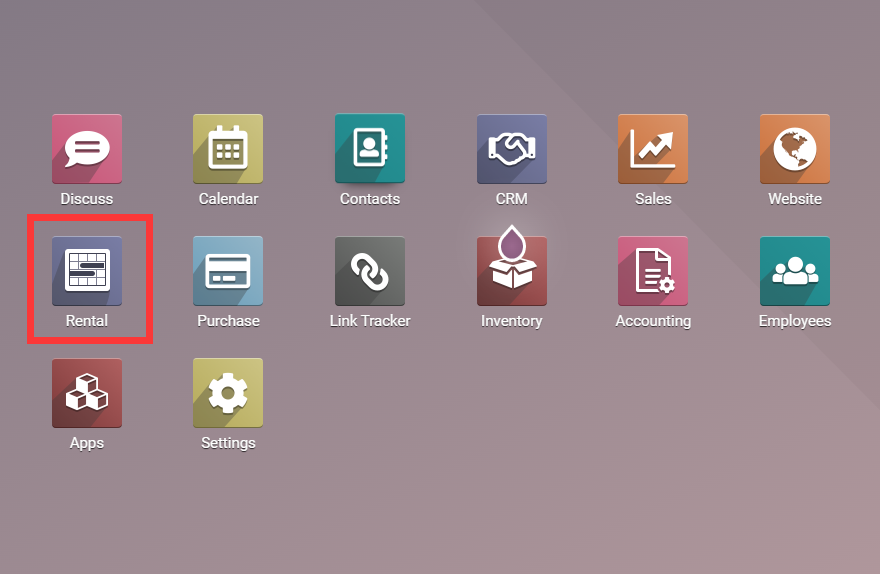

然后创建租赁订单。假设要将A4L租给北京三块网络科技有限公司一天，租金5000，可以按租赁周期和租赁产品创建订单。

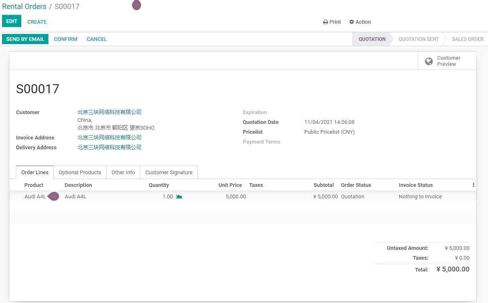

选择租赁产品后，系统会弹窗提示填写租赁期限。

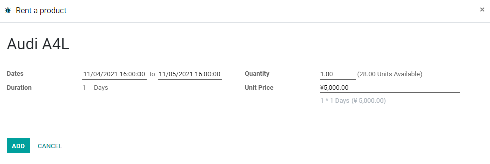

这里的订单单价会根据租赁价格和租赁期限计算。

租赁价格设计时要提前确认计价单位。例如按小时、按天、按周、按月收费，或者不同租期使用不同价格。对客户来说，租期和价格必须在报价阶段就清楚，否则归还后很容易产生争议。

### 3. 出租产品

确认订单后，可以点击出租，将产品正式借给客户，系统会创建出库动作并完成租赁转移。

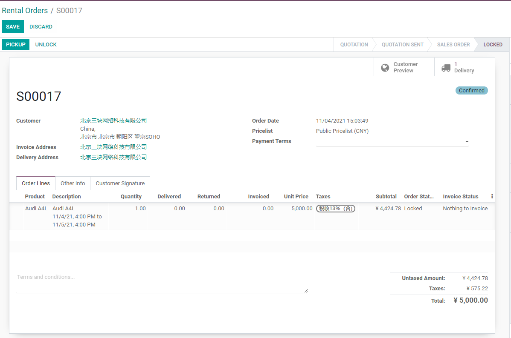

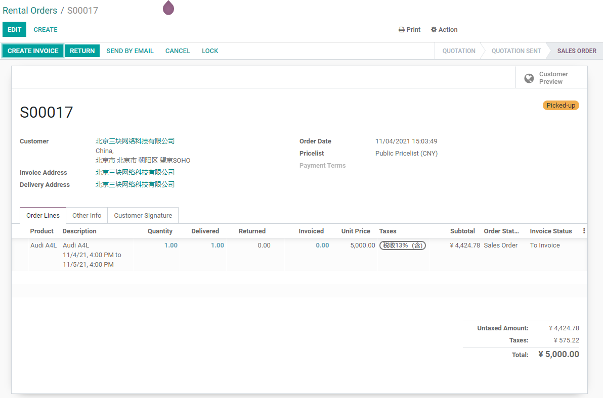

查看产品出入库记录，可以看到A4L已经被租借至租赁库位。

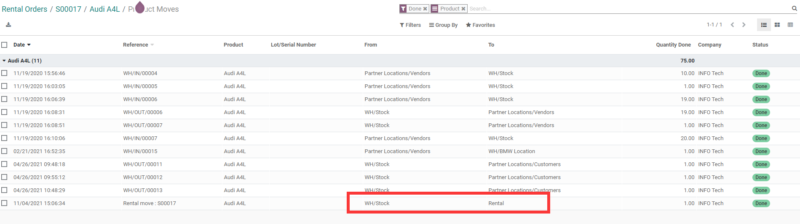

> Rental库位的类型是内部库位而不是客户库位，这表示产品所有权仍然属于本公司，只是处于出租状态。

这个设计很重要。租赁产品虽然离开了仓库，但它不是卖给客户，因此不应该像普通销售那样直接转到客户库位并完成所有权转移。租赁库位能帮助企业区分“在仓库存放”“已经出租”“已经归还”的状态。

### 4. 归还产品

客户归还产品后，在租赁订单中点击归还按钮，将产品归还到仓库。点击归还后会弹出归还向导。

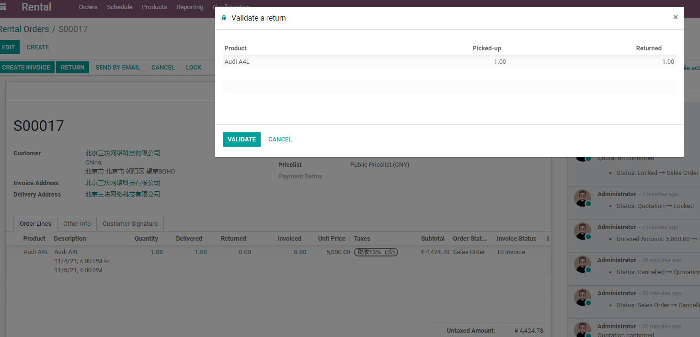

确认归还后，订单状态会变为已归还。

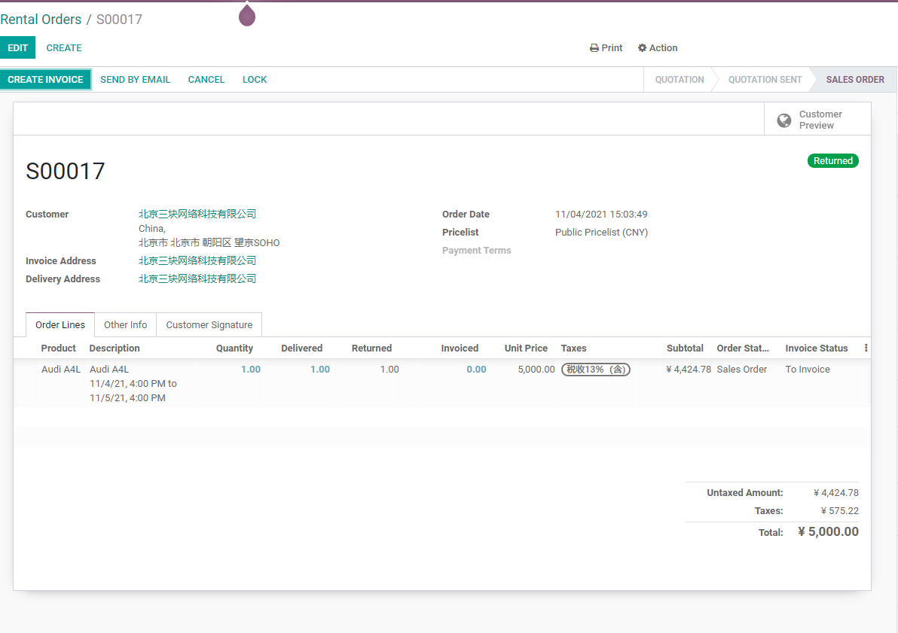

### 5. 开票

租赁订单完成后，可以给客户创建发票。租赁开票本质上仍然走销售订单到客户发票的流程。

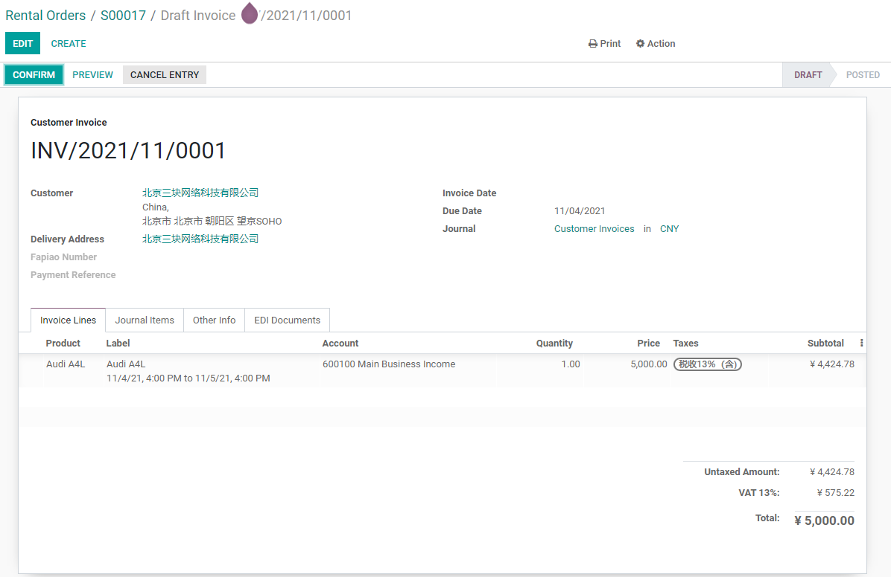

租赁开票可以根据企业规则安排：

- 出租前先收款；
- 归还后按实际租期结算；
- 按月定期开票；
- 租金和押金分开处理；
- 损坏赔偿单独开票。

Odoo原生租赁适合标准出租和归还。如果押金、逾期、赔偿、续租、维修都很复杂，就要在原生流程基础上进一步设计。

## 实施建议

Odoo原生租赁流程适合标准出租、归还和开票场景。如果客户有押金、逾期罚金、损坏赔偿、租赁审批、复杂库存状态、设备维保、合同续租等要求，就需要进一步做流程设计。

租赁不要一开始就做复杂定制。建议先用一两个租赁产品跑通出租、归还、开票和库存位置，再评估是否需要押金、合同、维修或行业增强。

本章讲清楚了租赁产品、租赁单、出租、归还和开票的基本流程。下一章会进入消费税，看看特定行业税种如何在销售流程中扩展标准税率逻辑。
