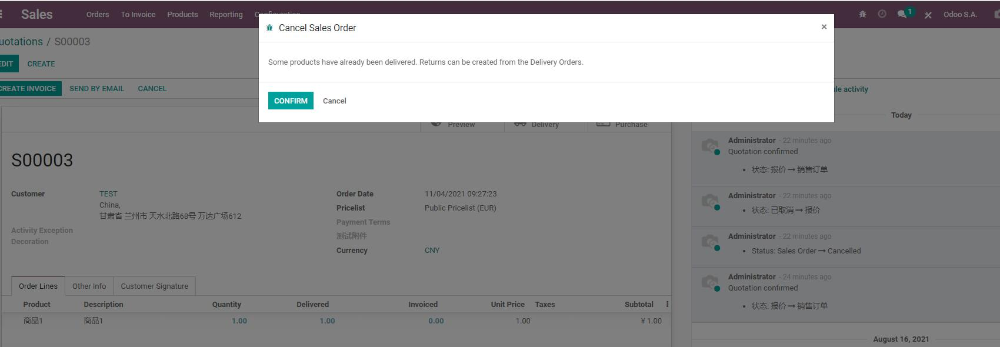
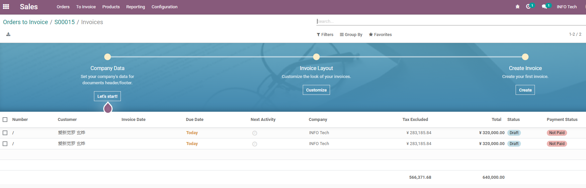

# 第九章 退货、退款与售后处理

销售流程不只包含报价、发货和收款，也要处理客户退货、换货、退款、折让和售后争议。Odoo原生把这些动作分散在销售、库存和会计模块里：销售订单记录原始交易，库存退货处理实物流向，会计贷项通知单处理金额冲减。

如果企业没有提前设计退货退款流程，员工很容易直接删除订单、手工改数量、线下退款，最后导致销售、库存和财务三套数据对不上。本章我们就来看一下Odoo中退货退款应该如何理解，以及自主实施时应该先建立哪些规则。

## 先区分退货和退款

退货和退款不是同一件事。

| 动作 | 处理对象 | 所属模块 |
| --- | --- | --- |
| 退货 | 商品实物从客户回到仓库 | 库存 |
| 退款 | 已开票金额冲减或退还客户 | 会计 |
| 换货 | 退回旧货，再发新货 | 库存+销售 |
| 折让 | 不退货，只减少客户应收 | 会计 |

实际业务中，它们可能同时发生，也可能只发生其中一部分。

例如客户退回一件商品并退款，就是退货+退款。客户接受商品但要求降价，就是折让，不一定发生退货。

## 常见售后场景

| 场景 | 推荐处理思路 |
| --- | --- |
| 未发货订单取消 | 取消销售订单和相关发货单 |
| 已发货未开票退货 | 通过库存退货处理实物，再调整订单后续开票 |
| 已开票已发货退货 | 库存退货+会计贷项通知单 |
| 商品不退只退款 | 创建贷项通知单或折让 |
| 换货 | 原商品退货，新商品重新发货 |
| 客户拒收 | 根据物流状态处理退回入库和订单取消 |

不要把所有售后问题都用“删除订单”解决。已经确认、发货、开票的订单都代表业务事实，应该通过反向业务单据处理。

售后流程建议先建立一套简单分类：

| 分类 | 示例 | 主要关注点 |
| --- | --- | --- |
| 客户原因退货 | 买错、重复下单、不想要 | 是否允许退货、运费谁承担 |
| 商品质量问题 | 破损、故障、规格不符 | 是否质检、是否换货或退款 |
| 发错货 | 发错产品、数量错误 | 仓库责任、补发或换回 |
| 价格争议 | 折扣漏给、价格谈错 | 是否贷项通知单或补差 |
| 物流异常 | 拒收、丢件、超期 | 物流责任和库存状态 |

分类不是为了增加流程负担，而是为了后续能分析：退货到底是产品问题、仓库问题、物流问题，还是销售承诺问题。

## 销售订单取消

如果订单尚未发货、尚未开票，取消相对简单。取消销售订单时，系统会尝试取消相关交付。

销售订单上可以看到取消按钮。取消前要先看智能按钮中是否已经有交付、发票或其他下游单据。



但如果已经发货或已经开票，取消就不再只是销售动作：

- 已发货，需要考虑库存退货；
- 已开票，需要考虑贷项通知单；
- 已收款，需要考虑退款或留作客户余额；
- 已触发采购或生产，需要处理下游单据。

所以销售人员取消订单前，应先看智能按钮：有没有交付、发票、采购、生产或项目记录。

## 库存退货

库存退货通常从原交付单上发起。这样系统能知道退的是哪一次交付、哪些产品、多少数量。

销售订单行中的已交付数量会受退货影响。退货后，系统需要通过库存反向流程更新真实履约情况，而不是直接删除原订单。


退货会影响：

- 客户位置库存减少；
- 仓库库存增加；
- 产品可用数量变化；
- 批次/序列号追踪；
- 库存估值和成本。

如果企业启用了批次或序列号，退货时必须确认退回的批次或序列号是否正确。否则售后、质检和库存账会很难追溯。

退回来的商品不一定都应该直接回到可售库存。企业可以根据业务设计不同处理方式：

| 退回状态 | 建议 |
| --- | --- |
| 完好可售 | 入回正常库存 |
| 需要检测 | 入待检库位 |
| 可维修 | 转维修或售后库位 |
| 不可销售 | 转报废或残次库位 |

第一期如果流程简单，可以先退回主仓库；如果售后量大，建议后续在库存模块设计待检和报废流程。

## 退款和贷项通知单

在Odoo会计中，退款通常通过贷项通知单处理。

如果订单已经开票，退款就应该进入财务流程。销售人员可以从订单或发票追踪相关单据，但不建议绕过会计直接改金额。



贷项通知单可以用于：

- 冲减已开客户发票；
- 处理退货退款；
- 处理折让；
- 修正错误开票；
- 抵减客户未来应收。

如果订单还没有开票，通常不需要先做贷项通知单。如果已经开票，就不能只改销售订单数量，应该在会计中用正式的冲减凭证处理。

退款金额也要分情况：

- 全额退款；
- 部分退款；
- 只退商品金额，不退运费；
- 退差价；
- 折让但不退货；
- 退款到原支付方式；
- 留作客户余额下次抵扣。

这些规则最好由财务和客服一起确认。销售只负责发起售后，不应单独决定财务冲减方式。

## 换货流程

换货可以理解成两个动作：

```text
退回原商品 -> 发出新商品
```

实施时要看业务规则：

- 新商品是否同价；
- 是否需要补差价；
- 是否需要重新开票；
- 原商品是否进入可售库存、维修库存或报废；
- 是否需要质检。

简单换货可以用退货+重新发货处理。复杂售后则可能需要售后工单、维修、质检或帮助台模块参与。

## 售后记录放在哪里

售后沟通建议不要只放微信群。至少要在相关单据消息区留下关键记录。

例如：

- 客户什么时候提出退货；
- 退货原因是什么；
- 谁批准退款；
- 退货物流单号是什么；
- 仓库是否收到货；
- 财务是否开具贷项通知单；
- 是否重新发货。

如果企业售后量较大，可以进一步使用Helpdesk、维修、质量等模块，但销售订单和发票仍然是售后追溯的重要入口。

一个实用做法是：销售订单记录原始交易，发货单记录实物退回，发票或贷项通知单记录金额冲减，消息区记录沟通和审批。这样以后老板、财务、客服、仓库看到的是同一套业务事实。

## 原生方案和定制边界

Odoo原生可以支撑大多数基础退货退款流程：销售订单、库存退货、贷项通知单、重新发货、消息记录。

以下情况可能需要流程设计或定制增强：

- 售后审批层级复杂；
- 退货原因需要严格统计；
- 需要客户门户提交退换货申请；
- 需要对接电商平台售后；
- 需要自动生成维修单或质检单；
- 需要复杂退款规则、手续费或部分退款；
- 需要售后绩效和质量分析报表。

实施建议仍然是先把原生反向流程跑通，再决定是否引入帮助台、维修、质检或电商售后接口。

## 实施建议

退货退款流程上线前，企业至少要明确：

| 问题 | 建议 |
| --- | --- |
| 谁能批准退货 | 销售主管、客服主管或财务 |
| 退货入哪个库位 | 正常库存、待检库存、报废库存 |
| 什么情况下退款 | 已收款、已开票、未发货的规则不同 |
| 是否统计退货原因 | 建议至少记录原因，方便后续改进 |
| 售后沟通在哪里留痕 | 优先回到销售订单、发票或售后工单 |

本章我们把退货、退款、换货、贷项通知单和售后记录的关系讲清楚了。下一章会进入租赁业务，看看当产品不是一次性销售，而是按时间出租和归还时，Odoo如何围绕销售订单扩展出租流程。
