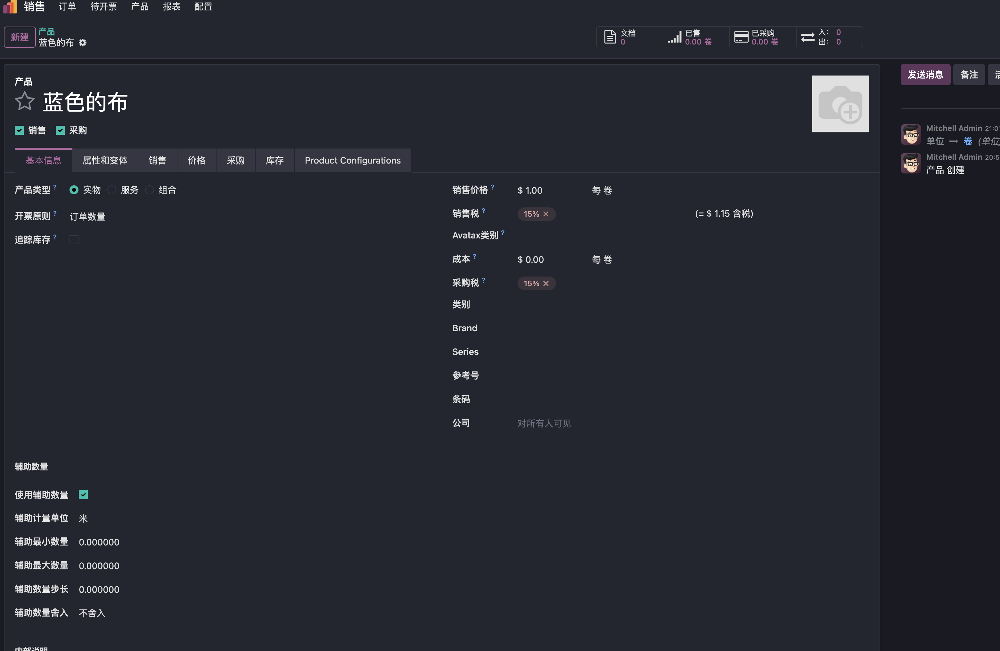
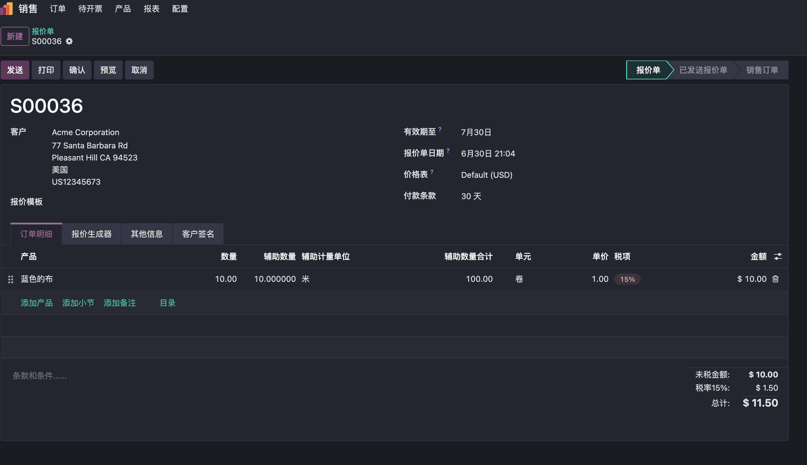
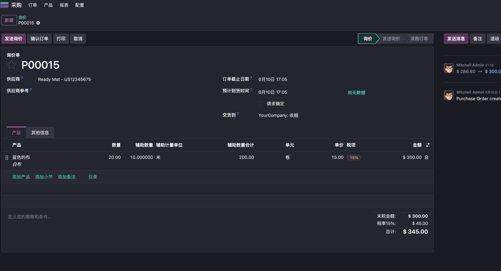
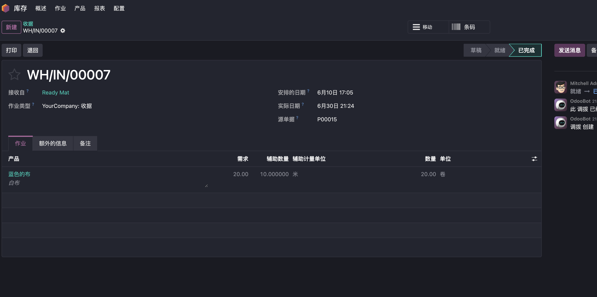
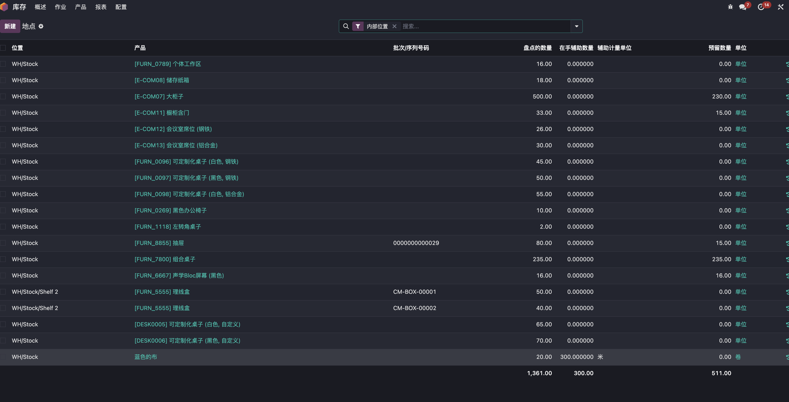
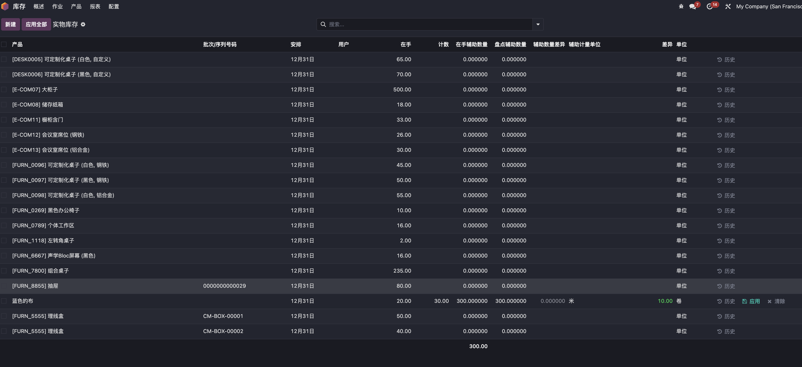

# 第二单位

## 什么是第二单位

在ERP系统里，“数量”和“单位”看起来是非常基础的概念。销售10件、采购5箱、入库3卷、出库20张，似乎一个数量加一个单位就可以把业务说明白。
但在很多行业的真实业务中，一个数量维度往往不够。
比如：

* 梯子按“件”销售，但业务还要记录每件多少米
* 布匹按“卷”采购，但采购和仓库都关心每卷多少米
* 板材按“张”出入库，但报价或统计可能要看平方米
* 纸箱按“箱”发货，但客户和仓库还要知道每箱内装多少个
* 加工件按“件”管理，但生产或报价时还会关注展开面积、加工长度或重量

这些场景里，“件、卷、箱、张”是系统主数量单位，用来支撑销售、采购、库存、开票等标准流程；而“米、平方米、个、展开量、加工量”等，则是业务上同样重要的辅助数量维度。

这个辅助数量维度，我们通常就称为第二单位，也可以理解为“辅助单位”或“业务规格单位”。

### 第二单位不是替代主单位

第二单位并不是要替代 Odoo 原生的计量单位体系。

Odoo 标准单位主要解决的是系统核心数量口径，例如：

* 销售订单数量
* 采购订单数量
* 库存移动数量
* 发票开票数量
* 成本和库存估值相关数量

这些数量通常应该保持稳定、统一、可核算。
第二单位解决的是另一个问题：当业务需要在主数量之外，同时记录另一个辅助维度时，系统应该如何表达。
例如销售订单上写：销售数量：4 件，第二数量：每件 2.5 米，第二数量合计：10 米

这里 Odoo 的主数量仍然是 4 件，销售、库存、开票可以继续按“件”运行；而 10 米 则用于表达客户关心的长度、内部交接需要的规格，或者后续报表统计需要的辅助维度。

### 为什么不能全部用 Odoo 原生单位换算解决？

Odoo 原生单位换算非常适合处理同一计量类别下的标准换算，比如：

* 1 箱 = 24 个
* 1 米 = 100 厘米
* 1 吨 = 1000 千克

但第二单位经常不是这种简单换算关系。

它可能和主数量不是同一类单位，也可能每个产品都有自己的业务规则。比如同样是“一件”，不同产品对应的长度、面积、展开量可能完全不同；同样是“一卷”，每卷米数也可能需要在采购或入库时填写。这时候如果强行用原生单位换算，容易带来几个问题：

* 主库存数量口径被扰乱
* 销售、采购、开票数量变得不清晰
* 不同产品的业务规格难以统一表达
* 报价、仓库和客户沟通仍然需要大量备注补充

所以更稳妥的做法，是让主单位继续服务 Odoo 标准流程，让第二单位作为辅助业务维度独立记录和流转。

## 第二单位适合解决什么问题

第二单位适合那些“主数量能表达业务流转，但不能完整表达业务规格”的场景。
典型价值包括：

* 让销售订单可以同时表达购买数量和规格数量
* 让采购订单记录供应商交付的辅助规格
* 让库存调拨同时保留计划数量和实际辅助数量
* 让报表可以统计长度、面积、内装数等业务维度
* 减少备注、Excel 和人工沟通带来的信息丢失

它的核心价值不是“多一个字段”，而是让业务数据从非结构化备注，变成可以校验、计算、流转和统计的结构化信息。

## 第二单位的实现方式

我们的第二单位解决方案，是基于 Odoo 标准单位体系之上的业务增强方案。

它不替代 Odoo 原生计量单位，也不改变 Odoo 标准销售、采购、库存、开票数量链路，而是在主数量之外，增加一个可配置、可校验、可计算、可流转的辅助数量维度。
可以简单理解为：

```sh
主数量：系统标准业务数量
例如 10 件、5 卷、3 箱

第二数量：每个主数量对应的辅助业务数量
例如每件 2.5 米、每卷 80 米、每箱 24 个

第二数量合计：主数量 × 标准化后的第二数量
例如 10 件 × 每件 2.5 米 = 25 米
```

这套方案适合那些主数量可以支撑 Odoo 标准流程，但业务现场还需要额外记录规格、长度、面积、内装数或加工量的企业。

### 核心功能

#### 1. 产品级第二单位配置

方案支持在产品上启用第二数量，并配置对应规则，包括：

* 是否启用第二数量
* 第二单位，例如米、平方米、个、包等
* 每个主数量单位允许的最小第二数量
* 每个主数量单位允许的最大第二数量
* 第二数量步长
* 第二数量舍入方式

通过产品级配置，企业可以把原本依赖人工经验的规格要求，沉淀为系统规则。
例如某产品每件长度必须按 0.5 米递增，系统可以根据配置自动进行标准化处理，避免业务人员随意输入导致后续统计口径混乱。



#### 2. 销售订单中的第二数量

在销售订单行中，用户可以录入第二数量。例如：



```sh
销售数量 = 10 卷
每件第二数量 = 10 米
第二数量合计 = 100 米
```

销售数量仍然是 Odoo 标准的10卷，第二数量用于辅助说明规格、报价参考、客户确认或报表分析。
这样既保留了 Odoo 标准销售流程，又让销售单据能够更准确地表达客户真正关心的业务信息。

#### 3. 采购订单中的第二数量

在采购订单行中，也可以使用第二数量。例如：

```sh
采购数量 = 6 卷
每卷第二数量 = 80 米
第二数量合计 = 480 米
```



采购人员可以按供应商交付方式录入主数量，同时记录每个主数量对应的辅助数量。这对于布匹、卷材、板材、包装材料等行业非常实用。
如果业务需要，采购中的第二数量还可以继续带入后续收货流程，减少采购和仓库之间的信息断点。

#### 4. 库存调拨中的第二数量

库存模块支持在计划调拨和实际作业层面记录第二数量。
例如：

```sh
计划出库 = 10 箱
每箱第二数量 = 24 个
计划第二数量合计 = 240 个

实际完成 = 8 箱
每箱第二数量 = 24 个
实际第二数量合计 = 192 个
```



这样仓库不仅可以按主数量完成出入库，也可以保留业务现场关心的辅助规格信息。
对于需要核对长度、面积、内装数、包装规格的企业来说，这能显著减少线下记录和人工沟通。

#### 5. 在手库存和报表中的第二数量

在库存模块中，系统可以在在手库存和报表中显示第二数量。例如：

```sh
在手库存 = 100 卷
每卷第二数量 = 80 米
在手第二数量合计 = 8000 米
```




用户可以在库存报表、销售报表、采购报表中查看第二数量，支持按业务规格进行统计和分析。

#### 6. 库存盘点支持第二单位

在库存盘点过程中，系统也支持记录和校验第二数量。例如：


```sh
盘点数量 = 50 卷
每卷第二数量 = 80 米
盘点第二数量合计 = 4000 米
```



这样，盘点人员可以同时核对主数量和辅助规格，确保库存数据的完整性和准确性。

## 业务价值

第二单位方案解决的不是一个字段问题，而是业务数据结构化的问题。它带来的价值包括：

* 让产品规格不再只依赖备注说明
* 让销售、采购、库存单据能表达更多业务信息
* 减少人工换算和重复沟通
* 支持上下限、步长、舍入等规则校验
* 为后续报价、报表、行业扩展留下统一基础
* 在不影响 Odoo 标准流程的前提下提升业务适配度

对于很多企业来说，真正难的不是“有没有系统”，而是系统能不能表达业务现场里的那些细节。第二单位方案，就是让 Odoo 更贴近这些细节的一步。

## 总结

青岛欧姆网络科技的第二单位解决方案，是面向多行业场景沉淀出的 Odoo 通用增强能力。
它让企业在保留 Odoo 标准主数量体系的同时，能够灵活记录长度、面积、内装数、包装规格、加工量等辅助业务数量。既保持标准流程稳定，又让业务单据表达更完整。

后续如果企业需要按第二数量计价、按第二数量开票、接入生产流程、扩展报表或对接外部系统，也可以在通用版基础上继续演进。

青岛欧姆网络科技，您身边的Odoo专家。