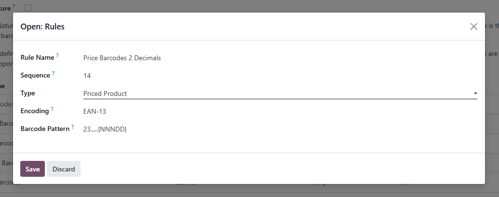

# 第八章 条码规则

Odoo支持扫码识别产品、序列号、批次号等应用，对于产品编码、批次和序列号的优先顺序以及解析规则，odoo使用了一个专有对象来用来处理，它就是条码规则。

## UPC和EAN

首先我们先来了解一下条码的基础知识，现行的两种流行的编码模式是UPC和EAN。UPC(universal product code)主要应用于美国和加拿大，12位条码。EAN(European Article Number)则应用于全球其他地方，13位条码。13位的EAN称为标准版，EAN13。缩减版的8位EAN，则称为EAN8。

UPC和EAN码可以相互转换，UPC在最前面加0即可变成ean码。

## GS1标准

GS1标准为企业创造了一套共通语言，让企业可独有识别、准确撷取及自动分享产品、位置及资产的重要信息。
我们的标准可作为企业于环球贸易的共通语言，提升供应链的透明度。

全球独有标识码，用以识别从制造商到消费者供应链上的贸易项目、物流单位、位置和资产。企业可将GS1标识码应用于不同的产品、文件、位置等事物。

|GS1标识码|识别对象|例子|
|----|-----|---------|
|GTIN (全球贸易货品编码)|产品|网上销售的衣服、商店售卖的蛋糕
|GLN (全球位置编码)|合作伙伴和位置|企业、仓库、工厂、商店
|SSCC (货运容器序号)|物流单位|货盘、集装箱、防滚架、邮包
|GRAI (全球可回收资产标识码)|用作运送货品的可回收用具|货盘底架、条板箱、集装箱
|GIAI (全球个体资产标识码)|高价值仪器及其他资产|医疗器材、生产器材
|GSRN (全球服务关系标识码)|个人|顾客忠诚度计划成员、病人、雇员
|GDTI (全球文件类别标识码)|文件|税单、货运单、保单、驾驶执照等文件
|GINC (全球托运标识码)|货物托运|组成一次托运的所有物流单位
|GSIN (全球货运标识码)|以同一发货通知或提单之名义运送的物流单位群组|海关对进出口货物进行识别
|GCN (全球优惠券编码)|优惠券|实体现金券、电子或流动优惠券
|CPID (组件／部件标识码)|组件及部件|须经过最少一轮工序才可成为最终产品的组件或部件，例如洗衣机变频马达和喉管

## 条码规则

认识了UPC和EAN，我们就可以看一下Odoo的条码规则了，我们来看一个典型的条码规则：

条码规则有下面的几个属性：

* 条码规则： 条码规则的标识名称
* UPC/EAN转换：配置UPC/EAN转换规则 可选项有4个：总是、EAN-13->UPC-A、UPC-A -> EAN-13和从不
* 使用GS1标准： 如果使用GS1标准，该条码规则将只接受GS1-128规则的编码

条码规则决定了条码的组织方式和识别规则，当条码被扫描到时，将使用第一个匹配到的规则。条码规则是由正则表达式组成的，如果正则表达式匹配了条码的前缀，那么该条码规则就被匹配到了。

正则表达式中同时可以指定数值的类型和位置，例如，产品的价格和重量等。数值使用{N}的方式，支持高精度的浮点数（Decimal）则使用{D}的方式。例如{NNNDD}表示3位数字和2位小数。

### 规则定义

当我们打开要给条码规则的条目，我们可以看到如下的界面：

* 规则名称： 该规则使用的名称
* 序号：该规则的序号，该序号将决定匹配的顺序
* 类型：规则支持的类型,odoo中支持条码扫码的场景类型
* 编码：编码规则
* 编码模式： 正则表达式的匹配模式

